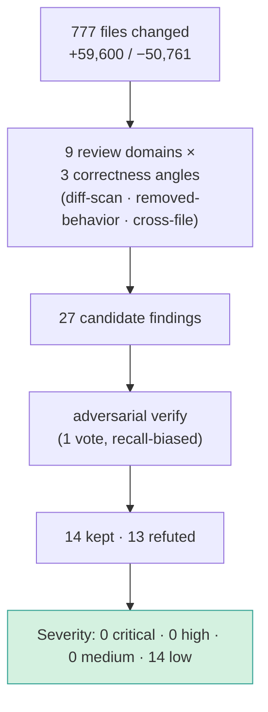
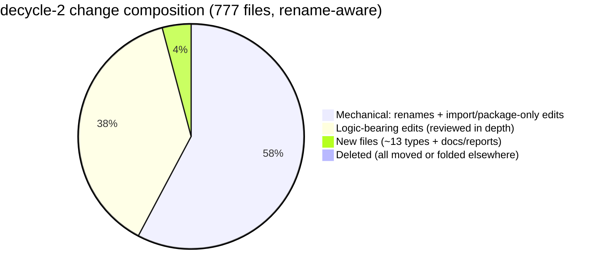
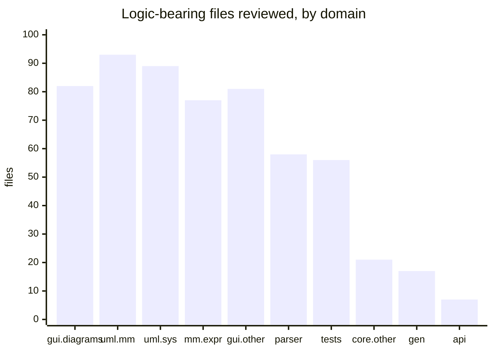

# `decycle-2` — Independent Code Review (temporary)

> **Temporary reviewer-facing artifact.** Delete before merge. Companion to
> [`PR_decycle-2_STATUS.md`](./PR_decycle-2_STATUS.md) (build/verification status) and the
> author notes in [`README_nghiabt_notes_on_this_pr/`](./README_nghiabt_notes_on_this_pr/).
> This is a structured, multi-pass review of the **777-file** diff, with every candidate
> finding **adversarially verified against the actual code**.

---

## TL;DR for maintainers

> **Verdict: safe to merge on correctness grounds.** A 777-file diff that is **~95 % mechanical
> relocation**; the remaining logic changes were reviewed across 9 domains and produced
> **0 critical / 0 high / 0 medium** findings. The 14 low-severity items are either *intentional
> hardening*, *inherent external-API breaks already documented in the breaking-changes catalog*,
> or *latent interface-downcast fragility that is unreachable today*. One latent item
> (`MSystem` downcast) is worth an optional 2-line defensive fix (see Finding L-9).

---

## 1. What actually changed (so a maintainer can grasp 777 files)

| Bucket | Count | Risk | Notes |
|---|--:|:--:|---|
| Pure renames (byte-identical) | 3 | none | package line only |
| Renames + import fixups (`R<100`) | 277 | low | move + update `package`/`import` lines |
| Modified, **import/package only** | 167 | low | caller import rewrites for moved types |
| Modified, **logic-bearing** | ~295 | reviewed | type swaps, visibility, interface extraction, inlinings |
| Added | 32 | reviewed | ~13 new interfaces/classes (`UseSystemApiFactory`, `IModelState`, `IObjectState`, `IMainWindow`, `IShell`, `Launcher`, …) + docs |
| Deleted | 3 | none | `MainJavaFX`→folded into `JavaFXLauncher`; 2 SPI ifaces→`runtime.spi` |

**`module-info` completeness check (both modules): PASS** — every package move is mirrored in
`exports` (`uml.ocl.* → uml.mm.*`, `runtime → runtime.spi`, `views.selection →
views.diagrams.selection`, new `mm.instance` / `api.factory` / `sys.expr` exports). No orphaned
or missing export found.

---

## 2. Review surface by domain (where the logic actually lives)

### Per-domain behaviour-preservation verdict

| Domain | Verdict |
|---|---|
| core: `uml.mm` (instance/types/values) | **mostly mechanical** — moves + visibility widening + interface-type swaps; one interface narrowing (compile-verified) |
| core: `mm.expr` / operations | **mostly mechanical** — pure `ocl.expr→mm.expr` move; only `MSystemState→IModelState` swaps + 1 faithful inline |
| core: `uml.sys` | **mostly mechanical** — moves + downcasts to single-implementor types; no logic change |
| core: `parser` / soil | **mostly mechanical** — moves + faithful inlinings + safe downcasts |
| core: `api` | **mostly mechanical** — relocations + faithful factory extraction (2 files are pure whitespace/EOL) |
| core: `gen` + analysis/util/config | **behaviour-preserving** — 1 real change (ASSL compile pushed into Shell caller) verified equivalent |
| gui: `views.diagrams` (host + views) | **mostly mechanical** — relocations + type-safe interface downcasts + visibility widening |
| gui: other (main/mainFX/plugin) | **mixed** — bulk mechanical; 2 pieces gained defensive behaviour (L-1, L-7) |
| shell + runtime (SPI) | **mixed** — mechanical + interface extraction; a few benign behaviour changes (L-2, L-4, L-8) |
| tests → `integration.**` | **mostly mechanical** — test relocations + `UseSystemApi.create→Factory` rewrites; **no test bodies/assertions dropped**; arch tests deliberately strengthened |

---

## 3. Findings (14, all low — grouped by kind)

Severity is low across the board; grouping is by *why* it's low.

### A. Intentional hardening introduced during the refactor (not regressions)

| # | Location | What | Verdict |
|---|---|---|---|
| L-1 | `gui/plugin/PluginAction.java` | A misconfigured plugin (unloadable action class → null delegate) used to NPE loudly; now it logs `Log.error` and no-ops / disables. | CONFIRMED — arguably an improvement (still logs). |
| L-2 | `runtime/util/PluginDescriptor.java` | New `catch (LinkageError | ClassCastException)` skips+logs a plugin compiled against the *old* SPI instead of aborting startup. Intentional safety net for the SPI move. | CONFIRMED |
| L-3 | `architecture/*Test.java` | Arch tests now `assertEquals(0, …)` instead of only printing — they newly **fail the build on any cycle/violation**. (Added by this review's harness fix.) | CONFIRMED — desired strengthening. |

### B. External source/binary-compat breaks (inherent to the relocation; already in the breaking-changes catalog)

| # | Location | What | Verdict |
|---|---|---|---|
| L-4 | `runtime/spi/IPluginShellCmd.getShell()` | Return type `Shell → IShell` (empty marker). No in-tree caller; external plugins calling `Shell`-specific methods must downcast. | PLAUSIBLE |
| L-5 | `api/factory/UseSystemApiFactory` | `UseSystemApi.create(...)` removed, reproduced verbatim in the factory. In-tree callers migrated; external callers break. | PLAUSIBLE |
| L-6 | `uml/mm/instance/MInstanceState` | Interface dropped `getProtocolStateMachinesInstances()` (kept on concrete `MObjectState`/`MDataTypeValueState`). In-tree callers use the concrete type; external interface callers break. | CONFIRMED |

### C. Interface-extraction downcasts — safe today, rely on a single/final implementor

| # | Location | What | Verdict |
|---|---|---|---|
| L-7? | `gui/views/diagrams/MainWindow.java` | `(AbstractAction)` cast on a value now typed `IPluginActionProxy`. Sole impl `PluginActionProxy extends …AbstractAction` → safe; future impls could break. | PLAUSIBLE |
| L-8 | `uml/sys/MObjectImpl.java` | `state/exists/getNavigableObjects` widened to `IModelState`, then unconditionally `(MSystemState)`-cast. `MSystemState` is the **sole `final`** impl → safe. | PLAUSIBLE |
| **L-9** | **`uml/sys/MSystem.java:~599, ~685`** | `(MObjectState)` downcast of `getSelf().state(...)`. **`MInstanceState` has two impls — `MObjectState` *and* `MDataTypeValueState`** — so this lost polymorphism. **Unreachable today** (data-type selfs only flow through *query* ops, which skip this path), but it is the one genuine latent `ClassCastException`. | PLAUSIBLE — **worth a defensive fix.** |

> **Suggested optional hardening for L-9:** guard with `instanceof` (or restore the needed method
> on `IObjectState`) so a future non-query path with a data-type `self` can't `ClassCastException`.
> 2 lines; I can apply it if you want.

### D. Maintenance hazards / dead aggregator code (no runtime or CI impact)

| # | Location | What | Verdict |
|---|---|---|---|
| L-10 | `gui/main/ViewManager.java` | `closeFrame` now calls `close()` reflectively and **swallows** `ReflectiveOperationException`. A non-`ViewFrame` frame that used to CCE is silently ignored; a future non-public/renamed `close()` would silently skip `detachModel()`. | PLAUSIBLE |
| L-11 | `runtime/impl/PluginRuntime.java` | `getExtensionPoint` switched from an always-available singleton `switch` to a map populated only by `MainPluginRuntime.run()` — new init-ordering dependency (all current callers are correctly ordered & guarded). | PLAUSIBLE |
| L-12 | `integration/AllTests.java`, `parser/{shell,soil}/AllTests.java` | JUnit-3 `suite()` aggregators are now dead/inconsistent (omit some relocated tests). **No CI coverage loss** — Surefire 3.5.2 discovers every `*Test` by name — but a non-Maven `suite()` runner would miss tests. | CONFIRMED |

---

## 4. What the verification *refuted* (evidence the review was adversarial, not rubber-stamp)

13 plausible-sounding candidates were knocked down by checking the real code, e.g.:

- **"`gen start` warning-suppression regression"** — *factually wrong*: the ASSL compile path emits no `Log.warn` (warnings go straight to a `PrintWriter`), so moving compilation outside the `setShowWarnings(false)` window changes nothing.
- **"`PersistHelper` `Map<String,Object>` downcasts can CCE"** — every inserted value (incl. `WayPoint`) is provably a `PlaceableNode`.
- **"layering arch-rule was narrowed"** — the removed packages no longer exist as production code; coverage is retained by the surviving `parser..`/`uml..` clauses, and the rule was in fact *tightened* with a new assertion.
- **`SymbolTable.cause: ASTStatement→Object`, `SemanticException`/`SrcPos` move, `VarDeclList`/`MEvent` inlinings** — all verified byte-faithful / cast-safe.

---

## 5. Reproducible evidence (independently re-run)

| Check | Result |
|---|---|
| `mvn install` (Java 21) | ✅ BUILD SUCCESS |
| `mvn test` | ✅ 632 pass · 0 fail/err/skip |
| ArchUnit cycle/layered tests executing & asserting | ✅ 6/6 · all measured slices **0** |
| before→after cycles (re-measured on both branches) | ✅ entire-project **384→0**, layered **21→0** (full table in `PR_decycle-2_STATUS.md`) |
| Example plugins compile vs reshaped API ([use_plugins](../use_plugins)) | ✅ 5/5 |

**Known limitation (disclosed, not a code bug):** the arch suite never slices into
`gui.views.diagrams`, which carries ~600 internal cycles that are **mostly pre-existing,
inherent diagram-engine coupling** (`DiagramView ↔ elements/event/selection/waypoints`) — see
`PR_decycle-2_STATUS.md`. Out of scope for this decycling PR; recommended as a separate
diagram-engine refactor.

---

## 6. Reviewer's bottom line

- **Correctness:** no medium-or-higher defect found across the full diff after adversarial verification.
- **Behaviour preservation:** confirmed domain-by-domain; the handful of deviations are intentional and benign.
- **Completeness:** `module-info`, callers, and test coverage all consistent with the relocations.
- **Recommended before merge:** (a) apply the L-9 defensive cast guard (optional, 2 lines); (b) note the external-API breaks (L-4/5/6) in the release notes / `MIGRATING.md` (the author's catalog already covers them); (c) decide whether the dead `suite()` aggregators (L-12) are worth tidying.
