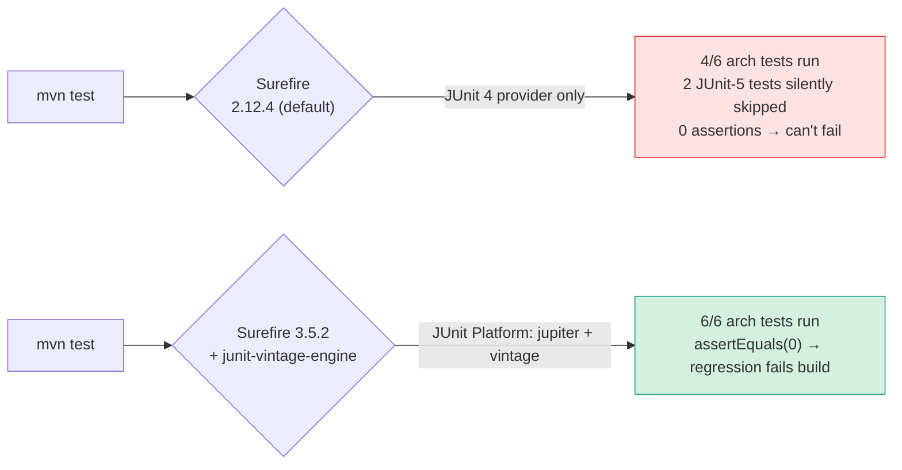
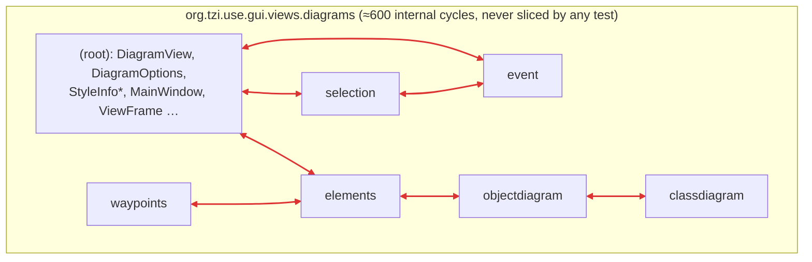

# `decycle-2` — Verification Status (temporary)

> **Temporary reviewer-facing summary.** Delete before merge. Companion to the detailed
> per-bug notes in [`README_nghiabt_notes_on_this_pr/`](./README_nghiabt_notes_on_this_pr/).
> Every number below was **independently re-measured** on this machine
> (OpenJDK 21.0.11, Maven 3.8.7) by building both branches and running the *same* six
> ArchUnit tests — not copied from the notes.

---

## Verdict at a glance

| Check | Result |
|---|:--:|
| `use-core` + `use-gui` + `use-assembly` compile (Java 21) | ✅ `BUILD SUCCESS` |
| Full `mvn test` | ✅ **632 pass**, 0 failures / 0 errors / 0 skipped |
| ArchUnit cycle + layered tests **executing** | ✅ **6 / 6** (was 4 / 6 — see fix below) |
| Cycle counts on every **measured** slice + entire-project | ✅ **0** |
| Layered-architecture violations | ✅ **0** |
| `cycles == 0` now **enforced** (build fails on regression) | ✅ assertions added |
| Example plugins compile against the reshaped API ([use_plugins](../use_plugins)) | ✅ **5 / 5** |

```mermaid
xychart-beta
    title "ArchUnit cycles / violations: main → decycle-2 (independently re-measured)"
    x-axis ["entire-project", "runtime", "core", "gui", "uml", "parser+tests", "layered"]
    y-axis "count" 0 --> 400
    bar [384, 43, 34, 14, 5, 36, 21]
    bar [0, 0, 0, 0, 0, 0, 0]
```



<sub>Left bar = `main` (re-measured); right bar = `decycle-2`. Full table below.</sub>

---

## Before → After (self-measured on both branches)

| ArchUnit metric | `main` | `decycle-2` |
|---|--:|--:|
| entire-project cycles | **384** | **0** |
| `runtime` cycles | 43 | 0 |
| `core` module (Ant whole-slice) | 34 | 0 |
| `core` module (Maven, withoutTests) | 55 | 0 |
| `core` module (Maven, withTests) | 210 | 0 |
| `gui` package (Ant) | 14 | 0 |
| `uml` slice | 5 | 0 |
| `parser` (production / withTests) | 2 / 36 | 0 / 0 |
| `api` / `gen` | 1 / 1 | 0 / 0 |
| `gui.main` / `gui.views` / `main.shell` | 1 / 1 / 1 | 0 / 0 / 0 |
| layered-architecture violations | **21** | **0** |

*Method: built `main` and `decycle-2`, ran the six `org.tzi.use.architecture.*` tests against
each (forcing the JUnit-5 ones under a modern Surefire — see below). The `main` figures
reproduce the baseline claimed in the PR notes.*

---

## Bug found and fixed: the test harness was under-reporting

The PR notes already flagged this honestly; it is now **fixed and verified**.

**Root cause.** The POMs pinned **no** Surefire version, so Maven 3.8.7 used its default
**2.12.4**, whose provider discovers **JUnit 4 only**. Consequences:

| | Before (default Surefire 2.12.4) | After (Surefire 3.5.2 + `junit-vintage-engine`) |
|---|---|---|
| ArchUnit tests that actually execute | **4 / 6** — `MavenCyclicDependenciesCoreTest` & `MavenLayeredArchitectureTest` (JUnit 5) **silently skipped** | **6 / 6** |
| Arch tests that **assert** `cycles == 0` | **0** — all six only `println` the count | **6** — `assertEquals(0, …)` |
| `use-core` unit tests executed | **271** | **613** |
| Build result | green (could be green *with* hidden cycles) | green (and a cycle now **fails** the build) |

**Fix** (commit on this branch — *local checkpoint, not pushed*):
- pin `maven-surefire-plugin` **3.5.2** in the parent `pluginManagement`;
- add `org.junit.vintage:junit-vintage-engine` to `use-core` and `use-gui` so the existing
  JUnit 4 tests keep running under the JUnit Platform;
- add `assertEquals(0, cycleCount, …)` to all six ArchUnit tests.



---

## Honest caveat: a cycle-detection blind spot in `gui.views.diagrams`

A maintainer should know this, and it is *not* hidden here.

Every ArchUnit test assigns a slice from the **first sub-package** under its root, and the
deepest GUI root any test uses is `org.tzi.use.gui.views`. **No test ever roots at
`org.tzi.use.gui.views.diagrams`**, so that whole subtree collapses into one slice and its
internal cycles are unmeasured. Rooted one level deeper, the same test logic reports
**~600 internal cycles**.

What that number actually is:



- **583 / 600** route through the `(root)` slice; **17** are purely sub↔sub.
- The `(root)→sub` edges come from the **diagram framework base itself** — `DiagramView`
  references the `elements` / `event` / `waypoints` it renders; `StyleInfo*` reference the
  node types they style — and the concrete diagrams extend those base classes back. This is
  **inherent, bidirectional graph-editor coupling**.
- **It pre-exists on `main`** (`DiagramView → elements/event/waypoints` and the back-edges
  are already there; `main` has no `diagrams`-rooted test either). The mediator-collapse in
  this PR only *added* `MainWindow`'s share on top of an already-cyclic subtree. It is the
  same category as the `uml.mm` (~88) and `uml.sys` clusters: pre-existing coupling that the
  chosen slice granularity does not drill into.

**Why it's not fixed in this PR.** Reaching 0 here requires re-architecting `DiagramView`
and the element/event/selection/waypoint framework (Dependency-Inversion across the whole
diagram engine) — a dedicated effort with its own risk, not a decycling tweak. Recommended
as a separate follow-up. The headline "0 cycles" is **true at the granularity the suite
measures**, and that granularity is identical on `main` and `decycle-2`.

---

## Reproduce it yourself

```bash
# 1. compile everything (Java 21)
mvn -DskipTests install

# 2. full suite — 632 tests, all six arch tests run and assert 0
mvn test

# 3. force the (previously skipped) JUnit-5 arch tests explicitly, if curious
mvn -pl use-core org.apache.maven.plugins:maven-surefire-plugin:3.5.2:test \
    -Dtest=MavenCyclicDependenciesCoreTest
mvn -pl use-gui  org.apache.maven.plugins:maven-surefire-plugin:3.5.2:test \
    -Dtest=MavenLayeredArchitectureTest
```
