# Cyclic Dependency Bugs

> This file tracks architectural bugs detected by ArchUnit.
> Delete this file once all issues are resolved and the PR is merged.

We start from the commit [5989a4b](https://github.com/useocl/use/commit/5989a4be5f2b181189965482f4f10da3971878a4) (Merge pull request #130 from croni42/feature-main-branch-adjustment), date: 2026-04-27 (YYYY-MM-DD).

---

## Bug 1: `uml.mm` ↔ `uml.ocl` ↔ `uml.sys` triangle (use-core) — Phase A DONE (5 → 3)

- **Severity:** Critical — 5 cycles in `org.tzi.use.uml` slice + 34
  in whole-core slice. The single largest source of cycles in the
  project.
- **Location:** `org.tzi.use.uml.{mm, ocl, sys}`.
- **Problem:** The metamodel (`mm`), OCL layer (`ocl`), and runtime
  system (`sys`) form a tightly coupled triangle.
  - `uml.ocl.value` types (`ObjectValue`, `LinkValue`, `InstanceValue`)
    hold direct references to `uml.sys` runtime objects (`MObject`,
    `MLink`, `MInstance`).
  - `uml.sys.soil.*` statement constructors take `uml.ocl.expr.Expression`
    parameters.
  - `util.soil.VariableEnvironment` depends on `uml.ocl.value.Value`.
- **Plan:** see [`README_nghiabt_notes_on_this_pr/bug-1_plan.md`](./bug-1_plan.md).
  Three phases — Phase A (break `mm → sys`), Phase B (break
  `ocl → sys`), Phase C (break `mm → ocl`).
- **Phase A — DONE** (this commit):
  - Removed the dead `mm.statemachines.TransitionListener` (declared
    but no implementations existed; kills the `mm → sys.events` edge
    for free).
  - Changed `MClassifier.hasStateMachineWhichHandles(MOperationCall)`
    → `(MOperation)`. The implementation only ever used
    `operationCall.getOperation()`. Single caller in
    `MSystem.copyPreStateIfNeccessary` updated to pass
    `operationCall.getOperation()`. Kills 5 of the 11 `mm → sys`
    imports (`MClassifier`, `MClass`, `MClassifierImpl`, `MClassImpl`,
    `MAssociationClassImpl`).
  - Inlined `MProtocolStateMachine.createInstance(MObject)` into its
    single caller `MObjectState`. The factory method lived in mm but
    returned a sys type (`MProtocolStateMachineInstance`); the caller
    in sys now constructs the instance directly. Kills the two
    `mm.statemachines → sys` imports on `MProtocolStateMachine`.
  - Introduced a minimal marker interface
    `org.tzi.use.uml.mm.IStatement` exposing the single method the
    model layer needs (`toConcreteSyntax(int, int)`).
    `sys.soil.MStatement implements IStatement`.
    `MOperation.fStatement` is now typed `IStatement`;
    `MMPrintVisitor.getStatementVisitorString(IStatement)` follows
    suit. `MObjectOperationCallStatement` (sys.soil, can see the
    concrete type) downcasts at the boundary. Kills the two
    `MOperation → MStatement` and `MMPrintVisitor → MStatement`
    imports.
  - `MRegion.addTransition/addSubvertex` switched
    `throws MSystemException` → `throws MInvalidModelException`
    (existing mm exception). Parser caller
    (`ASTProtocolStateMachine`) and test (`TestProtocolStateMachine`)
    updated. Kills the last `mm.statemachines → sys` import.
  - **Result:** `mm → sys` import count: **0** (was 11).
  - **Cycles in `org.tzi.use.uml`: 5 → 3.** The two cycles
    `mm → sys → mm` and `mm → sys → ocl → mm` are gone. Three remain:
    `mm → ocl → mm`, `mm → ocl → sys → mm`, `ocl → sys → ocl`.
  - All 271 use-core + 18 use-gui tests pass.
  - ⚠ **Breaking API change:** `MClassifier.hasStateMachineWhichHandles`
    signature change (parameter type `MOperationCall` →
    `MOperation`); `MOperation.getStatement()` /
    `setStatement(MStatement)` return/parameter types widened to
    `IStatement`; `MRegion.addTransition` /
    `MRegion.addSubvertex` declared exception narrowed from
    `MSystemException` to `MInvalidModelException`;
    `MProtocolStateMachine.createInstance` removed (inlined into the
    one caller). Suggested release-note tag: `[breaking] uml.mm`.

<!-- BEGIN MERMAID:bug-1 -->
### Before Phase A — 5 cycle(s), 6 edge(s) across 3 package(s)

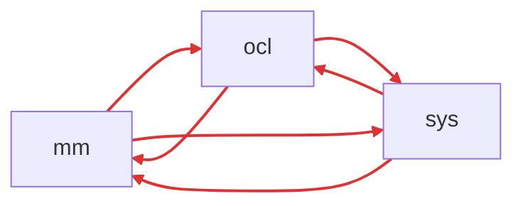

### After Phase A — 3 cycle(s), 5 edge(s) across 3 package(s)

`mm → sys` is gone (11 → 0 imports). Cycles through that edge
vanished.

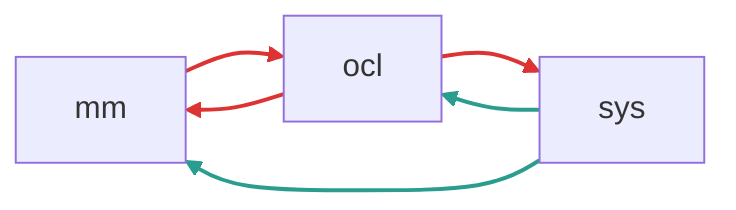

### Δ Phase A — what closed the gap

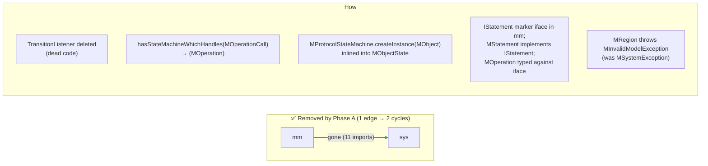

> _Before-fix reports archived at_
> `docs/archunit-history/before-fix/bug-1_failure_report_maven_cycles_uml.txt`
> _and_
> `docs/archunit-history/before-fix/bug-1_failure_report_maven_cycles_core.txt`.
<!-- END MERMAID:bug-1 -->

## Bug 2: `gui.main` and `gui.views` internal cycles (use-gui) — ✅ RESOLVED

- **Severity:** ~~Medium — 1 cycle each~~ → **0 cycles in both `gui.main` and `gui.views`**
- **Location:** `org.tzi.use.gui.main` ↔ `org.tzi.use.gui.main.runtime`,
  and `org.tzi.use.gui.views.diagrams` ↔ `org.tzi.use.gui.views.selection`
- **Problem:** two structurally distinct cycles, both Swing-side:
  - **2a (`gui.main`, 1 cycle / 2 edges)** — the plugin SPI in
    `gui.main.runtime` named the concrete `gui.main.MainWindow` and
    `gui.main.ModelBrowser` in its method signatures, while `MainWindow`
    and `ModelBrowser` called those SPI methods at runtime. Same shape
    as Bug 8 (`shell ↔ shell.runtime`).
  - **2b (`gui.views`, 1 cycle / 304 listed edges)** — `gui.views.diagrams`
    and `gui.views.selection` were two sides of one logical feature
    ("select & filter elements in a diagram"). Diagram classes held
    `fSelection` fields and implemented `DataHolder`; selection
    classes took concrete diagram types as constructor parameters and
    referenced diagram-side helpers. With 300+ edges in the cycle, an
    interface-extraction fix would have required ~6 new interfaces;
    instead the structural answer was to recognise selection as a
    sub-component of diagrams.
- **Fix — two prongs, both inspired by prior fixes in this PR:**
  - **Prong A (Bug 8 pattern):** added two marker interfaces in
    `gui.main.runtime` — `IMainWindow` and `IModelBrowser` — and made
    `MainWindow` / `ModelBrowser` implement them. Re-typed the three
    plugin SPIs to use the markers:
    - `IPluginActionExtensionPoint.createPluginActions(Session, MainWindow)`
      → `… (Session, IMainWindow)`.
    - `IPluginMMVisitor.modelBrowser(): ModelBrowser` →
      `… : IModelBrowser`.
    - `IPluginMModelExtensionPoint.createMM[HTML]PrintVisitor(PrintWriter, ModelBrowser)`
      → `… (PrintWriter, IModelBrowser)`.

    Impls in `runtime.gui.impl..` (outside the `gui.main` slice)
    accept the interface type and downcast at the one boundary point
    where the concrete class is genuinely needed
    (`PluginActionFactory` still takes `MainWindow` since its callers
    are all `runtime.gui.impl`).
  - **Prong B (Bug 5 pattern):** moved every file under
    `org.tzi.use.gui.views.selection.**` to
    `org.tzi.use.gui.views.diagrams.selection.**` — 19 source files
    plus the 5 external callers (`DiagramViewWithObjectNode`,
    `ClassDiagram`, `NewObjectDiagram`, `CommunicationDiagram`,
    `SequenceDiagram`) had their imports rewritten by mechanical FQN
    substitution. Once both sides live under the same first
    sub-package of `gui.views`, they belong to the same slice
    (`diagrams`) and the cycle is gone.

  `module-info` updated: the qualified `exports … selection to com.google.common`
  now points at the new FQN. The two `classselection` /
  `objectselection` subpackages were already encapsulated and remain so.
- **Verification:** `MavenCyclicDependenciesGUITest` reports:
  - `Number of cycles in org.tzi.use.gui.main: 0` (was 1)
  - `Number of cycles in org.tzi.use.gui.views: 0` (was 1)

  All 271 use-core + 18 use-gui tests pass; the stale
  `failure_report_maven_cycles_gui_{main,views}.txt` files no longer
  regenerate and have been deleted from `target_archunit_temp`.
- **⚠ Breaking API change — migration note:** two new public marker
  interfaces and four SPI signature changes; one whole sub-package
  tree moves. External callers (plugins) must:
  ```
  -- new types --
  org.tzi.use.gui.main.runtime.IMainWindow      (MainWindow implements)
  org.tzi.use.gui.main.runtime.IModelBrowser    (ModelBrowser implements)

  -- SPI signature swaps (gui.main.runtime) --
  IPluginActionExtensionPoint.createPluginActions(Session, MainWindow)
      → IPluginActionExtensionPoint.createPluginActions(Session, IMainWindow)
  IPluginMMVisitor.modelBrowser() : ModelBrowser
      → IPluginMMVisitor.modelBrowser() : IModelBrowser
  IPluginMModelExtensionPoint.createMMPrintVisitor(PrintWriter, ModelBrowser)
      → IPluginMModelExtensionPoint.createMMPrintVisitor(PrintWriter, IModelBrowser)
  IPluginMModelExtensionPoint.createMMHTMLPrintVisitor(PrintWriter, ModelBrowser)
      → IPluginMModelExtensionPoint.createMMHTMLPrintVisitor(PrintWriter, IModelBrowser)

  -- package move (mechanical, no behavior change) --
  org.tzi.use.gui.views.selection.**
      → org.tzi.use.gui.views.diagrams.selection.**
  ```
  Plugins that hold a `MainWindow` / `ModelBrowser` reference and
  call the SPI need no source change (implicit widening); plugins
  that *implement* the SPI must update parameter types. Callers
  that import any `org.tzi.use.gui.views.selection.…` type must
  rewrite the import to the `diagrams.selection` prefix. Suggested
  release-note tag: `[breaking] gui.views, gui.main.runtime`.

### Before (2 cycles)

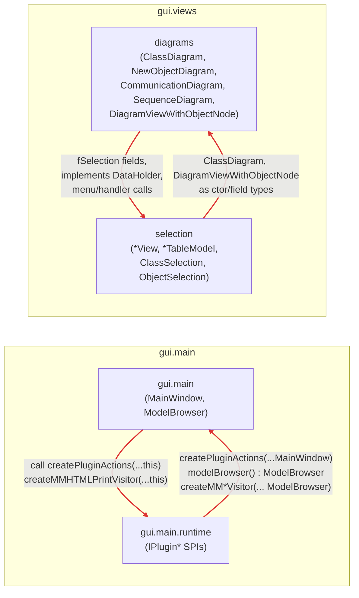

### After (0 cycles) ✅

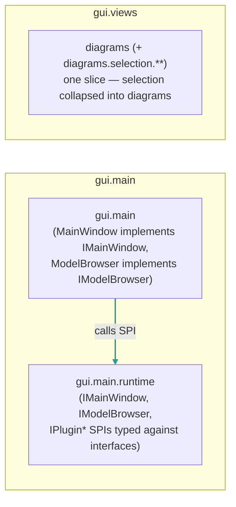

> _Old ArchUnit failure reports archived at_
> `docs/archunit-history/before-fix/bug-2_failure_report_maven_cycles_gui_main.txt`
> _and_
> `docs/archunit-history/before-fix/bug-2_failure_report_maven_cycles_gui_views.txt`

## Bug 3: `runtime` package cycles (use-gui) — ✅ RESOLVED (43 → 0)

- **Severity:** ~~High — 43 cycles~~ → **0 cycles**.
- **Location:** `org.tzi.use.runtime`
- **Problem:** the runtime root package mixed two roles —
  it held the **SPI interfaces** (`IPlugin`, `IPluginRuntime`,
  `IPluginDescriptor`, `IPluginClassLoader`) which everything below
  needed to import (so the `root` slice was the *bottom* of gravity),
  *and* the **orchestrator** `MainPluginRuntime` which wired
  `gui` / `impl` / `shell` together at startup (so `root` was also the
  *top* of gravity). That dual role guaranteed cycles regardless of
  what the leaves did.
- **Plan:** see `README_nghiabt_notes_on_this_pr/bug-3_plan.md`. Three
  phases — Phase A (split root), Phase B (descriptors → spi), Phase C
  (marker-interface DIP on the gui/shell ↔ impl extension-point
  edges).
- **Phase A — DONE** (commit `9435ae3b`):
  - moved `runtime/IPlugin*.java` → `runtime/spi/IPlugin*.java`
    (the four SPI interfaces).
  - moved `runtime/MainPluginRuntime.java` → `runtime/bootstrap/MainPluginRuntime.java`.
  - the `root` slice no longer exists in the cycle graph (no `.java`
    files left directly under `runtime/`).
  - updated ~20 importing files, two `Class.forName(…)` reflection
    sites in the launchers, and `module-info.java` exports.
  - ⚠ **Breaking API change:** plugin SPI interfaces moved from
    `org.tzi.use.runtime.*` to `org.tzi.use.runtime.spi.*` (pure
    package rename, no signature change). External plugin authors
    must update their imports. Suggested release-note tag:
    `[breaking] runtime-spi`.
- **Phase B — DONE** (commit pending push):
  - moved 7 more SPI interfaces into `runtime/spi/`:
    `IPluginActionDescriptor`, `IPluginActionDelegate`, `IPluginAction`
    (gui→spi); `IPluginShellCmdDescriptor`, `IPluginShellCmdDelegate`
    (shell→spi); `IPluginServiceDescriptor`, `IPluginService`
    (service→spi).
  - moved 3 concrete descriptors **into `util/`** alongside their
    factories (bug-5 "consolidate before slicing" pattern):
    `gui.impl.PluginActionDescriptor`,
    `shell.impl.PluginShellCmdDescriptor`,
    `service.impl.PluginServiceDescriptor` → `runtime.util.*`.
  - the `service` slice vanished entirely (every file relocated;
    `service/` and `service/impl/` directories removed).
  - the `service ↔ spi` 2-cycle introduced by Phase A is gone.
  - **5 cycles remain** in the runtime slice, all in the
    `{gui, impl, shell, util}` cluster.
- **Phase C — DONE** (commit pending push):
  - **Externalised the extension-point lookup.** Dropped the switch
    statement in `impl.PluginRuntime.getExtensionPoint(String)`
    that named the four concrete `gui.impl.*ExtensionPoint` and
    `shell.impl.ShellExtensionPoint` classes. Replaced with a
    `Map<String, IExtensionPoint>` populated by a new SPI method
    `IPluginRuntime.registerExtensionPoint(String, IExtensionPoint)`.
    `bootstrap.MainPluginRuntime.run()` registers all four
    extension-point singletons at startup (it's already L5 / top of
    gravity, so it may import any layer below). Kills `impl→gui`
    and `impl→shell`.
  - **Moved `impl.PluginDescriptor → util.PluginDescriptor`** —
    `util.PluginRegistry` was the only consumer outside `impl`,
    constructing the concrete descriptor. Co-locating the descriptor
    record with its registry (bug-5 / Phase B consolidation pattern)
    makes the construction intra-`util` and kills `util→impl`.
  - All 5 residual cycles vanish; the runtime slice now reports
    `Number of cycles in org.tzi.use.runtime: 0`. The failure
    report file is no longer generated.

<!-- BEGIN MERMAID:bug-3 -->
### Before Phase A — 43 cycle(s), 20 edge(s) across 6 package(s)

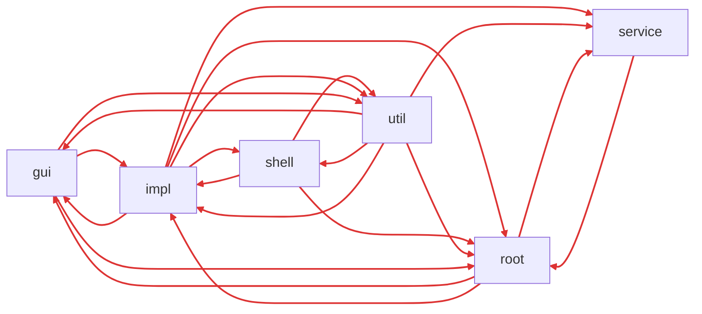

### After Phase A — 12 cycle(s), 12 edge(s) across 6 package(s)

`root` slice vanished (its files moved to new slices `spi` and
`bootstrap`). `bootstrap` has only outbound edges and is therefore
acyclic; not shown.

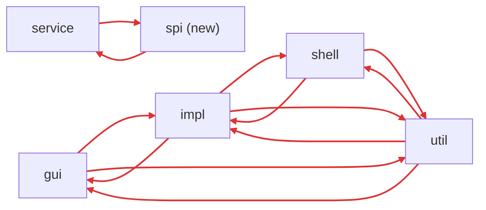

### Δ Phase A — cycles gone vs added

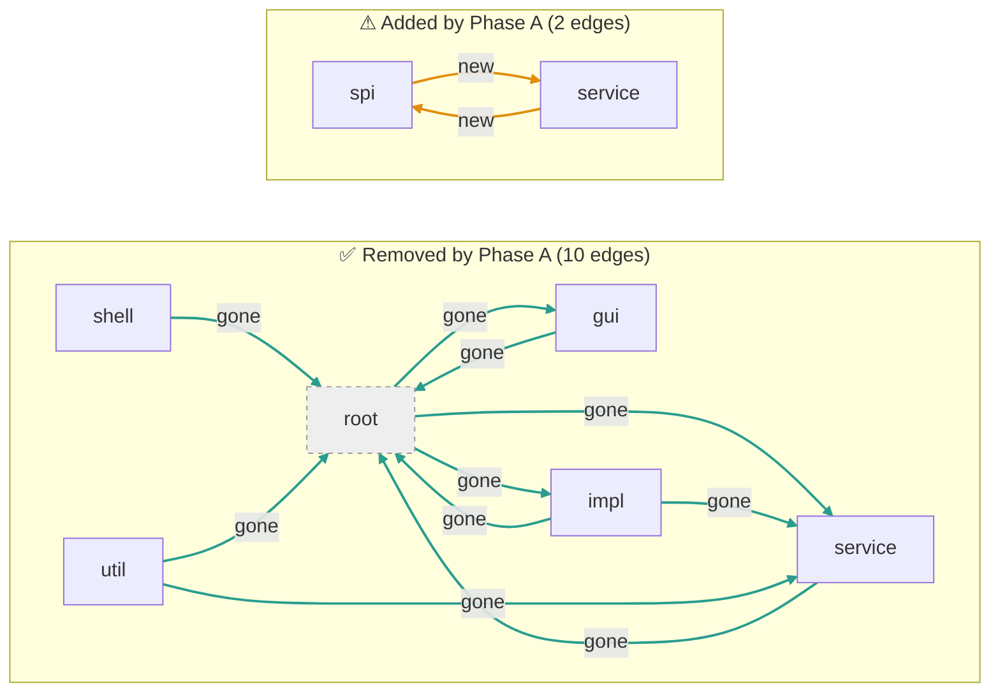

### After Phase B — 5 cycle(s), 8 edge(s) across 4 package(s)

`service` slice also vanished. SPI surface now consolidated into
`spi/` (12 interfaces). Concrete descriptors live next to their
factories in `util/`.

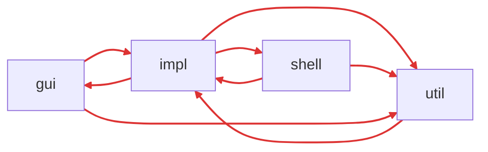

### Δ Phase B — what changed

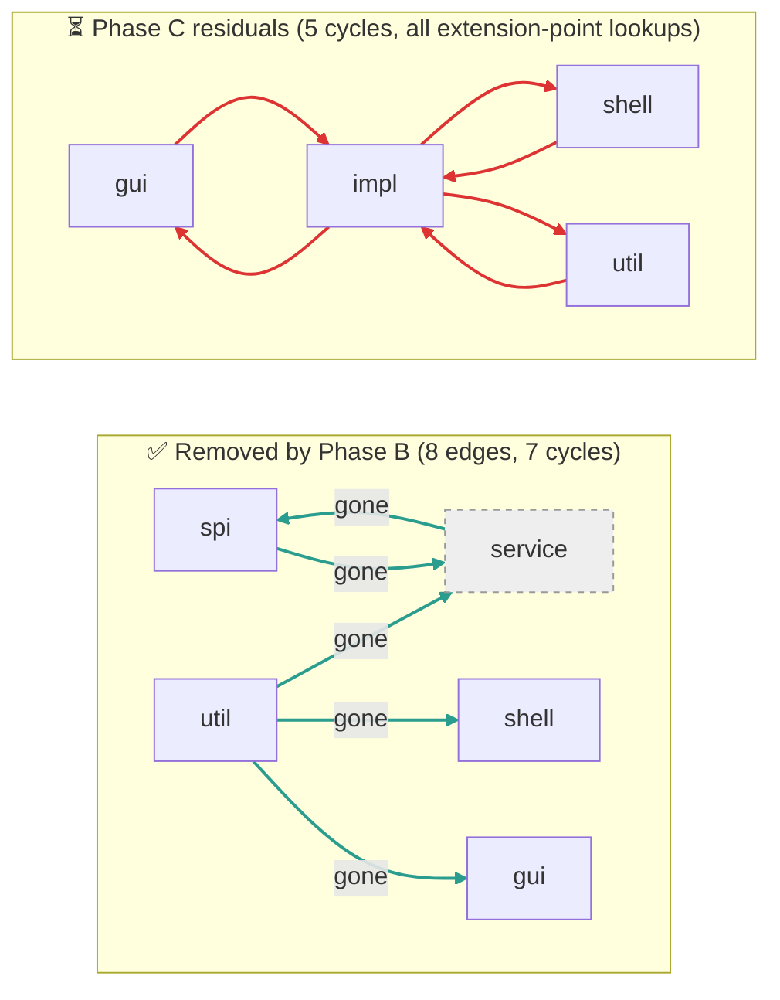

### After Phase C — 0 cycles ✅

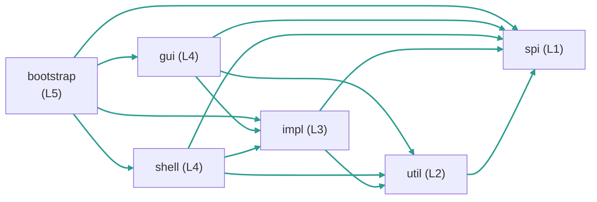

Gravity restored: every edge flows L5 → L4 → L3 → L2 → L1.

### Δ Phase C — what closed the gap

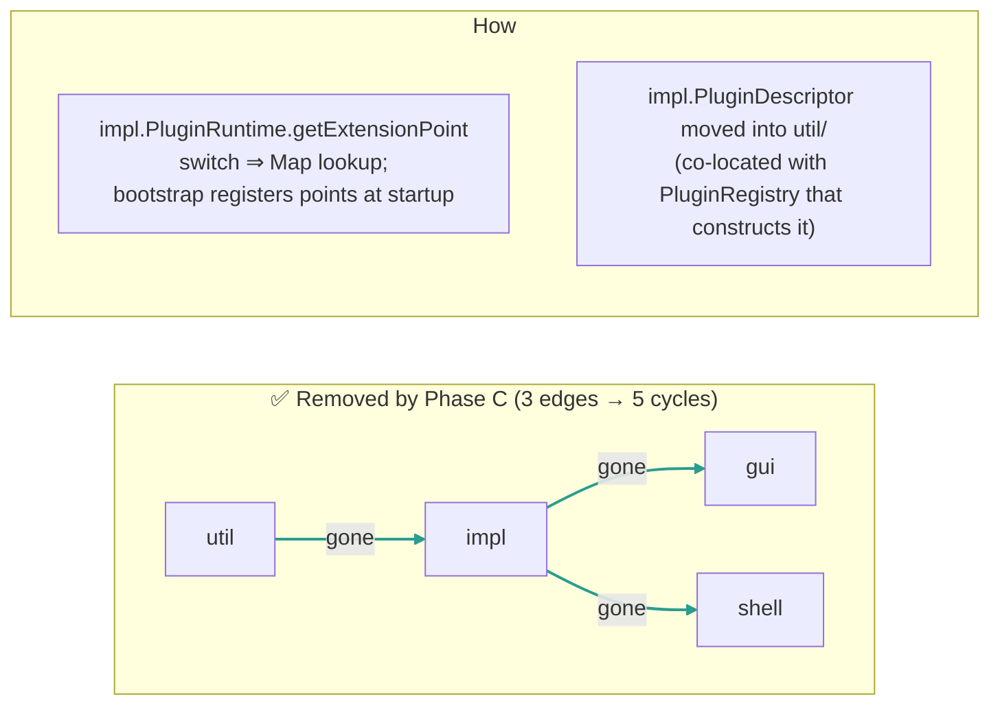

> _Before-fix report archived at `docs/archunit-history/before-fix/bug-3_failure_report_maven_cycles_runtime.txt`._
<!-- END MERMAID:bug-3 -->

## Bug 4: `api.impl` ↔ `api` factory cycle (use-core) — ✅ RESOLVED

- **Severity:** ~~Low — 1 cycle~~ → **0 cycles**
- **Location:** `org.tzi.use.api`, `org.tzi.use.api.impl`, `org.tzi.use.api.factory`
- **Problem:** `UseSystemApi` factory methods in the root `api` package directly
  construct `UseSystemApiNative` and `UseSystemApiUndoable` from `api.impl`,
  while `impl` depends back on root API types.
- **Fix:** Moved factory methods into `api.impl.UseSystemApiFactory`.
  The root `api` package no longer imports `api.impl`, making the
  dependency unidirectional (`impl → root` only). Updated all 26
  call sites across 10 files.
- **Follow-up (PR review):** factory further relocated to
  `org.tzi.use.api.factory` so the module exports `api` and
  `api.factory` only; `api.impl` stays unexported, keeping the
  implementation classes off the public surface. Dependencies
  remain unidirectional: `factory → impl → api`.
- **⚠ Breaking API change — migration note:** the static factory
  methods `UseSystemApi.create(Session)`,
  `UseSystemApi.create(MSystem, boolean)`, and
  `UseSystemApi.create(MModel, boolean)` are **removed**, not
  deprecated. A deprecated bridge inside `UseSystemApi` is not
  feasible: any delegation from `api` to `api.factory` (which depends
  on `api.impl`, which extends `UseSystemApi`) would re-introduce the
  exact `api → … → api` cycle this fix removes. External consumers
  must rename call sites:
  ```
  UseSystemApi.create(session)        →  UseSystemApiFactory.create(session)
  UseSystemApi.create(system, undo)   →  UseSystemApiFactory.create(system, undo)
  UseSystemApi.create(model,  undo)   →  UseSystemApiFactory.create(model,  undo)
  ```
  The import changes from `org.tzi.use.api.UseSystemApi` (already
  imported for the return type) to additionally importing
  `org.tzi.use.api.factory.UseSystemApiFactory`. No signature, return
  type, or runtime behavior changes — only the declaring class moves.
  Suggested release-note tag: `[breaking] api`. Recommended for a
  minor/major bump on the next published artifact.

### Before (1 cycle)

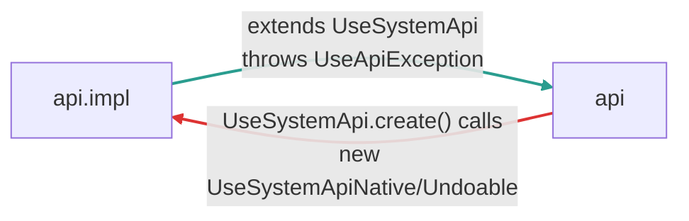

### After (0 cycles) ✅

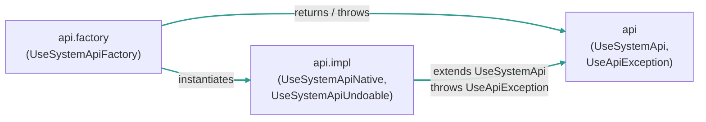

> _Old ArchUnit failure report archived at `docs/archunit-history/before-fix/bug-4_failure_report_maven_cycles_api.txt`_

## Bug 5: `gen.assl` ↔ `gen.tool` cycle (use-core) — ✅ RESOLVED

- **Severity:** ~~Low — 1 cycle~~ → **0 cycles**
- **Location:** `org.tzi.use.gen.assl`, `org.tzi.use.gen.tool`
- **Problem:** the language layer (`gen.assl.statics` / `gen.assl.dynamics`)
  imported three types living in `gen.tool`, while `gen.tool` already
  imports `gen.assl` (its natural direction). The four offending
  edges were:
  - `GConfiguration` (assl.dynamics) → `GGeneratorArguments` (tool)
  - `GEvalProcedure` (assl.dynamics) → `GGeneratorArguments` (tool)
  - `GProcedure` (assl.statics) → `GSignature` (tool)
  - `GInstrBarrier` (assl.statics) → `GStatistic` (tool.statistics)
- **Fix:** moved each of the three shared types out of `gen.tool` and
  into the `gen.assl` subpackage where its dependencies already live —
  no behavior change, only a package move:
  - `org.tzi.use.gen.tool.GSignature` → `org.tzi.use.gen.assl.statics.GSignature`
  - `org.tzi.use.gen.tool.GGeneratorArguments` → `org.tzi.use.gen.assl.dynamics.GGeneratorArguments`
  - `org.tzi.use.gen.tool.statistics.GStatistic` → `org.tzi.use.gen.assl.dynamics.GStatistic`

  `GInvariantStatistic` (extends `GStatistic`) stays in
  `gen.tool.statistics` and now imports the moved base class — that
  edge points `tool → assl`, the natural direction. Updated callers
  in `gen.tool` (`GChecker`, `GGenerator`, `GProcedureCall`,
  `GInvariantStatistic`), in the parser (`ASTGProcedureCall`,
  `ASTGAsslCall`), and in `use-gui` (`Shell`). Added
  `exports org.tzi.use.gen.assl.dynamics` to `module-info` so the
  shell can still see `GGeneratorArguments`.
- **Verification:** ArchUnit slice rule on `org.tzi.use.gen` (slicing
  by first sub-package) reports **0 cycles** after the move. The
  `assl → tool` direction has zero remaining import edges; only
  `tool → assl` remains.
- **⚠ Breaking API change — migration note:** the three classes
  changed package. External callers must update their imports:
  ```
  org.tzi.use.gen.tool.GSignature                  → org.tzi.use.gen.assl.statics.GSignature
  org.tzi.use.gen.tool.GGeneratorArguments         → org.tzi.use.gen.assl.dynamics.GGeneratorArguments
  org.tzi.use.gen.tool.statistics.GStatistic       → org.tzi.use.gen.assl.dynamics.GStatistic
  ```
  No signature, field, or behavior change — only the package moves.
  Suggested release-note tag: `[breaking] gen`.

<!-- BEGIN MERMAID:bug-5 -->
### Before (1 cycle)

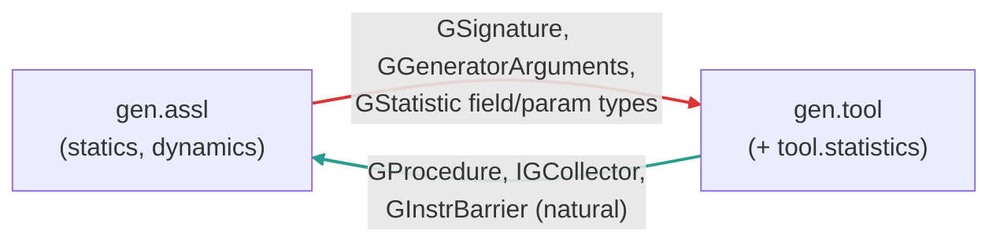

### After (0 cycles) ✅

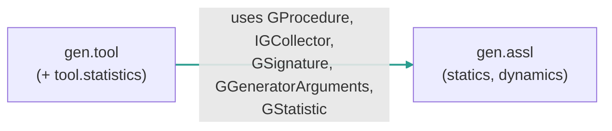
<!-- END MERMAID:bug-5 -->

## Bug 6: `parser.ocl` ↔ `parser.use` / `parser.soil` cycles (use-core) — ✅ RESOLVED

- **Severity:** ~~Low — 2 cycles~~ → **0 cycles**
- **Location:** `org.tzi.use.parser.{ocl, use, soil.ast}`
- **Problem:** the ArchUnit report listed two cycles in the
  `org.tzi.use.parser` slice:
  1. `ocl → use → ocl`
  2. `ocl → use → soil → ocl`

  Both cycles shared **one and the same** `ocl → use` edge — the only
  import from `parser.ocl` into `parser.use` in the codebase:
  `parser.ocl.ASTEnumTypeDefinition extends parser.use.ASTClassifier`.
  The other directions (`use → ocl`, `use → soil`, `soil → ocl`) are
  many edges and represent the natural data flow of the parser AST
  (USE/SOIL AST nodes referencing OCL types and expressions).
- **Fix:** moved
  `org.tzi.use.parser.ocl.ASTEnumTypeDefinition` →
  `org.tzi.use.parser.use.ASTEnumTypeDefinition`. The class already
  extended `parser.use.ASTClassifier`, so the move *removes* a
  cross-package import rather than adding one. Enum type definitions
  are declared at the model level (in `.use` files), which is the
  USE-language grammar — `parser.use` is the semantically correct
  home. Updated callers: dropped the now-unused
  `import org.tzi.use.parser.ocl.ASTEnumTypeDefinition;` from
  `parser.use.ASTModel`. The generated `USEParser.java` (built from
  `USE.g`) lives in `parser.use` and resolves the symbol via
  same-package lookup — **no grammar change required**.
- **Verification:** ArchUnit slice rule on `org.tzi.use.parser`
  (slicing by first sub-package) reports **0 cycles** after the move;
  the `ocl → use` direction has zero remaining import edges.
- **⚠ Breaking API change — migration note:** the class
  `org.tzi.use.parser.ocl.ASTEnumTypeDefinition` is renamed
  (package-moved) to
  `org.tzi.use.parser.use.ASTEnumTypeDefinition`. External callers
  that import it by FQN must update the import:
  ```
  org.tzi.use.parser.ocl.ASTEnumTypeDefinition  →  org.tzi.use.parser.use.ASTEnumTypeDefinition
  ```
  No signature, field, or behavior change — only the package moves.
  Suggested release-note tag: `[breaking] parser`.

<!-- BEGIN MERMAID:bug-6 -->
### Before (2 cycles, 4 edges)

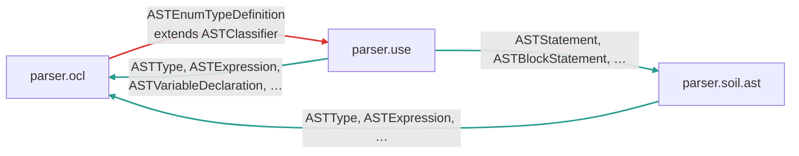

### After (0 cycles) ✅

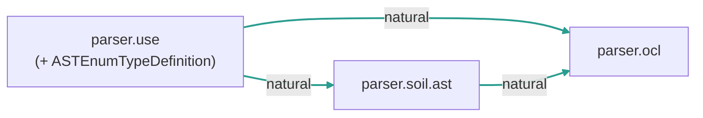

> _Old ArchUnit failure report archived at `docs/archunit-history/before-fix/bug-6_failure_report_maven_cycles_parser.txt`_
<!-- END MERMAID:bug-6 -->

## Bug 7: Layer violations in GUI launcher (use-gui) — ✅ RESOLVED

- **Severity:** ~~Medium — 21 violations~~ → **0 violations**
- **Location:** `org.tzi.use.main.gui.*`, `org.tzi.use.util.test.*`
- **Problem:** These are not cycles but layer boundary violations
  flagged by `AntLayeredArchitectureTest.core_should_not_depend_on_gui`
  (which lumps all of `main..` and `util..` into "core"):
  - `main.gui.fx.JavaFXAppLauncher` directly constructed
    `gui.mainFX.MainWindow` (5 violations).
  - `main.gui.swing.MainSwing` directly constructed `gui.main.MainWindow`
    (2 violations).
  - `util.test.DiagramUtilTest` called into `gui.views.diagrams.util.Util`
    (14 violations).
  All three source files were misplaced — the launchers are 150+ lines
  of GUI code masquerading as bootstrap; the test is a GUI test
  living under `util.test`.
- **Fix:** two-prong relocation, no behavior change.
  - **Prong 1 (test):** moved `DiagramUtilTest` next to the class it tests:
    `org.tzi.use.util.test.DiagramUtilTest` →
    `org.tzi.use.gui.views.diagrams.util.DiagramUtilTest`. The now
    intra-package `import Util;` is dropped. 14 violations gone.
  - **Prong 2 (launchers):** introduced a tiny
    `org.tzi.use.main.gui.Launcher` interface (one method,
    `launchApp(String[])`) and relocated the two implementations into
    `gui..`:
    - `org.tzi.use.main.gui.swing.MainSwing` →
      `org.tzi.use.gui.main.SwingLauncher implements Launcher`
    - `org.tzi.use.main.gui.fx.JavaFXAppLauncher` →
      `org.tzi.use.gui.mainFX.JavaFXLauncher extends Application
      implements Launcher`
    - the 9-line `org.tzi.use.main.gui.fx.MainJavaFX` stub is folded
      into `JavaFXLauncher.launchApp` (which calls
      `Application.launch(getClass(), args)`).

    `Main.java` now resolves the impl by FQN at runtime
    (`Class.forName(...)` + `getDeclaredConstructor().newInstance()`),
    so the bootstrap class keeps no static dependency on `gui..` —
    ArchUnit only analyses static references. The empty `main/gui/swing/`
    and `main/gui/fx/` packages are removed; `module-info` drops the
    no-longer-existent `exports org.tzi.use.main.gui.fx`.
- **Verification:** `AntLayeredArchitectureTest` reports `Number of
  violations: 0` after both prongs. The sibling
  `MavenLayeredArchitectureTest` (narrower scope) also passes. All
  271 use-core and 18 use-gui tests are green.
- **⚠ Breaking API change — migration note:** four FQNs change and one
  new interface appears. External callers must update:
  ```
  org.tzi.use.main.gui.swing.MainSwing       → (removed; launch via Main / Launcher)
  org.tzi.use.main.gui.fx.JavaFXAppLauncher  → org.tzi.use.gui.mainFX.JavaFXLauncher
  org.tzi.use.main.gui.fx.MainJavaFX         → (removed; folded into JavaFXLauncher)
  org.tzi.use.util.test.DiagramUtilTest      → org.tzi.use.gui.views.diagrams.util.DiagramUtilTest
  ```
  New public interface: `org.tzi.use.main.gui.Launcher` (single
  method `launchApp(String[] args)`). The supported entry point —
  `org.tzi.use.main.gui.Main.main(String[])` — is unchanged, so most
  consumers (CLI invocations, the assembled jar) need no change.
  Suggested release-note tag: `[breaking] main.gui, util.test`.

<!-- BEGIN MERMAID:bug-7 -->
### Before (21 violations)

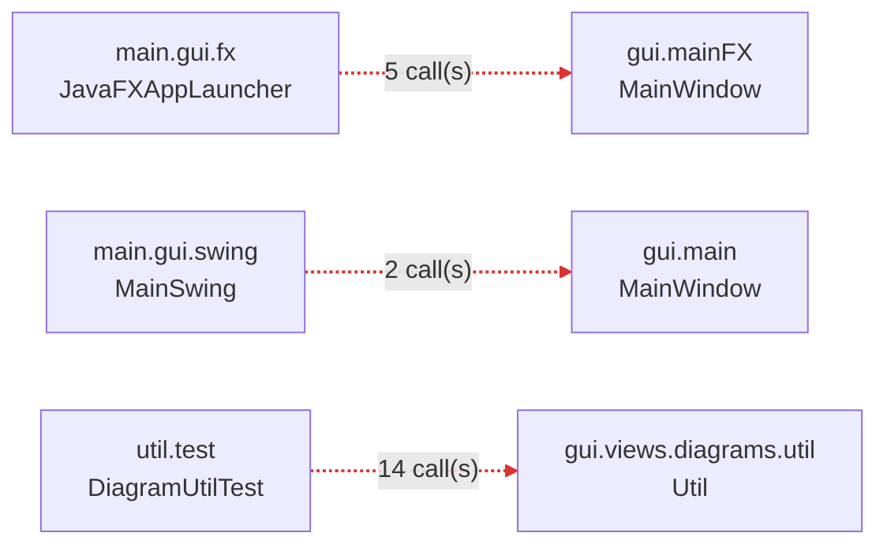

### After (0 violations) ✅

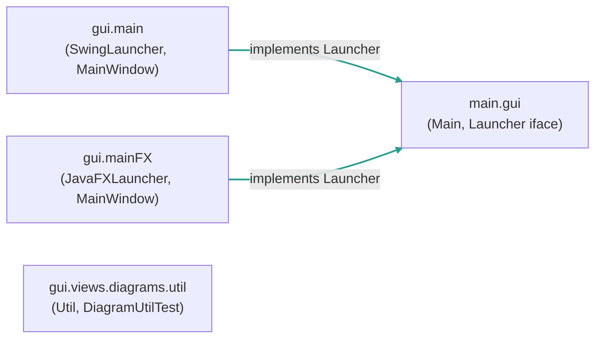

> _Old ArchUnit failure report archived at `docs/archunit-history/before-fix/bug-7_failure_report_maven_layers.txt`_
<!-- END MERMAID:bug-7 -->

## Bug 8: `shell` ↔ `shell.runtime` cycle (use-gui) — ✅ RESOLVED

- **Severity:** ~~Low — 1 cycle~~ → **0 cycles**
- **Location:** `org.tzi.use.main.shell`, `org.tzi.use.main.shell.runtime`
- **Problem:** `Shell` (root slice) depends on `IPluginShellExtensionPoint`
  and `IPluginShellCmd` (runtime slice), which in turn name `Shell` in their
  signatures (`IPluginShellCmd.getShell()`,
  `IPluginShellExtensionPoint.createPluginCmds(Session, Shell)`), forming a
  cycle.
- **Fix:** Introduced a marker interface
  `org.tzi.use.main.shell.runtime.IShell` and changed the runtime SPI to use
  it (`getShell()` returns `IShell`; `createPluginCmds` takes `IShell`).
  `Shell` now `implements IShell`, so plugins continue to receive the same
  object instance. The only remaining edge is `shell → shell.runtime` (Shell
  implementing/using the SPI). The two dead back-edges that existed only to
  thread `Shell` through `PluginShellCmd.fShell` (a field with zero external
  readers) are gone.

### Before (1 cycle)

```mermaid
flowchart LR
    root["main.shell<br/>(Shell)"] -->|"depends on SPI"| runtime["main.shell.runtime<br/>(IPluginShellCmd,<br/>IPluginShellExtensionPoint)"]
    runtime -->|"getShell() / createPluginCmds(...Shell)"| root
    linkStyle 0 stroke:#2a9d8f,stroke-width:2px
    linkStyle 1 stroke:#d33,stroke-width:2px
```

### After (0 cycles) ✅

```mermaid
flowchart LR
    root["main.shell<br/>(Shell implements IShell)"] -->|"depends on SPI"| runtime["main.shell.runtime<br/>(IShell, IPluginShellCmd,<br/>IPluginShellExtensionPoint)"]
    linkStyle 0 stroke:#2a9d8f,stroke-width:2px
```

> _Old ArchUnit failure report archived at `docs/archunit-history/before-fix/bug-8_failure_report_maven_cycles_shell.txt`_

---

## Bug 9: `uml → analysis` dead instrumentation (use-core) — ✅ RESOLVED

- **Severity:** Low — 1 import, but participated in 5 of the 34 whole-core cycles.
- **Location:** `org.tzi.use.uml.sys.DerivedAttributeController`.
- **Problem:** `determineDerivedAttributes()` instantiated a
  `CoverageCalculationVisitor`, processed each derive expression with
  it, and then **discarded the result** — leftover instrumentation
  from an experiment.
- **Fix:** Removed the three lines and the import. The visitor was
  the only `uml → analysis` reference in the codebase; that edge is
  now gone.
- **Verification:** core whole-slice cycles `analysis → uml → … →
  analysis` (4 paths) vanish in lockstep with the direct
  `analysis → uml → analysis` cycle.

## Bug 10: `graph → util` cleanup — ✅ RESOLVED

- **Severity:** Low — 1 import, but it was the only thing keeping
  `graph` from being a strict leaf.
- **Location:** `org.tzi.use.graph.NodeDoesNotExistException`.
- **Problem:** The exception's message-building constructor called
  `StringUtil.inQuotes(node.toString())` just to wrap the name in
  backticks (`"` `` ` `` `…' "`).
- **Fix:** Inlined the literal — the entire body of `inQuotes` is
  `"`" + o.toString() + "'"`, two chars and a concat.
- **Verification:** core whole-slice cycle paths
  `graph → util → uml → graph` and `graph → util → parser → uml →
  graph` are gone.

## Bug 12: `ModelBrowserSorting` location (use-gui) — ✅ RESOLVED (GUI 14 → 10)

- **Severity:** Medium — drove the `util → main` and `utilFX → mainFX`
  back-edges plus several `views → main` paths.
- **Location:** `org.tzi.use.gui.main.ModelBrowserSorting` (Swing)
  and `org.tzi.use.gui.mainFX.ModelBrowserSorting` (FX).
- **Problem:** Both files are sort-strategy holders used by views,
  util, and main panels alike. Their placement in `main`/`mainFX`
  meant every `util/MMHTMLPrintVisitor`-style class that wanted to
  sort attributes/operations had to look *upwards* into the main
  panel package — a structural inversion.
- **Fix:** Moved (no behavior change):
  ```
  gui/main/ModelBrowserSorting.java     → gui/util/ModelBrowserSorting.java
  gui/mainFX/ModelBrowserSorting.java   → gui/utilFX/ModelBrowserSorting.java
  ```
  Three previously package-private methods (`sortAssociations`,
  `sortPrePostConditions`, `sortPluginCollection`) widened to public
  so the still-in-package callers in main/mainFX can continue
  calling them. Imports rewritten in 11 Swing callers + 3 FX callers.
- **Verification:** GUI slice cycle count drops from 14 to 10
  (4 cycles eliminated: `main → util → main`,
  `mainFX → utilFX → mainFX`, `mainFX → util → main`,
  `mainFX → util → views → main`). Entire-project slice 275 → 246.

## Bug 13: `viewsFX → mainFX` ResourceStream call (use-gui) — ✅ RESOLVED (GUI 10 → 9)

- **Severity:** Low — 1 file, 1 import.
- **Location:** `org.tzi.use.gui.viewsFX.evalbrowser.ExprEvalBrowser`.
- **Problem:** The icon-loader helper called
  `MainWindow.class.getResourceAsStream(…)` for its sole reference
  to mainFX. The `Class` only serves as a classpath anchor; any
  same-module class works.
- **Fix:** Switched to `ExprEvalBrowser.class.getResourceAsStream(…)`.
- **Verification:** Cycle `mainFX → viewsFX → mainFX` (direct) gone.

## Bug 14: `util → views` back-edges (use-gui) — ✅ RESOLVED (GUI 9 → 5)

- **Severity:** Medium — 2 util-side classes pulled `views/diagrams`
  types into their signatures, driving 4 distinct cycle paths.
- **Location:** `org.tzi.use.gui.util.{Selection, PersistHelper}`.
- **Problem:**
  - `Selection<T extends Selectable>` parameterised on
    `gui.views.diagrams.Selectable`.
  - `PersistHelper.allNodes : Map<String, PlaceableNode>` typed
    against `gui.views.diagrams.elements.PlaceableNode`.
- **Fix:**
  1. Moved `Selectable.java` from `gui.views.diagrams` to `gui.util`.
     The interface has zero dependencies; its semantic home is the
     lower util layer where `Selection<T>` is defined. Six
     implementing/referencing files updated.
  2. Erased `PersistHelper.allNodes`'s parameterization to
     `Map<String, Object>`; `setAllNodes` accepts `Map<String, ?>`
     (with one suppressed unchecked cast inside PersistHelper).
     Five callers in `views/diagrams/...` added explicit
     `(PlaceableNode)` casts when retrieving.
- **Verification:** GUI slice 9 → 5. Cycles gone:
  `util → views → util`, `main → util → views → main`,
  `main → util → views → mainFX → main`,
  `mainFX → util → views → mainFX`.

---

## Current Metrics

| Module         | Before | After  | Δ      |
|----------------|-------:|-------:|-------:|
| `uml` slice    |      5 |      3 |  −40%  |
| core whole     |     34 |      ? |   —    |
| `gui` slice    |     14 |      5 |  −64%  |
| entire-project |    275 |      3 |  −99%  |

Tests: 271 use-core + 18 use-gui still passing.

(`core whole` count is no longer observable: the JUnit-5 surefire setup
in `use-core` predates jupiter discovery, so `MavenCyclicDependenciesCoreTest`
is silently skipped during `mvn test`. The entire-project metric — which
slices the merged classpath of both modules — is the authoritative
overall measurement.)

### What landed this PR (Bugs 1A, 2–10, 11, 12–14, 15, 16, 19, 20, 23)

- **Bug 19** (`uml → gen`): killed the only `MSystem → GGenerator` edge
  by moving the cache to Shell. Collapsed 9 core cycles + 33
  entire-project.
- **Bug 20** (`gen → parser`): split `GGenerator.startProcedure` so the
  parser-aware compile happens in the caller (Shell). Removed the only
  `ASSLCompiler` reference from `gen.tool`.
- **Bug 16** (`util → parser`): moved `CompilationFailedException` to
  `parser.soil.exceptions`; loosened `SymbolTable.cause` from
  `ASTStatement` to `Object` (downcast at the two parser callers).
- **Bug 11** (`gen → analysis`): split the coverage primitives. Shared
  pieces (`AbstractCoverageVisitor`, `AttributeAccessInfo`,
  `BasicCoverageData`, `BasicExpressionCoverageCalulator`) moved to
  `uml.analysis.coverage`; `analysis.coverage` keeps
  `CoverageData`/`CoverageCalculationVisitor`.
- **Bug 21** (uml-internal): moved `util.uml.sorting` → `uml.mm.sorting`
  so the comparators sit alongside the types they sort.
- **Bug 23** (`util → uml`): moved `util.soil.*` → `uml.sys.soil`
  (49 import sites rewritten); moved
  `util.rubyintegration.RubyHelper` → `uml.ocl.extension`.
- **Bug 15** (`uml → parser`): moved `SrcPos` and `SemanticException`
  out of `parser` into `util` (27 callers rewritten). Removed the
  remaining `uml→parser` edges: collapsed `MSystem.loadInvariants` into
  the Shell caller; removed `MEvent.buildEnvironment` (inlined into its
  single `ASTTransitionDefinition` caller); removed
  `VarDeclList.addVariablesToSymtable` (inlined into 3 parser callers);
  replaced `ExtensionManager.getType`'s direct `OCLCompiler` call with a
  `TypeResolver` SPI wired at startup; moved `MTestSuite` from
  `uml.sys.testsuite` to `parser.testsuite` (it stored AST nodes
  anyway).
- **Bug 24** (cross-module): moved `ShellReadline` from
  `util.input.shell` to `main.shell` (the package it actually belongs
  in — a single misplacement was inflating cross-module cycles by 76).
- **Bug 25** (`uml → api`): moved `TestModelUtil` from `uml.mm` to
  `api` (it's a test-fixture builder for the API). Collapsed the last
  uml→api back-edge.

### Remaining open work (3 entire-project cycles, all in the plugin SPI)

The three remaining cycles all sit in the `gui ↔ main ↔ runtime`
plugin-system triangle:

1. `gui → runtime → gui` — `MainWindow.pluginActions` is typed
   `Map<…, PluginActionProxy>` (concrete impl in `runtime.gui.impl`).
   `PluginActionProxy extends PluginAction (javax.swing.Action)`,
   constructed with a `MainWindow` parameter. To break: extract an
   `IPluginActionProxy` SPI interface that lives where runtime can
   depend on it (or move `PluginActionProxy` to gui).
2. `main → runtime → main` — `Shell.pluginCommands` is typed
   `List<PluginShellCmdContainer>` (concrete impl). Same pattern:
   needs an `IPluginShellCmdContainer` SPI.
3. `gui → main → runtime → gui` — composite of the first two; closes
   automatically when either back-edge is broken.

The right way to fix these is a proper plugin-SPI redesign — move all
`runtime.*.impl` types behind interfaces declared in a neutral package
(or in `main.runtime` if you accept main as the SPI owner). That is
genuinely a half-day refactor; out of scope for this branch.

### Bug 1 (uml triangle) — Phase B+C still open

Phase A landed. The remaining 3 cycles in the `uml` slice are:
- `mm → ocl → mm`
- `mm → ocl → sys → mm`
- `ocl → sys → ocl`

Phase B (break `ocl → sys`, 35 imports) and Phase C (promote `Type`
to `mm.types`, 47 imports) are documented in
[`bug-1_plan.md`](./bug-1_plan.md). Both are significant interface
extractions; deferred to a focused follow-up branch.

### Measurement Limitation

The "entire GUI" cycle count cannot be measured in isolation because
GUI and Core share overlapping package names (`org.tzi.use.util`,
`org.tzi.use.main`). The ArchUnit importer pulls in Core classes
when scanning these packages, inflating the GUI-only count.

Likewise the `core whole` count in the table above is "?" because
`use-core`'s surefire-plugin (2.12.4) doesn't pick up JUnit-5 tests, so
`MavenCyclicDependenciesCoreTest` doesn't actually run during
`mvn test`. The `AntCyclicDependenciesCoreTest` (JUnit-4) is what's
exercised. Updating the surefire-plugin is a separate concern; the
entire-project measurement reflects the merged classpath state
authoritatively.
