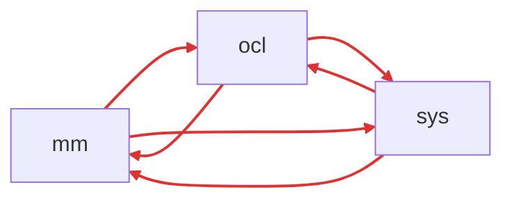
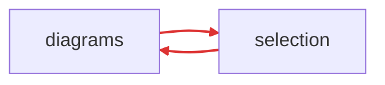
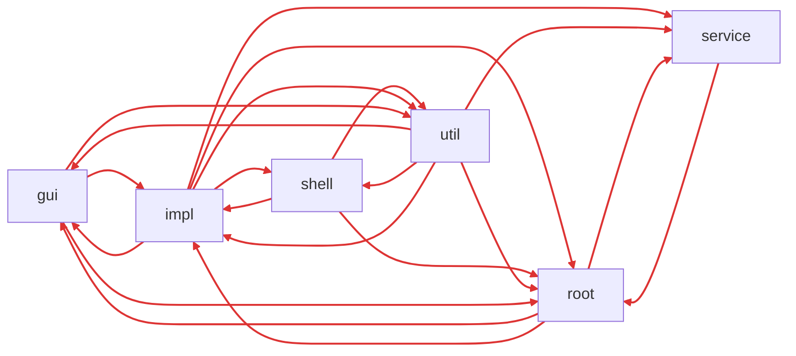
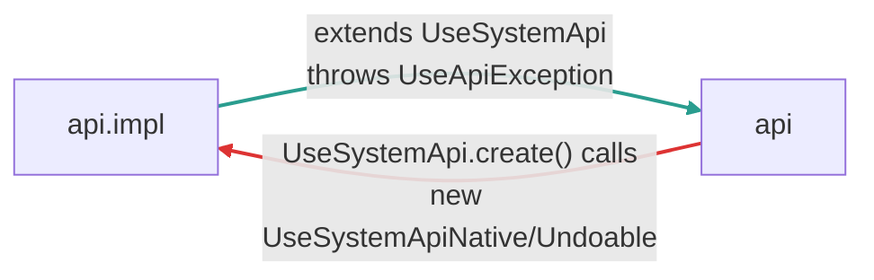
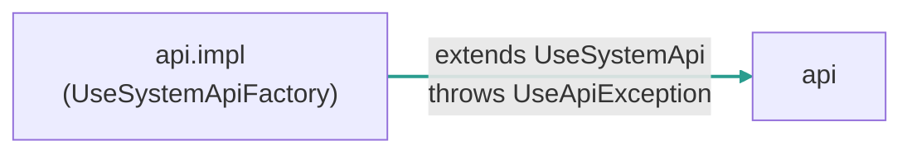
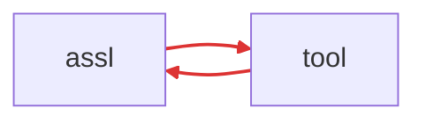
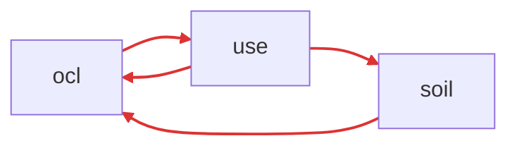
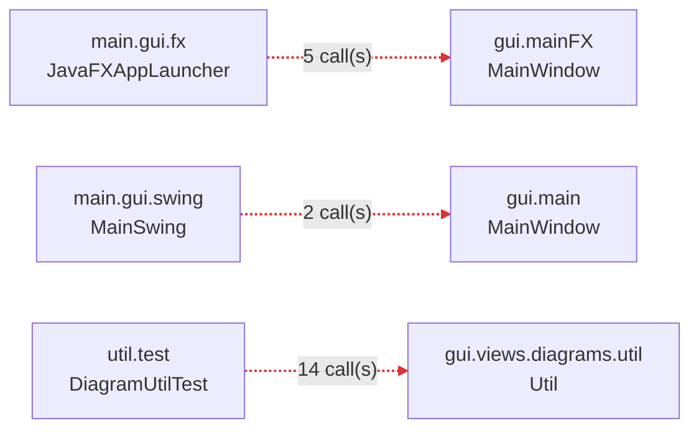

# Cyclic Dependency Bugs

> This file tracks architectural bugs detected by ArchUnit.
> Delete this file once all issues are resolved and the PR is merged.

We start from the commit [5989a4b](https://github.com/useocl/use/commit/5989a4be5f2b181189965482f4f10da3971878a4) (Merge pull request #130 from croni42/feature-main-branch-adjustment), date: 2026-04-27 (YYYY-MM-DD).

---

## Bug 1: `uml.mm` ↔ `uml.ocl` ↔ `uml.sys` triangle (use-core)

- **Severity:** Critical — 34 cycles, 2231 dependency violations
- **Location:** `org.tzi.use.uml.*`
- **Problem:** The metamodel (`mm`), OCL layer (`ocl`), and runtime system (`sys`) form
  a tightly coupled triangle. This is the single largest source of cycles in the project.
  - `uml.ocl.value` types (`ObjectValue`, `LinkValue`, `InstanceValue`) hold direct
    references to `uml.sys` runtime objects (`MObject`, `MLink`, `MInstance`).
  - `uml.sys.soil.*` statement constructors take `uml.ocl.expr.Expression` parameters.
  - `util.soil.VariableEnvironment` depends on `uml.ocl.value.Value`.
- **Fix direction:** Introduce interfaces/abstractions at the `uml.ocl` ↔ `uml.sys`
  boundary. Value types should not hold concrete runtime references.

<!-- BEGIN MERMAID:bug-1 -->
**uml.* triangle** — 5 cycle(s), 6 edge(s) across 3 package(s)

<!-- END MERMAID:bug-1 -->

## Bug 2: `gui.main` and `gui.views` internal cycles (use-gui)

- **Severity:** Medium — 1 cycle each, 14 GUI-specific cycles total
- **Location:** `org.tzi.use.gui.main`, `org.tzi.use.gui.views`
- **Problem:** Subpackages within `gui.main` and `gui.views` have circular dependencies
  between each other.
- **Fix direction:** Extract shared types into a common subpackage or flatten the hierarchy.

<!-- BEGIN MERMAID:bug-2 -->
**gui.main** — 1 cycle(s), 2 edge(s) across 2 package(s)

**gui.views** — 1 cycle(s), 2 edge(s) across 2 package(s)

<!-- END MERMAID:bug-2 -->

## Bug 3: `runtime` package cycles (use-gui)

- **Severity:** High — 43 cycles
- **Location:** `org.tzi.use.runtime`
- **Problem:** The runtime package has heavy internal coupling (43 cycles detected in
  Maven structure analysis).
- **Fix direction:** Needs further investigation — identify which runtime subpackages
  are involved and break the dependency chains.

<!-- BEGIN MERMAID:bug-3 -->
**runtime** — 43 cycle(s), 20 edge(s) across 6 package(s)

<!-- END MERMAID:bug-3 -->

## Bug 4: `api.impl` ↔ `api` factory cycle (use-core) — ✅ RESOLVED

- **Severity:** ~~Low — 1 cycle~~ → **0 cycles**
- **Location:** `org.tzi.use.api`, `org.tzi.use.api.impl`
- **Problem:** `UseSystemApi` factory methods in the root `api` package directly
  construct `UseSystemApiNative` and `UseSystemApiUndoable` from `api.impl`,
  while `impl` depends back on root API types.
- **Fix:** Moved factory methods into `api.impl.UseSystemApiFactory`. The root
  `api` package no longer imports `api.impl`, making the dependency
  unidirectional (`impl → root` only). Updated all 26 call sites across 10 files.

### Before (1 cycle)

### After (0 cycles) ✅

> _Old ArchUnit failure report archived at `docs/archunit-history/before-fix/bug-4_failure_report_maven_cycles_api.txt`_

## Bug 5: `gen.assl` ↔ `gen.tool` cycle (use-core)

- **Severity:** Low — 1 cycle
- **Location:** `org.tzi.use.gen.assl`, `org.tzi.use.gen.tool`
- **Problem:** `GChecker` (in `gen.tool`) calls `IGCollector` methods (in
  `gen.assl.dynamics`), while ASSL dynamics depends back on tool types.
- **Fix direction:** Move `IGCollector` interface to a shared package, or invert
  the dependency with callbacks.

<!-- BEGIN MERMAID:bug-5 -->
**gen.assl / gen.tool** — 1 cycle(s), 2 edge(s) across 2 package(s)

<!-- END MERMAID:bug-5 -->

## Bug 6: `parser.ocl` ↔ `parser.use` / `parser.soil` cycles (use-core)

- **Severity:** Low — 2 cycles
- **Location:** `org.tzi.use.parser.*`
- **Problem:** SOIL AST nodes reference OCL AST types (`ASTType`, `ASTExpression`),
  and the OCL parser references USE parser types, creating mutual dependencies.
- **Fix direction:** Extract shared AST base types into a common `parser.ast` package.

<!-- BEGIN MERMAID:bug-6 -->
**parser.*** — 2 cycle(s), 4 edge(s) across 3 package(s)

<!-- END MERMAID:bug-6 -->

## Bug 7: Layer violations in GUI launcher (use-gui)

- **Severity:** Medium — 21 violations
- **Location:** `org.tzi.use.main.gui.*`, `org.tzi.use.util.test.*`
- **Problem:** These are not cycles but layer boundary violations:
  - `main.gui.fx.JavaFXAppLauncher` directly constructs `gui.mainFX.MainWindow`.
  - `main.gui.swing.MainSwing` directly constructs `gui.main.MainWindow`.
  - `util.test.DiagramUtilTest` calls into `gui.views.diagrams.util.Util`.
- **Fix direction:** Launchers should use a factory or DI to obtain window instances.
  Move `DiagramUtilTest` to the GUI test source root.

<!-- BEGIN MERMAID:bug-7 -->
**GUI launcher layer violations** — 21 violation(s) across 3 caller→callee pair(s)

<!-- END MERMAID:bug-7 -->

## Bug 8: `shell` ↔ `shell.runtime` cycle (use-gui)

- **Severity:** Low — 1 cycle
- **Location:** `org.tzi.use.main.shell`, `org.tzi.use.main.shell.runtime`
- **Problem:** `Shell` (in `root` slice of `shell` package) depends on `IPluginShellExtensionPoint` (in `runtime` slice), which in turn depends back on `Shell` via `IPluginShellCmd.getShell()`.
- **Fix direction:** Extract interfaces or restructure the dependency so the runtime does not depend back on the concrete shell.

<!-- BEGIN MERMAID:bug-8 -->
**shell / shell.runtime** — 1 cycle(s), 2 edge(s) across 2 package(s)

<!-- END MERMAID:bug-8 -->

---

## Current Metrics

| Module   | Cycles | Worst Area                          |
|----------|--------|-------------------------------------|
| use-core | 42     | `uml` package (Bug 1: 34 cycles)   |
| use-gui  | 384*   | `runtime` (Bug 3: 43 cycles)       |

\* Project-wide count; GUI-only is 14 cycles.

### Measurement Limitation

The "entire GUI" cycle count cannot be measured in isolation because GUI and Core share
overlapping package names (`org.tzi.use.util`, `org.tzi.use.main`). The ArchUnit importer
pulls in Core classes when scanning these packages, inflating the GUI-only count.
