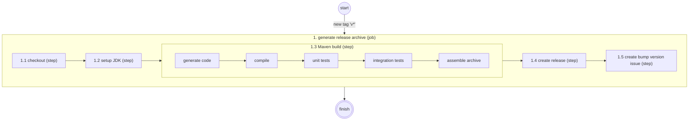
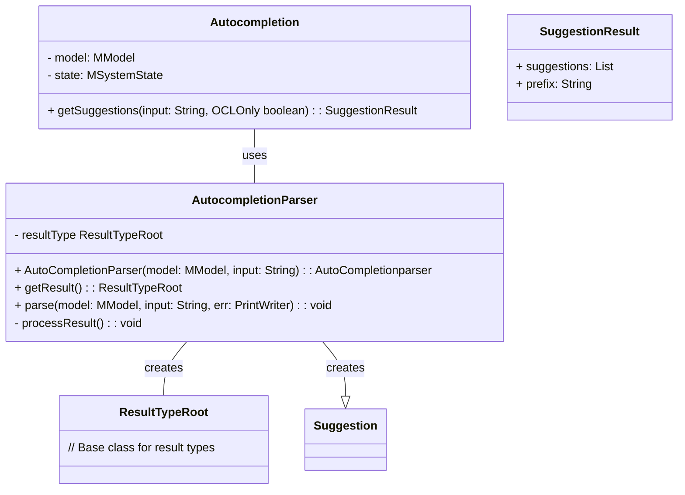
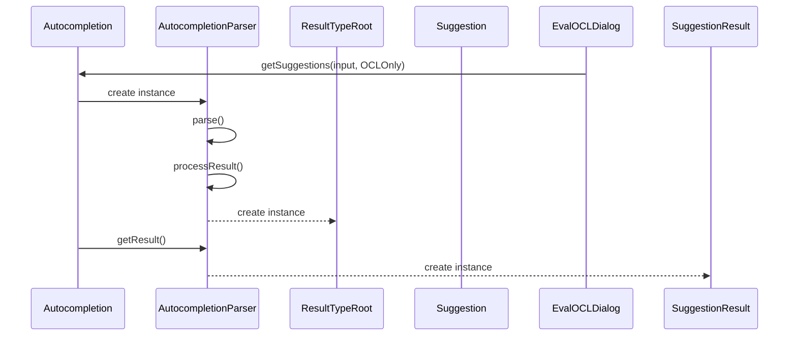

# USE Developer Documentation

This documentation is intended to provide guidance to people interested
in contributing to USE. Either by developing use itself or by building plugins.

It was startet in 2022 and is a growing documentation. Any pull request for USE should
also change this technical documentation, to foster the growing.

## Build Process
For the build process Maven is used.

### Release Process

To release a new USE version a GitHub workflow (action) is used.
This action automates the process of releasing a new version to a very high degree.

The overall workflow is as follows:



#### 1. Generate Release Archive

This is the only job of the release action, because all steps depend on the success of the step before and no parallel execution is possible. The job is started after a tag matching the pattern `v*` is created. For example, creating the tag `v7.0.0` would start the release process for USE version 7.0.0.

#### 1.1 Checkout

Checks out the commit that triggered the execution of the release process (the tag) using [actions/checkout](https://github.com/actions/checkout).

#### 1.2 Setup JDK

Sets up a JDK with the used version (currently 15) by using [actions/setup-java@v3](https://github.com/actions/setup-java).

#### 1.3 Maven Build

Executes a complete Maven build inclusing all tests and assemling an archive.

#### 1.4 Create Release

Creates a new GitHub release that is accessible from the project page.
This is done using [release-action](https://github.com/ncipollo/release-action).

#### 1.5 Create Bump Version Issue

To be able to set the new version, an issue is created that should be used to modify the version using a pull request.

## Plugin Infrastructure

USE can be extended without changing USE itself by providing plugins.
Currently, it is best to have a look at the
[existing plugins published on GitHub](https://github.com/useocl/use_plugins).

### Plugin Actions

Plugins can provide actions that users can execute. These actions get visible in the menu `Plugins` and 
on the toolbar. Actions must be declared in the file `useplugins.xml`:

```xml
<?xml version="1.0" encoding="UTF-8"?>
<?use version="2.4.0"?>
<plugin name="ObjectToClass" version="1.0">
    <actions>
		<action label="Create Object to Class View" icon="resources/ObjectToClassView.gif"
			class="org.tzi.use.gui.plugins.ActionObjectToClass" tooltip="Create Object to Class View"
			menu="View" menuitem="Object to Class" toolbaritem="plugins"
			id="org.tzi.use.gui.plugins.ActionObjectToClass">
		</action>
	</actions>
</plugin>
```

Further, class defining the behavior of the action is required. In the above example this is the class
`org.tzi.use.gui.plugins.ActionObjectToClass`. This is done by providing the attribute `class` for the
element `<action>`.

Classes defining the plugin-action need to implement the interface `IPluginActionDelegate`.

### Enabling or disabling GUI elements

All plugin-actions are by default only enabled, i.e. the menuitem and toolbar-button are clickable, if
a model is loaded. A plugin-action can change this behaviour by overriding the default method
```boolean shouldBeEnabled(IPluginAction pluginAction)```.
This is especially useful, if an action does not require a model to be loaded.  

## Autocompletion for OCL statements

### Design



The autocompletion process involves a lexer, a parser and a suggester.

The 'Autocompletion' serves as the suggester, while the 'AutoCompletionParser' acts as both lexer and parser.

An instance of 'Autocompletion' is held by the Main Window, ensuring only one instance exists when the GUI is active. Upon loading a new model, the existing instance is replaced with a new one.



In the 'getSuggestions' method of 'Autocompletion,' a new 'AutoCompletionParser' instance is created. The constructor of 'AutoCompletionParser' involves parsing the input string and processing the found types.

Processing is essential as the 'parse' method only collects types found in the input string. In 'processResult,' an instance of a subtype of 'ResultTypeRoot' is created.

The 'getSuggestions' method then calls 'getResult' of the 'AutoCompletionParser' object, returning a 'SuggestionResult' object containing suggestion strings and a possible prefix for colored input.

### Usage in GUI

1. **Autocompletion suggestions:** Suggestions are updated in real-time as characters are typed in the text area.

2. **Navigation:** Use the 'ArrowDown' and 'ArrowUp' keys to move through the suggested list.

3. **Selection:** Press 'Enter' to choose an item from the suggestion list.

4. **Focus:** The text area retains focus for all other keyboard inputs, even when the suggestion list is active.

### Usage in Code

To obtain suggestions for an OCL statement:

- Call the 'getSuggestions' method of the 'AutocompleteManager' instance.

For obtaining only a subtype of 'ResultTypeRoot' without suggestions:
- Instantiate a new 'AutocompleteParser' object.
- Call the 'getResult' method of the new object.

### Adding autocompletion support for new operation

When adding a new operation for a collection type in USE these steps have to be completed:

- Create a new subclass of 'OpGeneric,' e.g., 'MyOperation.'
- Register it through the given 'registerOperation' in 'StandardOperationsMyCollection.'

To add autocompletion support for 'MyOperation' no additional steps are required, as both autocompletion and the OCL compiler rely on the same data structure ('opmap' in 'ExpStdOp'). The new operation seamlessly becomes part of the suggestion list, e.g., when typing 'MyCollection{MyValues}->MyOp.'