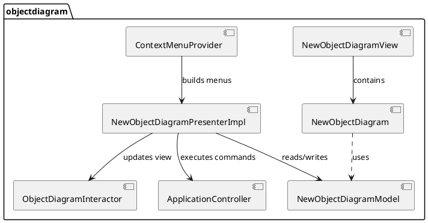
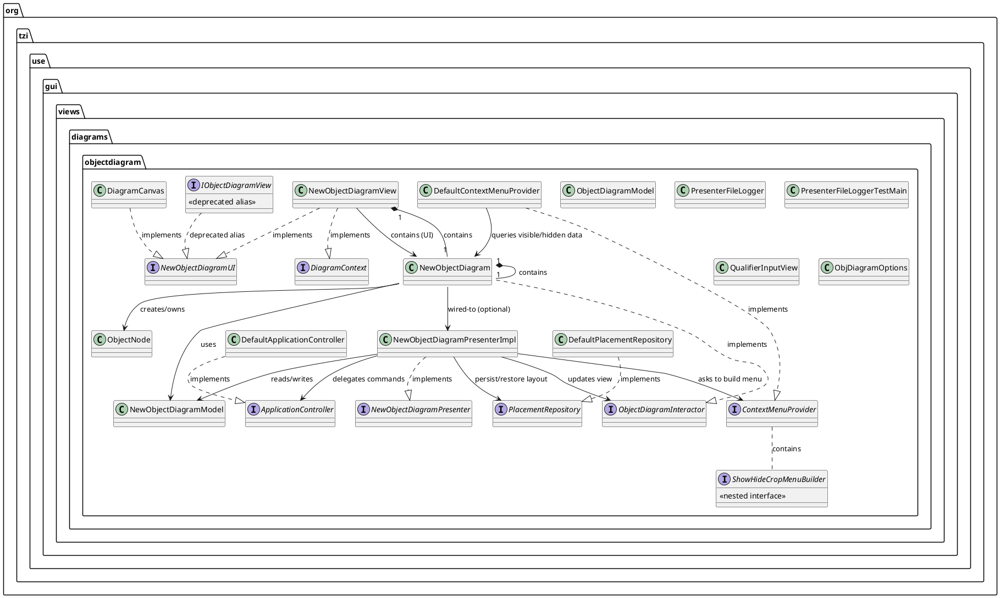
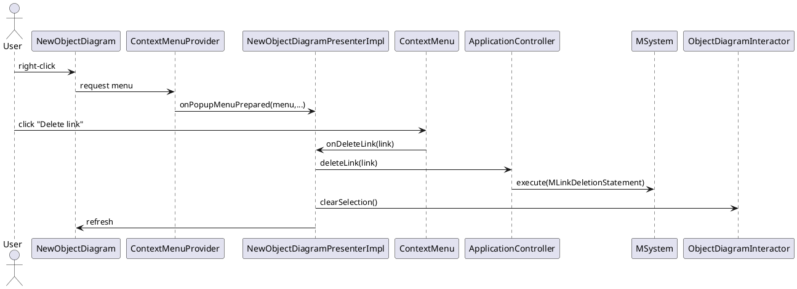

# Object Diagram — MVP Migration Plan

This document describes a practical, incremental migration path from the current larger monolithic object-diagram implementation toward a clean MVP (Model–View–Presenter) architecture. It focuses on the `org.tzi.use.gui.views.diagrams.objectdiagram` package and outlines which classes / interfaces to keep, which to simplify or remove, and how to reduce class count while preserving compatibility.

Goals
- Reduce unnecessary classes and duplicate interfaces.
- Make responsibilities explicit and small (Presenter vs View vs Application Controller vs Model).
- Keep backward compatibility where possible; perform breaking removals only in major releases.
- Improve testability and reduce cognitive complexity of large classes (especially `DefaultContextMenuProvider` and `NewObjectDiagram`).

Scope
- Files directly analysed: the `objectdiagram` package in `use-gui` (see package contents).
- Focus on API shapes (interfaces) and the primary presenter/view boundaries.

Summary of the current state
- View / UI classes: `NewObjectDiagram`, `NewObjectDiagramView`, `DiagramCanvas` (placeholder)
- Presenter: `NewObjectDiagramPresenter` + `NewObjectDiagramPresenterImpl`
- Model: `NewObjectDiagramModel`
- Controllers / Bridges: `ApplicationController`, `DefaultApplicationController`
- Menu builder: `ContextMenuProvider`, `DefaultContextMenuProvider` (very large)
- Placement persistence: `PlacementRepository`, `DefaultPlacementRepository`
- `ShowHideCropMenuBuilder` moved into `ContextMenuProvider` as nested interface (deprecated alias preserved)

Design principles and decisions
- Keep Presenter small and focused: it should translate UI actions into domain operations and update the View via `ObjectDiagramInteractor`.
- `ApplicationController` is the boundary for executing domain operations that affect the `MSystem`; keep it separate from `ObjectDiagramInteractor` (which manipulates the UI/graph only).
- The `ContextMenuProvider` is a UI-building component. Large monolithic providers should be split into small builders (e.g. InsertItemsBuilder, LinksByKindBuilder, HideShowBuilder).
- Avoid duplicate small view interfaces — keep `NewObjectDiagramUI` as the canonical minimal UI contract.

Proposed target architecture (MVP simplified)
- Model: `NewObjectDiagramModel` — holds application state (visible/hidden data, selection, caches).
- Presenter: `NewObjectDiagramPresenter` (interface) + `NewObjectDiagramPresenterImpl` (impl) — subscribes to system events, coordinates model & view.
- View / Interactor: `ObjectDiagramInteractor` — operations the presenter can invoke on the view.
- UI contract: `NewObjectDiagramUI` — minimal UI surface for hosting view.
- Application boundary: `ApplicationController` — executes domain-level commands against `MSystem`.
- Menu factories: `ContextMenuProvider` and small builder components.

High-level Component Diagram (PlantUML)

## Complete class & interface diagram

Below is a complete PlantUML diagram that lists the main classes and interfaces in the
`org.tzi.use.gui.views.diagrams.objectdiagram` package and their primary relationships
(implementation, composition and usage). Use this diagram to get a single-picture overview
of responsibilities and dependencies.

Sequence Diagram: User opens context menu & deletes a link

## Rationale for the refactoring (why these changes make sense)

This refactoring was performed to make the codebase more maintainable, testable and easier to understand over the long term. The main reasons and the direct impact on our implementation are summarized below.

- Separation of concerns:
  - Before: UI logic, placement/persistence logic and domain commands were mixed inside the same classes (for example `NewObjectDiagram`, `DefaultContextMenuProvider`).
  - After: `ApplicationController` is responsible for domain/system commands, `ObjectDiagramInteractor` provides view/rendering APIs only, and `NewObjectDiagramModel` holds diagram state. This reduces the risk that UI changes accidentally affect domain behavior.

- Reduced duplication and improved cohesion:
  - Duplicate small interfaces were consolidated (for example `IObjectDiagramView` is now an alias of `NewObjectDiagramUI`) and the `ShowHideCropMenuBuilder` was grouped under `ContextMenuProvider`. Related concepts are now collected in a single place.

- Safe, incremental migration:
  - Instead of deleting types immediately we introduced deprecations (for example in `DiagramContext`) and kept compatibility aliases. This allows downstream code to migrate in small steps without breaking the build.

- Better testability and lower cognitive load:
  - By splitting large classes into focused builders and utilities we reduce per-class cognitive complexity which makes unit testing easier and quicker to write.

- Preparing for quality tools (SonarQube):
  - Many Sonar issues are caused by duplicated code, public static fields, overly long methods or high cognitive complexity. The applied changes are targeted at reducing those metrics.

Implemented, concrete changes and refinements

- `ShowHideCropMenuBuilder` was moved into `ContextMenuProvider` as a nested interface; the old file was deleted. 
- `IObjectDiagramView` was consolidated to `NewObjectDiagramUI` and 'IObjectDiagramView' is now deleted. 
- `DiagramContext` now marks application-level command methods as deprecated and points callers to `ApplicationController`.
- `NewObjectDiagramPresenter` and `NewObjectDiagramPresenterImpl` were updated to use the relocated nested builder type.

These steps are intentionally small to preserve compatibility while steering the architecture towards a clear MVP structure.

