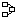
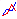
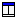
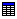
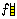
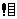

# USE Manual Version 0.1

This document represents the first version of the USE documentation.
Several section will be completed, added or changed in the following
versions (e.g. the USE Generator sections).

## Introduction to USE

USE is a system for the specification of information systems. It is
based on a subset of the Unified Modeling Language (UML)
[[Obj99]](#bib-obj99).

### Overview of USE Features

A USE specification contains a textual description of a model using
features found in UML class diagrams (classes, associations, etc.).
Expressions written in the Object Constraint Language (OCL) are used to
specify additional integrity constraints on the model. A model can be
animated to validate the specification against non-formal requirements.
System states (snapshots of a running system) can be created and
manipulated during an animation. For each snapshot the OCL constraints
are automatically checked. Information about a system state is given by
graphical views. OCL expressions can be entered and evaluated to query
detailed information about a system state.

### Working with USE

This section outlines the general workflow for the specification and
validation of a UML model. [Figure 1.1](#fig:workflow)
gives a general view of the USE approach. Within this section we use an
example model specifying the class `Car` including an attribute
`mileage` of type `Integer` and an operation
`increaseMileage` with one formal parameter and no return value.

<a name="fig:workflow">*Figure 1.1: Overview of the Specification Workflow*</a>

#### Specifying a UML Model

The USE tool expects a textual description of a model and its
constraints as input. (see section
[2](#SpecWithUSE){reference-type="ref" reference="SpecWithUSE"}) The
example must therefore be translated into a USE specification[^1] by
using an external text editor. The USE specification of the example
model is shown below.

    model Cars

    class Car
    attributes
      mileage : Integer
    operations
      increaseMileage(kilometers : Integer)
    end

#### Running USE

The following command can be used to invoke USE on the example
specification.[^2]

    use ../examples/Documentation/Cars/Cars.use

This command will compile and check the file `Cars.use`. There are
currently two kinds of user interfaces which can be used simultaneously.
The first one is a command line interface where you enter commands at a
prompt. The output should be similar to the following.

    loading properties from: /home/opti/use/etc/use.properties
    loading properties from: /home/opti/.userc
    use version 2.3.1, Copyright (C) 1999-2006 University of Bremen
    compiling specification...
    Model Cars (1 class, 0 associations, 0 invariants, 1 operation, 0 pre-/postconditions)
    Enter `help' for a list of available commands.
    use>

To start USE without loading a specification use the command `use`.

#### USE Shell - The Command Line Interface

After loading a specification you can enter commands at the prompt. [^3]
For example, you can enter OCL expressions by starting the input with a
question mark. The expression will be evaluated and its result will be
shown, e.g.:

    use> ? Set{1,2,3}->select(e | e > 1)
    -> Set{2,3} : Set(Integer)

The command line interface is useful for experienced users and for
automated validation procedures since commands can be read from a script
file. The graphical user interface is easier to learn and provides
different ways of visualizing a system state. By default both interfaces
are launched. [^4]

#### Graphical User Interface

The window that appears after starting USE can be seen in the screen
shot in figure [1.2](#fig:StartCars){reference-type="ref"
reference="fig:StartCars"}. On the left is a tree view showing the
contents (classes, associations, invariants, and pre- and
postconditions) of the model.\

![Graphical User Interface after starting USE with the Cars
Example[]{label="fig:StartCars"}](Screenshots/GUI/StartCars.png){#fig:StartCars}

\
The next figure [1.3](#fig:CarsInv){reference-type="ref"
reference="fig:CarsInv"} shows the expanded tree with all model
elements. The invariant is selected and its definition is shown in the
panel below the tree.\

![Expanded tree with all model
elements[]{label="fig:CarsInv"}](Screenshots/GUI/CarsInv.png){#fig:CarsInv}

\
The large area on the right is a workspace where you can open views
visualizing different aspects of a system. Views can be created any time
by choosing an entry from the view menu or directly by a toolbar button.
There is no limit on active views. The next screenshot shown in figure
[1.4](#fig:WorkingspaceViews){reference-type="ref"
reference="fig:WorkingspaceViews"} displays the main window after the
creation of four views.

![Main window with four different
views[]{label="fig:WorkingspaceViews"}](Screenshots/GUI/WorkingspaceViews.png){#fig:WorkingspaceViews}

The two lower views list the names of classes and associations defined
in the model and show the number of objects and links in the current
system state. The initial system state is empty, i.e., there are no
objects and links yet. The view at the upper right displays a list of
OCL invariants and their results. As you can see, all invariants are
true in the empty system state. Finally, the upper left view will show
an object diagram once we have created objects and links.

#### Creating Objects and Setting Attributes

Now you can create and destroy objects of type $\mathit{Car}$ and set
their attributes. More complex specifications allow more commands to
manipulate the system state. (see section
[5.1](#ShellCommands){reference-type="ref" reference="ShellCommands"}).\
We create two objects $\mathit{smallCar}$ and $\mathit{bigCar}$ and set
their mileage to $2000$ resp. $-1500$ kilometers. The commands are shown
below. They can be entered step by step or by reading in a command file.
To read in the corresponding command file use the following USE command:
`open ../examples/Documentation/Cars/Cars.cmd`

    !create smallCar : Car
    !create bigCar : Car

    !set smallCar.mileage := 2000
    !set bigCar.mileage := -1500

#### Checking OCL Invariants

After creating the system state the Class Invariant View shows that
$\mathit{MileageNotNegative}$ is violated. (see figure
[1.5](#fig:InvFailed){reference-type="ref" reference="fig:InvFailed"})\

![Constraint
failed[]{label="fig:InvFailed"}](Screenshots/GUI/Views/InvFailed.png){#fig:InvFailed}

\
To get more information you can double click on the failed invariant.
This opens the Evaluation Browser showing the evaluation of the marked
invariant. In figure [1.6](#fig:InvFailedBrowser){reference-type="ref"
reference="fig:InvFailedBrowser"} you can see, that object
$\mathit{bigCar}$ violates the invariant because its mileage is a
negative number.

![Evaluation of the violated
invariant[]{label="fig:InvFailedBrowser"}](Screenshots/GUI/InvFailedBrowser.png){#fig:InvFailedBrowser}

#### Evaluating OCL Expressions

The OCL parser and interpreter of USE allows the evaluation of arbitrary
OCL expressions. The menu item `State|Evaluate OCL expression` opens a
dialog where expressions can be entered and evaluated (see figure
[1.7](#fig:EvalSetExpr){reference-type="ref"
reference="fig:EvalSetExpr"}).\

![Evaluating a simple select
expression[]{label="fig:EvalSetExpr"}](Screenshots/GUI/EvalSetExpr.png){#fig:EvalSetExpr}

\
The example in figure [1.8](#fig:EvalSelectExpr){reference-type="ref"
reference="fig:EvalSelectExpr"} shows a more complex expression with
$\mathit{allInstances}$ and the collection operations $\mathit{select}$,
$\mathit{collect}$ and $\mathit{exists}$.

![Evaluating a more complex
expression[]{label="fig:EvalSelectExpr"}](Screenshots/GUI/EvalSelectExpr.png){#fig:EvalSelectExpr}

### Formal Background

The USE specification language is based on UML and OCL. Due to the semi
formal definition of early OCL versions, there were language constructs
whose interpretation was ambiguous or unclear
[@GogollaRichtersUML:1998]. In [@GogollaRichtersOCL:1998] and
[@GogollaRichters:1999] we have presented a formalization of OCL which
was designed to provide a solution for most of the problems and which
became part of UML 1.4/1.5. The USE approach to validation is described
in [@GogollaRichters:2000] and [@richters:phd]. Several other papers of
our group employing USE can be found in the publications of our
group.[^5]

### Examples inspected within this documentation {#examplesDocu}

Beside the cars example there are four examples, which are treated in
the course of this documentation.

#### Employees, Departments and Projects

This example specifies employees working in at least one department.
They work on an arbitrary number of projects, which are controlled by
exactly one department.\
Persons, departments and projects have names identifying them.
Departments, which have different locations, and projects have specific
budgets. Persons are paid for their job. They have a regular salary.
(see figure [1.9](#fig:exampleModel){reference-type="ref"
reference="fig:exampleModel"})

![Class diagram of the Employees, Departments and Projects
example[]{label="fig:exampleModel"}](Pictures/cls-EDP.png){#fig:exampleModel}

#### Persons and Companies

The UML class diagram in figure
[1.10](#fig:DiagramPersonCompany){reference-type="ref"
reference="fig:DiagramPersonCompany"} shows an altered model
representing persons and companies. Persons have a name, an age, and a
salary, which can be raised with the operation $\mathit{raiseSalary}$ by
a specific amount. They work for at most one company, which has a name
and a location. Companies can hire and fire persons.

![Class diagram of the Person & Company
example[]{label="fig:DiagramPersonCompany"}](Pictures/cls-Employee.png){#fig:DiagramPersonCompany}

#### Graphs {#graphsExample}

This example is modeling a graph structure. Objects of class
$\mathit{Node}$ represent nodes of a graph that can be connected by
edges. Each node can be connected to an arbitrary number of source and
target nodes. The $\mathit{Node}$ class contains an operation
$\mathit{newTarget}$. The purpose of this operation is to create a new
node and to insert a new edge between the source node and the new target
node.

![Class diagram of the Graph
example[]{label="fig:GraphClassDiagram"}](Pictures/GraphClassDiagram.png){#fig:GraphClassDiagram}

#### Factorial {#factorialExample}

The factorial example shows how operation calls may be nested in the
simulation. It also shows that postconditions may be specified on
operations without side effects. An OCL expression can be given to
describe the computation of a side effect free operation. In the
example, we use a recursive definition of the factorial function. There
is only one class $\mathit{Rec}$.

![Class diagram of factorial
example[]{label="fig:FactorialClassDiagram"}](Pictures/NestedClassDiagram.png){#fig:FactorialClassDiagram}

## Specifying a UML Model with USE {#SpecWithUSE}

To define a USE specifications you need an external text editor. The
syntactic elements are clarified by a grammar defined with the Extended
Backus-Naur Form.

### Defining a UML Model

Every UML Model has a name and an optional body.

Syntax:

:   $$\begin{aligned}
    \langle\mathit{umlmodel\rangle}&\Coloneqq& \verb+model+ ~
    \langle\mathit{modelname}\rangle~ [~\langle\mathit{modelbody}\rangle~]\\
    \langle\mathit{modelname}\rangle &\Coloneqq& \langle\mathit{name}\rangle\end{aligned}$$

Example:

:   The models name is `Fruits`.

        model Fruits
        ...

The model body consists of at least one class definition and an
arbitrary number of association definitions. Enumeration definitions are
allowed at the top of the body. At the end of the specification OCL
constraints may be defined.

Syntax:

:   $$\begin{aligned}
    \langle\mathit{modelbody}\rangle &\Coloneqq&
    \{~\langle\mathit{enumerationdefinition}\rangle~\}\\
    &&\{~\langle\mathit{associationdefinition}\rangle~|~
    \langle\mathit{associationclassdefinition}\rangle~\}\\
    &&\langle\mathit{classdefinition}\rangle\\
    &&\{~\langle\mathit{classdefinition}\rangle ~|~
    \langle\mathit{associationdefinition}\rangle~
    |~\langle\mathit{associationclassdefinition}\rangle~\}\\
    &&[~\verb+constraints+ ~\{~\langle\mathit{constraintdefinition}\rangle~\}~]\end{aligned}$$

### Specification Elements

The following sections describe all available elements, which can be
used in the model body.

#### Enumerations

Enumerations may be added at the top of the model body.

Syntax:

:   $$\begin{aligned}
    \langle\mathit{enumerationdefinition}\rangle &\Coloneqq&
    \verb+enum+~\langle\mathit{enumerationname}\rangle~\verb+{+~
    \langle\mathit{elementname}\rangle~\{~\verb+,+~\langle\mathit{elementname}\rangle~\}~\verb+}+\\
    \langle\mathit{enumerationname}\rangle &\Coloneqq&
    \langle\mathit{name}\rangle\\
    \langle\mathit{elementname}\rangle &\Coloneqq&
    \langle\mathit{name}\rangle\end{aligned}$$

Example:

:   An enumeration definition with three elements.

        enum Flatware {Spoon, Fork, Knife}

#### Classes

A class has a name and optionally attribute and operation definitions.
It may be defined as an abstract class.

Syntax:

:   $$\begin{aligned}
    \langle\mathit{classdefinition}\rangle &\Coloneqq& [~\verb+abstract+~]~\verb+class+~
    \langle\mathit{classname}\rangle~[~\verb+<+~\langle\mathit{classname}\rangle~
    \{~\verb+,+~\langle\mathit{classname}\rangle~\}~]\\
    &&[~\verb+attributes+~\{~\langle\mathit{attributename}\rangle
    ~\verb+:+~\langle\mathit{type}\rangle~\}~]\\
    &&[~\verb+operations+~\{~\langle\mathit{operationdeclaration}\rangle
    ~[~\verb+=+~\langle\mathit{oclexpression}\rangle~]\\
    &&\{~\langle\mathit{preconditiondefinition}\rangle~|~
    \langle\mathit{postconditiondefinition}\rangle~\}~\}~]\\
    && [~\verb+constraints+~\{~\langle\mathit{invariantdefinition}\rangle~\}~]\\
    && \verb+end+\\
    \langle\mathit{classname}\rangle &\Coloneqq& \langle\mathit{name}\rangle\\
    \langle\mathit{attributename}\rangle &\Coloneqq& \langle\mathit{name}\rangle\end{aligned}$$

Example:

:   The example shows five different class definitions. The class
    $\mathit{Apple}$ inherits two and the class $\mathit{Banana}$ one
    class. The class $\mathit{Lemon}$ is abstract and class
    $\mathit{Banana}$ defines pre- and postconditions for the operation
    $\mathit{peel}$ within its body. The class $\mathit{Peach}$ shows
    how invariants can be integrated into the classes body.

        class Apple < Orange, Lemon
        end

        abstract class Orange
        attributes
          juice : Boolean
        end

        class Lemon
        operations
          squeeze(i : Integer) : Integer = i + 1
        end

        class Banana < Lemon
        attributes
          flatware : Set(Sequence(Flatware))
        operations
          peel() : String = 'abcd'
              pre: true
              post: 2 = 2
              post: result = 'theResult'
        end

        class Peach
        attributes
        operations
        constraints
          inv: 3 > 2
          inv neverViolated: true
        end

#### Associations

It is possible to define n ary associations . The definition requires a
name, at least two participating classes and multiplicity information.
Role names are optional.

Syntax:

:   $$\begin{aligned}
    \langle\mathit{associationdefinition}\rangle &\Coloneqq&
    (~\verb+association+~|~\verb+composition+~|~\verb+aggregation+~)\\
    &&\langle\mathit{associationname}\rangle~\verb+between+\\
    &&\langle\mathit{classname}\rangle~\verb+[+~\langle\mathit{multiplicity}\rangle~
    \verb+]+~[~\verb+role+~\langle\mathit{rolename}\rangle~]~[~\verb+ordered+~]\\
    &&\langle\mathit{classname}\rangle~\verb+[+~\langle\mathit{multiplicity}\rangle~
    \verb+]+~[~\verb+role+~\langle\mathit{rolename}\rangle~]~[~\verb+ordered+~]\\
    &&\{~\langle\mathit{classname}\rangle~\verb+[+~\langle\mathit{multiplicity}\rangle~
    \verb+]+~[~\verb+role+~\langle\mathit{rolename}\rangle~]~[~\verb+ordered+~]~\}\\
    &&\verb+end+\\
    \langle\mathit{multiplicity}\rangle &\Coloneqq&
    (~\verb+*+~|~\langle\mathit{digit}\rangle~\{~\langle\mathit{digit}\rangle~\}~
    [~\verb+..+~(~\verb+*+~|~\langle\mathit{digit}\rangle~\{~\langle\mathit{digit}\rangle~\}~)~]~)\\
    && \{~\verb+,+~(~\verb+*+~|~\langle\mathit{digit}\rangle~\{~\langle\mathit{digit}\rangle~\}~
    [~\verb+..+~(~\verb+*+~|~\langle\mathit{digit}\rangle~\{~\langle\mathit{digit}\rangle~\}~)~]~)~\}\\
    \langle\mathit{associationname}\rangle &\Coloneqq& \langle\mathit{name}\rangle\\
    \langle\mathit{rolename}\rangle &\Coloneqq& \langle\mathit{name}\rangle\end{aligned}$$

Example:

:   This Examples shows a binary and a tertiary association with
    different multiplicities and optional role names. The first
    association is defined as a composition. The diamond appears at the
    first participating class. You may order the elements by using the
    keyword `ordered`.

        composition AppleSpritzer between
          Apple[*] role base
          Lemon[1..8,10,15..*] role flavor
        end

        association Ingredients between
          Apple[*] role mainIngredient
          Orange[1]
          Lemon[1..*] role lemon ordered
        end

#### Association classes

Association classes combine the body elements of classes and
associations.

Syntax:

:   $$\begin{aligned}
    \langle\mathit{associationclassdefinition}\rangle &\Coloneqq&
    [~\verb+abstract+~]~\verb+associationclass+~
    \langle\mathit{classname}\rangle\\
    &&[~\verb+<+~\langle\mathit{classname}\rangle~
    \{~\verb+,+~\langle\mathit{classname}\rangle~\}~]~\verb+between+\\
    &&\langle\mathit{classname}\rangle~\verb+[+~\langle\mathit{multiplicity}\rangle~
    \verb+]+~[~\verb+role+~\langle\mathit{rolename}\rangle~]~[~\verb+ordered+~]\\
    &&\langle\mathit{classname}\rangle~\verb+[+~\langle\mathit{multiplicity}\rangle~
    \verb+]+~[~\verb+role+~\langle\mathit{rolename}\rangle~]~[~\verb+ordered+~]\\
    &&\{~\langle\mathit{classname}\rangle~\verb+[+~\langle\mathit{multiplicity}\rangle~
    \verb+]+~[~\verb+role+~\langle\mathit{rolename}\rangle~]~[~\verb+ordered+~]~\}\\
    &&[~\verb+attributes+~\{~\langle\mathit{attributename}\rangle
    ~\verb+:+~\langle\mathit{type}\rangle~\}~]\\
    &&[~\verb+operations+~\{~\langle\mathit{operationdeclaration}\rangle
    ~[~\verb+=+~\langle\mathit{oclexpression}\rangle~]\\
    &&\{~\langle\mathit{preconditiondefinition}\rangle~|~
    \langle\mathit{postconditiondefinition}\rangle~\}~\}~]\\
    && [~\verb+constraints+~\{~\langle\mathit{invariantdefinition}\rangle~\}~]\\
    && \verb+end+\end{aligned}$$

Example:

:   The example defines an association class between two classes. It has
    two attributes and one operation, which is no query.

        associationclass FruitSalad < Orange
         between
          Banana[0..1]
          Apple[1..*]
        attributes
          name : String
          weight : Real
        operations
          putIn(apple : Apple, banana : Banana)
        end

#### Constraints

The keyword `constraints` indicates the begin of constraint definition
segment. An arbitrary number of invariants may be defined in context of
a class. In addition to that, you may define pre- and postconditions to
constrain operations. Every constraint can be named.

Syntax:

:   $$\begin{aligned}
    \langle\mathit{constraintdefinition}\rangle &\Coloneqq&
    \langle\mathit{invariantcontext}\rangle~|~\langle\mathit{operationcontext}\rangle\\
    \langle\mathit{invariantcontext}\rangle &\Coloneqq&
    \verb+context+~[~\langle\mathit{variablename}\rangle~\verb+:+~]~\langle\mathit{classname}\rangle\\
    &&\{~\langle\mathit{invariantdefinition}\rangle~\}\\
    \langle\mathit{operationcontext}\rangle &\Coloneqq&
    \verb+context+~\langle\mathit{classname}\rangle~\langle\mathit{operationconstraints}\rangle\\
    \langle\mathit{invariantdefinition}\rangle &\Coloneqq&
    \verb+inv+~[~\langle\mathit{invariantname}\rangle~]~\verb+:+~\langle\mathit{booleanoclexpression}\rangle\\
    \langle\mathit{operationconstraints}\rangle &\Coloneqq&
    \verb+::+~\langle\mathit{operationdeclaration}\rangle\\
    &&(~\langle\mathit{preconditiondefinition}\rangle~|~\langle\mathit{postconditiondefinition}\rangle~)\\
    &&\{~\langle\mathit{preconditiondefinition}\rangle~|~
    \langle\mathit{postconditiondefinition}\rangle~\}\\
    \langle\mathit{preconditiondefinition}\rangle &\Coloneqq&
    \verb+pre+~[~\langle\mathit{preconditionname}\rangle~]~
    \verb+:+~\langle\mathit{booleanoclexpression}\rangle\\
    \langle\mathit{postconditiondefinition}\rangle &\Coloneqq&
    \verb+post+~[~\langle\mathit{postconditionname}\rangle~]~
    \verb+:+~\langle\mathit{booleanoclexpression}\rangle~)\\
    \langle\mathit{invariantname}\rangle &\Coloneqq& \langle\mathit{name}\rangle\\
    \langle\mathit{variablename}\rangle &\Coloneqq& \langle\mathit{name}\rangle\\
    \langle\mathit{preconditionname}\rangle &\Coloneqq& \langle\mathit{name}\rangle\\
    \langle\mathit{postconditionname}\rangle &\Coloneqq& \langle\mathit{name}\rangle\end{aligned}$$

Example:

:   The first two definitions are showing three invariants of the class
    $\mathit{Orange}$. The second definition defines the variable
    $\mathit{orange}$ which may be used in the OCL expression similar to
    $\mathit{self}$. The third invariant is not named. USE will assign a
    name like $\mathit{inv2}$ to it. Two preconditions and one
    postcondition constrain the Operation $\mathit{squeeze}$ in class
    $\mathit{Lemon}$.

        context Orange
         inv OrangeInv: 1 = 1

        context orange : Orange
         inv alwaysTrue: orange = orange
         inv: juice = true

        context Lemon :: squeeze(i : Integer) : Integer
          pre: i>0
          pre lessThanTenOranges: i<10
          post alwaysTrue: true

#### Operation declarations

The declaration of an operation consists of the operation name, optional
parameters and the return type.

Syntax:

:   $$\begin{aligned}
    \langle\mathit{operationdeclaration}\rangle &\Coloneqq&
    \langle\mathit{operationname}\rangle~\verb+(+~[~\langle\mathit{parameters}\rangle~]~
    \verb+)+~[~\verb+:+~\langle\mathit{type}\rangle~]\\
    \langle\mathit{parameters}\rangle &\Coloneqq&
    \langle\mathit{parametername}\rangle~\verb+:+~\langle\mathit{type}\rangle~
    \{~\verb+,+~\langle\mathit{parametername}\rangle~\verb+:+~\langle\mathit{type}\rangle~\}\\
    \langle\mathit{operationname}\rangle &\Coloneqq& \langle\mathit{name}\rangle\\
    \langle\mathit{parametername}\rangle &\Coloneqq& \langle\mathit{name}\rangle\end{aligned}$$

Example:

:   Three operation declarations are shown within the class definition
    example.

#### Types

Types may be simple ($\langle\mathit{simpletype}\rangle$) or complex
($\langle\mathit{collectiontype}\rangle$).

Syntax:

:   $$\begin{aligned}
    \langle\mathit{type}\rangle &\Coloneqq& \langle\mathit{collectiontype}\rangle~
    |~\langle\mathit{simpletype}\rangle~|~\langle\mathit{enumerationname}\rangle\\
    \langle\mathit{collectiontype}\rangle &\Coloneqq& (~\verb+Set+~|~\verb+Bag+~|~\verb+Sequence+~)~
    \verb+(+\\
    &&\{~\langle\mathit{collectiontype}\rangle~
    |~\langle\mathit{simpletype}\rangle~|~\langle\mathit{enumerationname}\rangle~\}~\verb+)+\\
    \langle\mathit{simpletype}\rangle &\Coloneqq& \verb+Integer+~|~\verb+Real+~|~\verb+Boolean+~|~
    \verb+String+~|~\langle\mathit{classname}\rangle\end{aligned}$$

Example:

:   The attribute $\mathit{flatware}$ has a complex type.

#### Names, Numbers and OCL-Expressions

$$\begin{aligned}
\langle\mathit{name}\rangle &\Coloneqq& (~\langle\mathit{letter}\rangle ~|~ \_~)~
\{~\langle\mathit{letter}\rangle~ |~ \langle\mathit{digit}\rangle ~|~ \_~\}\\
\langle\mathit{letter}\rangle &\Coloneqq&  \verb+a+~ |~ \verb+b+~
|~ \dots~ |~ \verb+z+~ | ~\verb+A+~ |~ \verb+B+~ |~ \dots~ | ~\verb+Z+\\
\langle\mathit{digit}\rangle &\Coloneqq& \verb+0+~ |~ \verb+1+~ |~ \dots~ |~ \verb+9+\\
\langle\mathit{oclexpression}\rangle &\Coloneqq&
(^*~\mathrm{Replace~this ~symbol~ by~ an ~ordinary ~OCL ~expression.}~^*)\\
\langle\mathit{booleanoclexpression}\rangle &\Coloneqq&
(^*~\mathrm{Replace~ this ~symbol~ by~ an~ ordinary~ OCL expression}\\
&&\mathrm{which~results ~in~ a ~boolean~ value.}~^*)\end{aligned}$$

### Specifications of the Examples

The USE specification of the example models shown in section
[1.4](#examplesDocu){reference-type="ref" reference="examplesDocu"} are
presented in this section.

#### Employees, Departments and Projects {#EDPspec}

The first part of the specification shown below describes the structural
information of the class diagram. There are classes with attributes and
associations with different multiplicities.

    model Company

    -- classes

    class Employee
    attributes
      name : String
      salary : Integer
    end

    class Department
    attributes
      name : String
      location : String
      budget : Integer
    end

    class Project
    attributes
      name : String
      budget : Integer
    end

    -- associations

    association WorksIn between
      Employee[*]
      Department[1..*]
    end

    association WorksOn between
      Employee[*]
      Project[*]
    end

    association Controls between
      Department[1]
      Project[*]
    end

We extend the model by the following four constraints which place
further restrictions on systems conforming to the model. The constraints
are first given in natural language and will later be expressed more
formally in OCL (Object Constraint Language). Constraints:

1. The number of employees working in a department must be greater or
   equal to the number of projects controlled by the department.

2. Employees get a higher salary when they work on more projects.

3. The budget of a project must not exceed the budget of the
   controlling department.

4. Employees working on a project must also work in the controlling
   department.

The goal of applying the USE tool is to interactively validate the above
model and the constraints. Objects and links can be created which
constitute a system state reflecting a snapshot of a running system. In
every system state, the constraints are automatically checked for
validity.\
\
In the second part of the specification, we define the constraints in
OCL. Each constraint is defined as an invariant in context of a class.

    -- OCL constraints

    constraints

    context Department
        -- the number of employees working in a department must
        -- be greater or equal to the number of projects
        -- controlled by the department
      inv MoreEmployeesThanProjects:
        self.employee->size >= self.project->size

    context Employee
        -- employees get a higher salary when they work on
        -- more projects
      inv MoreProjectsHigherSalary:
        Employee.allInstances->forAll(e1, e2 |
          e1.project->size > e2.project->size
            implies e1.salary > e2.salary)

    context Project
        -- the budget of a project must not exceed the
        -- budget of the controlling department
      inv BudgetWithinDepartmentBudget:
        self.budget <= self.department.budget

        -- employees working on a project must also work in the
        -- controlling department
      inv EmployeesInControllingDepartment:
        self.department.employee->includesAll(self.employee)

The complete specification is also available in the file Demo.use[^6] in
the example directory of the distribution.

#### Persons and Companies {#personCompanySpec}

Here is the USE specification of the class diagram shown in figure
[1.10](#fig:DiagramPersonCompany){reference-type="ref"
reference="fig:DiagramPersonCompany"}.

    model Employee

    -- classes

    class Person
    attributes
      name : String
      age : Integer
      salary : Real
    operations
      raiseSalary(rate : Real) : Real
    end

    class Company
    attributes
      name : String
      location : String
    operations
      hire(p : Person)
      fire(p : Person)
    end

    -- associations

    association WorksFor between
      Person[*] role employee
      Company[0..1] role employer
    end

We add pre- and postconditions for the $\mathit{hire}$ and
$\mathit{fire}$ operations in class Company. The USE specification is
extended as follows.

    -- constraints

    constraints

    context Company::hire(p : Person)
      pre  hirePre1: p.isDefined()
      pre  hirePre2: employee->excludes(p)
      post hirePost: employee->includes(p)

    context Company::fire(p : Person)
      pre  firePre:  employee->includes(p)
      post firePost: employee->excludes(p)

The first precondition of the hire operation is named
$\mathit{hirePre1}$ and makes sure that the operation can only be called
with a well defined person object.[^7] The second precondition
$\mathit{hirePre2}$ makes sure that the person passed as parameter $p$
is not already an employee of the company. The postcondition
$\mathit{hirePost}$ guarantees that after the operation has exited, the
person actually has been added to the set of employees. The constraints
for the operation $\mathit{fire}$ work just the other way round.

#### Graphs {#graphsSpec}

The USE specification of the graphs example
([1.4.3](#graphsExample){reference-type="ref"
reference="graphsExample"}) is shown below.

    model Graph

    class Node
    operations
      newTarget()
    end

    association Edge between
      Node[*] role source
      Node[*] role target
    end

    constraints

    context Node::newTarget()
      -- the operation must link exactly one target node
      post oneNewTarget:
        (target - target@pre)->size() = 1

      -- the target node must not exist before
      post targetNodeIsNew:
        (target - target@pre)->forAll(n | n.oclIsNew())

The postcondition $\mathit{targetNodeIsNew}$ also demonstrates the
application of the OCL operation $\mathit{oclIsNew}$ to check for the
creation of new objects.

#### Factorial {#factorialSpec}

The factorial example presented in section
[1.4.4](#factorialExample){reference-type="ref"
reference="factorialExample"} is specified below.

    model NestedOperationCalls

    class Rec
    operations
      fac(n : Integer) : Integer =
        if n <= 1 then 1 else n * self.fac(n - 1) endif
      end

    constraints

    context Rec::fac(n : Integer) : Integer
      pre:  n > 0
      post: result = n * fac(n - 1)

The postcondition reflects the inductive case of the definition of the
factorial function.

## Analyzing the formal Specification

After specifying a UML model within a `.use` file you can open it with
USE. The USE system will parse and type check the file automatically.
Possible errors are listed in the log window. (see section
[4.3.4](#logWindow){reference-type="ref" reference="logWindow"})

### Creating System States

The Employees, Departments and Projects example specified in section
[2.3.1](#EDPspec){reference-type="ref" reference="EDPspec"} is used to
show how system states can be created and invariants evaluated.\
\
Objects can be created by selecting a class and specifying a name for
the object. The menu command `State|Create object` opens a dialog where
this information can be entered (shown in figure
[3.1](#fig:CreateObject){reference-type="ref"
reference="fig:CreateObject"}).

![Create object
dialog[]{label="fig:CreateObject"}](Screenshots/GUI/CreateObject.png){#fig:CreateObject}

\
Alternatively, the following command can be used at the shell to achieve
the same effect.

    use> !create cs:Department

And, even simpler, an object can be created via drag & drop. Just select
a class in the model browser (see section
[4.3.3](#low){reference-type="ref" reference="low"}) and drag it to the
object diagram.\
\
Figure [3.2](#fig:ViewsWithObject){reference-type="ref"
reference="fig:ViewsWithObject"} is similar to figure
[1.4](#fig:WorkingspaceViews){reference-type="ref"
reference="fig:WorkingspaceViews"}, but the specification changed to the
Employees, Departments and Projects example and the object $\mathit{cs}$
was created. The lower left view indicates that there is now one
$\mathit{Department}$ object, and the object diagram shows this object
graphically.\

![Main window with views after creating a new
object[]{label="fig:ViewsWithObject"}](Screenshots/GUI/ViewsWithObject.png){#fig:ViewsWithObject}

\
A context menu available on a right mouse click in the object diagram
provides several display options. For example, the automatic layout can
be turned off, the layout of the diagram can be saved and restored from
a file, etc. In the previous picture we have turned on the display of
attribute values. You can see that the attribute values of the
$\mathit{Department}$ object are all undefined. For changing attribute
values, we can use the `set` command:

    use> !set cs.name := 'Computer Science'
    use> !set cs.location := 'Bremen'
    use> !set cs.budget := 10000

Attributes can also be changed with an Object Properties View. If you
choose `View|Create|` `Object Properties` from the `View` menu and
select the $\mathit{cs}$ object, you get the view shown in figure
[3.3](#fig:ObjectProperties){reference-type="ref"
reference="fig:ObjectProperties"} where you can inspect and change
attributes of the selected object.\

![Object Properties
View[]{label="fig:ObjectProperties"}](Screenshots/GUI/ObjectProperties.png){#fig:ObjectProperties}

\
We continue by adding two $\mathit{Employee}$ objects and setting their
attributes.[^8]

    use> !create john : Employee
    use> !set john.name := 'John'
    use> !set john.salary := 4000
    use> !create frank : Employee
    use> !set frank.name := 'Frank'
    use> !set frank.salary := 4500

Now we have three objects, a department and two employees, but still no
connections between them. The layout in the object diagram is
continuously refined and updated. This can be turned off by deselecting
the option `Auto-Layout` in the context menu of the object diagram.\
\
The previous commands resulted in an invalid system state. This is
discussed in detail in the next section.

#### Model Inherent Constraints {#modelinherent}

The invariant view indicates some problem with the new system state. The
message says: `Model inherent constraints violated`. Model inherent
constraints are constraints defined implicitly by a UML model (in
contrast to explicit OCL constraints). The details about this message
are shown in the log panel at the bottom of the screen. (see figure
[4.5](#fig:LogWindow){reference-type="ref" reference="fig:LogWindow"})
They are also available by issuing a check command at the prompt:

    use> check
    checking structure...
    Multiplicity constraint violation in association `WorksIn':
      Object `frank' of class `Employee' is connected to 0 objects of
        class `Department' via role `department'
      but the multiplicity is specified as `1..*'.
    Multiplicity constraint violation in association `WorksIn':
      Object `john' of class `Employee' is connected to 0 objects of
        class `Department' via role `department'
      but the multiplicity is specified as `1..*'.
    ...

The problem here is that we have specified in the model that each
employee has to be related to at least one department object. (see the
class diagram shown in figure
[1.9](#fig:exampleModel){reference-type="ref"
reference="fig:exampleModel"}) In our current state, no employee has a
link to a department. In order to fix this, we insert the missing links
into the $\mathit{WorksIn}$ association:

    use> !insert (john,cs) into WorksIn
    use> !insert (frank,cs) into WorksIn

Links can also be inserted by selecting the objects to be connected in
the object diagram and choosing the `insert` command from the context
menu.\
\
The new state shows the links in the object diagram as red edges between
the $\mathit{Employee}$ objects and the $\mathit{Department}$ object.
(see figure [3.4](#fig:ViewsWithLinks){reference-type="ref"
reference="fig:ViewsWithLinks"})

![Main window after creating the objects and inserting the
links[]{label="fig:ViewsWithLinks"}](Screenshots/GUI/ViewsWithLinks.png){#fig:ViewsWithLinks}

### Validating Invariants

We have seen that class invariants are checked automatically each time a
system state changes. This section shows how invariants can be analyzed.
We continue the example by adding two projects and linking them to the
existing employees and the department.

    use> !create research : Project
    use> !set research.name := 'Research'
    use> !set research.budget := 12000
    use>
    use> !create teaching : Project
    use> !set teaching.name := 'Validating UML'
    use> !set teaching.budget := 3000
    use>
    use> !insert (cs,research) into Controls
    use> !insert (cs,teaching) into Controls
    use>
    use> !insert (frank,research) into WorksOn
    use> !insert (frank,teaching) into WorksOn
    use> !insert (john,research) into WorksOn

The resulting state is shown in figure
[3.5](#fig:ViewsDemo){reference-type="ref" reference="fig:ViewsDemo"}.

![Main window after reading in the whole Demo.cmd
file[]{label="fig:ViewsDemo"}](Screenshots/GUI/ViewsDemo.png){#fig:ViewsDemo}

In this state, three of the four invariants are true but one fails. The
failing one has the name $\mathit{BudgetWithinDepartmentBudget}$. This
invariant states that the budget of a project must not exceed the budget
of the controlling department. Obviously, one of the two projects in our
example must have a budget higher than the budget of the department.\
The value $\mathit{false}$ finally resulting from an evaluation of an
invariant is not very helpful in finding the reason for an illegal
system state. An Evaluation Browser provides a more detailed view of an
expression by showing the results of all sub expressions. (see section
[4.5](#evaluationBrowserSec){reference-type="ref"
reference="evaluationBrowserSec"}) Double clicking on an invariant will
open an Evaluation Browser (see figure
[3.6](#fig:EvalBrowserDemo){reference-type="ref"
reference="fig:EvalBrowserDemo"}).

![Evaluation Browser showing the violated
constraint[]{label="fig:EvalBrowserDemo"}](Screenshots/GUI/EvalBrowserDemo.png){#fig:EvalBrowserDemo}

\
The root node in the evaluation browser shows the complete expression
and its result, which is false for the chosen invariant. For each
component of an expression there are child nodes displaying the sub
expressions and their results. You can see that the argument expression
of the $\mathit{forAll}$ quantifier is false, thus making the whole
expression result false. In this sub expression, the variable
$\mathit{self}$ is bound to the object $\mathit{research}$. The
Evaluation Browser has helped to find out that it is the
$\mathit{budget}$ attribute value of this object which causes the
invariant to fail.

### Validating Pre- and Postconditions

OCL provides special syntax for specifying pre- and postconditions on
operations in a UML model. Pre- and postconditions are constraints that
define a contract that an implementation of the operation has to
fulfill. A precondition must hold when an operation is called, a
postcondition must be true when the operation returns. The USE tool
allows to validate pre- and postconditions by simulating operation
calls. The following describes how this feature works.

#### Validating the Person & Company Model

We test the pre- and postconditions of the Person & Company example
specified in section [2.3.2](#personCompanySpec){reference-type="ref"
reference="personCompanySpec"}. First we start the USE tool with the
specification of the example model.

    use> open ../examples/Documentation/Employee/Employee.use
    compiling specification...
    Model Employee (2 classes, 1 association, 0 invariants, 3 operations,
      7 pre-/postconditions)

At the prompt, we enter the following commands to create two objects.

    use> !create ibm : Company
    use> !create joe : Person
    use> !set joe.name := 'Joe'
    use> !set joe.age := 23

The current system state can be visualized with an object diagram view
in USE (see figure [3.7](#fig:EmployeeObjects){reference-type="ref"
reference="fig:EmployeeObjects"}).\

![Object diagram of the Person & Company
example[]{label="fig:EmployeeObjects"}](Screenshots/GUI/EmployeeObjects.png){#fig:EmployeeObjects}

\
Next, we want to call the operation $\mathit{hire}$ on the company
object to hire $\mathit{joe}$ as a new employee.

##### Calling Operations and Checking Preconditions

Operation calls are initiated with the command `openter`. Its syntax is
presented in section [5.1.12](#openterCmd){reference-type="ref"
reference="openterCmd"}. The following command shows the top level
bindings of variables. These variables can be used in expressions to
refer to existing objects.

    use> info vars
    ibm : Company = @ibm
    joe : Person = @joe

We invoke the operation $\mathit{hire}$ on the receiver object
$\mathit{ibm}$ and pass the object $\mathit{joe}$ as parameter.

    use> !openter ibm hire(joe)
    precondition `hirePre1' is true
    precondition `hirePre2' is true

The openter command has the following effect.

1. The source expression is evaluated to determine the receiver object.

2. The argument expressions are evaluated.

3. The variable $\mathit{self}$ is bound to the receiver object and the
   argument values are bound to the formal parameters of the operation.
   These bindings determine the local scope of the operation.

4. All preconditions specified for the operation are evaluated.

5. If all preconditions are satisfied, the current system state is
   saved and the operation call is saved on a call stack.

In the example, the call of the operation $\mathit{hire}$ was successful
because both preconditions are satisfied. The stack of currently active
operations can be viewed by issuing the following command.

    use> info opstack
    active operations:
    1. Company::hire(p : Person)

We can verify the bindings of the $\mathit{self}$ variable and the
formal parameter $p$ as follows.

    use> info vars
    ibm : Company = @ibm
    joe : Person = @joe
    p : Person = @joe
    self : Company = @ibm

##### Operation Effects

We can simulate the execution of an operation with the usual USE
primitives for changing a system state. The postcondition of the
$\mathit{hire}$ operation requires that a $\mathit{WorksFor}$ link
between the person and the company has to be created. We also set the
salary of the new employee.

    use> !insert (p, ibm) into WorksFor
    use> !set p.salary := 2000

The object diagram in
[3.8](#fig:EmployeeObjectsLinks){reference-type="ref"
reference="fig:EmployeeObjectsLinks"} shows the new system state with
the link between the $\mathit{Person}$ and $\mathit{Company}$ objects.

![Object diagram of the Person & Company example after changing the
state[]{label="fig:EmployeeObjectsLinks"}](Screenshots/GUI/EmployeeObjectsLinks.png){#fig:EmployeeObjectsLinks}

##### Exiting Operations and Checking Postconditions

After generating all side effects of an operation, we are ready to exit
the operation and check its postconditions. The command `opexit`
simulates a return from the currently active operation. The syntax is:\
\
`!opexit` $\mathit{ReturnValExpr}$\
\
The optional $\mathit{ReturnValExpr}$ is only required for operations
with a result value. An example will be given later. The operation
$\mathit{hire}$ specifies no result, so we can just issue:

    use> !opexit
    postcondition `hirePost' is true

The opexit command has the following effect.

1. The currently active operation is popped from the call stack.

2. If an optional result value is given, it is bound to the special OCL
   variable $\mathit{result}$.

3. All postconditions specified for the operation are evaluated in
   context of the current system state and the pre state saved at
   operation entry time.

4. All local variable bindings are removed.

In our example, the postcondition $\mathit{hirePost}$ is satisfied.\
\
The operation has been removed from the call stack:

    use> info opstack
    no active operations.

All variable bindings local to operations are removed on exit.

    use> info vars
    ibm : Company = @ibm
    joe : Person = @joe

Note that object names are elements of the top level bindings. If you
create new objects inside an operation call, their names will still be
available after exiting the operation.

##### Result Values and References to the Previous State

The operation $\mathit{raiseSalary}$ in class $\mathit{Person}$ is used
for changing the salary of an employee by a given rate. The following
constraints are added to the model specification.

    context Person::raiseSalary(rate : Real) : Real
      post raiseSalaryPost:
        salary = salary@pre * (1.0 + rate)
      post resultPost:
        result = salary

The first postcondition $\mathit{raiseSalaryPost}$ requires that the new
value of the salary attribute equals a value that is computed in terms
of the previous value using the $\mathit{@pre}$ modifier. The second
postcondition $\mathit{resultPost}$ specifies that the result value of
the operation equals the new salary.\
\
We call $\mathit{raiseSalary}$ on the new employee $\mathit{joe}$. The
rate $0.1$ is given to raise the salary by $10\%$.

    use> !openter joe raiseSalary(0.1)

The $\mathit{salary}$ attribute is assigned a new value with the `set`
command.

    use> !set self.salary := self.salary + self.salary * rate

Since $\mathit{raiseSalary}$ is an operation with a return value, we
have to specify a result value on exit. This value is bound to the OCL
result variable when the postconditions are evaluated.

    use> !opexit 2200
    postcondition `raiseSalaryPost' is true
    postcondition `resultPost' is true

##### Visualization as Sequence Diagram

The USE tool can visualize a sequence of operation calls as a UML
sequence diagram. The screenshot in figure
[3.9](#fig:EmployeeSequence){reference-type="ref"
reference="fig:EmployeeSequence"} shows the sequence of calls for the
example. During a validation session the diagram is automatically
updated on each operation call.

![Sequence diagram of the Person & Company
example[]{label="fig:EmployeeSequence"}](Screenshots/GUI/EmployeeSequence.png){#fig:EmployeeSequence}

#### An Example with oclIsNew

The graph model specified in section
[2.3.3](#graphsSpec){reference-type="ref" reference="graphsSpec"}
includes constraints calling the operation $\mathit{oclIsNew}$. We use
the following command script for animating the model. The script
simulates three operation calls. The first one is expected to succeed
while the second and third one should violate the postconditions.

    !create n1 : Node

    -- this call satisfies both postconditions
    !openter n1 newTarget()
    !create n2 : Node
    !insert (n1,n2) into Edge
    !opexit

    -- postcondition oneNewTarget fails,
    -- because n3 is not linked to n1
    !openter n1 newTarget()
    !create n3 : Node
    !opexit

    -- postcondition targetNodeIsNew fails,
    -- because n3 has already been created above
    !openter n1 newTarget()
    !insert (n1,n3) into Edge
    !opexit

Here is the output of the USE tool confirming our expectations about the
success and failure of postconditions. Details during the evaluation of
failing postconditions provide hints about what went wrong.

    $ use -nogui ../examples/Documentation/Graph/Graph.use
      ../examples/Documentation/Graph/Graph.cmd

    use version 2.3.1-devel, Copyright (C) 1999-2006 University of Bremen
    compiling specification...
    Model Graph (1 class, 1 association, 0 invariants, 1 operation, 2 pre-/postconditions)
    Graph.cmd> -- Opens the class diagram:
    Graph.cmd> -- open examples/Documentation/Graph/Graph.use
    Graph.cmd>
    Graph.cmd> -- Creates the object diagram:
    Graph.cmd> -- read examples/Documentation/Graph/Graph.cmd
    Graph.cmd>
    Graph.cmd> !create n1 : Node
    Graph.cmd>
    Graph.cmd> -- this call satisfies both postconditions
    Graph.cmd> !openter n1 newTarget()
    Graph.cmd> !create n2 : Node
    Graph.cmd> !insert (n1,n2) into Edge
    Graph.cmd> !opexit
    postcondition `oneNewTarget' is true
    postcondition `targetNodeIsNew' is true
    Graph.cmd>
    Graph.cmd> -- postcondition oneNewTarget fails,
    because n3 is not linked to n1
    Graph.cmd> !openter n1 newTarget()
    Graph.cmd> !create n3 : Node
    Graph.cmd> !opexit
    postcondition `oneNewTarget' is false
    evaluation results:
      self : Node = @n1
      self.target : Set(Node) = Set{@n2}
      self : Node = @n1
      self.target@pre : Set(Node) = Set{@n2}
      (self.target - self.target@pre) : Set(Node) = Set{}
      (self.target - self.target@pre)->size : Integer = 0
      1 : Integer = 1
      ((self.target - self.target@pre)->size = 1) : Boolean = false
    postcondition `targetNodeIsNew' is true
    Graph.cmd>
    Graph.cmd> -- postcondition targetNodeIsNew fails,
    because n3 has already been create above
    Graph.cmd> !openter n1 newTarget()
    Graph.cmd> !insert (n1,n3) into Edge
    Graph.cmd> !opexit
    postcondition `oneNewTarget' is true
    postcondition `targetNodeIsNew' is false
    evaluation results:
      self : Node = @n1
      self.target : Set(Node) = Set{@n2,@n3}
      self : Node = @n1
      self.target@pre : Set(Node) = Set{@n2}
      (self.target - self.target@pre) : Set(Node) = Set{@n3}
      n : Node = @n3
      n.oclIsNew : Boolean = false
      (self.target - self.target@pre)->forAll(n : Node | n.oclIsNew) : Boolean = false
    Graph.cmd>
    use>

The screenshot in figure [3.10](#fig:GraphSequence){reference-type="ref"
reference="fig:GraphSequence"} shows the sequence diagram automatically
generated from the example. Dashed return arrows in red indicate that a
postcondition failed on exit from an operation call.

![Sequence diagram of the Graph
example[]{label="fig:GraphSequence"}](Screenshots/GUI/GraphSequence.png){#fig:GraphSequence}

#### Nested Operation Calls

The factorial example specified in section
[2.3.4](#factorialSpec){reference-type="ref" reference="factorialSpec"}
includes nested operation calls. The following commands show the
computation of 3!.

    use> !create r : Rec
    use> !openter r fac(3)
    precondition `pre1' is true
    use> !openter r fac(2)
    precondition `pre1' is true
    use> !openter r fac(1)
    precondition `pre1' is true

The call stack now looks like this.

    use> info opstack
    active operations:
    1. Rec::fac(n : Integer) : Integer
    2. Rec::fac(n : Integer) : Integer
    3. Rec::fac(n : Integer) : Integer

We exit the operations in reverse order and provide result values that
satisfy the postcondition.

    use> !opexit 1
    postcondition `post1' is true
    use> !opexit 2
    postcondition `post1' is true
    use> !opexit 6
    postcondition `post1' is true

The screenshot in figure
[3.11](#fig:NestedSequence){reference-type="ref"
reference="fig:NestedSequence"} shows the sequence diagram automatically
generated from the example. Note the stacked activation frames resulting
from the recursion.

![Sequence diagram of the factorial
example[]{label="fig:NestedSequence"}](Screenshots/GUI/NestedSequence.png){#fig:NestedSequence}

## GUI Reference

### The Menubar

The symbols on the left side of the menu entries indicate that there is
a corresponding button available at the toolbar.

#### File

##### Open Specification... {#openSpec}

Loads an available USE specification from file
($\mathit{filename}$`.use`).

##### Save Script...

Saves all previously entered operation calls and commands which changed
the system state to file ($\mathit{filename}$`.cmd`).

##### Save Protocol...

Saves a detailed protocol including many GUI and shell activities.

##### Printer Setup...

Opens a dialog with modifiable standard printer settings.

##### Print Diagram... {#printDia}

Opens the printer window for printing the active diagram with any
desired settings.

##### Print View... {#printView}

This function is enabled for sequence diagrams only. It prints the
visible part of the diagram. For printing the whole sequence diagram,
the `Print Diagram...` function has to be used.

##### Exit

Quits the running USE system.

#### Edit

##### Undo

This function cancels the commands changing the system state step by
step. It makes no difference between GUI and shell commands.

#### State

##### Create object...

Shows all specified classes. After selecting a class, any number of
objects may be created by entering an unique object name.

##### Evaluate OCL expression... {#evalExpr}

This function opens an evaluating window which consists of two parts. In
the upper part you can enter a OCL expression. After evaluating the
expression the lower part shows the result with its type. The `Clear`
button clears the result information. The `Browser` button opens the
evaluation browser for analyzing the entered expression and its parts.
If the evaluation browser is still opened and a new expression is
evaluated the browser will be actualized. If the expression cannot be
evaluated the browser window will be closed. This also happens if the
`Clear` button is pressed.\
The model elements like class names, role names etc. may be integrated
into the OCL expression. If a system state is defined, object names may
be used too.

##### Check structure now

This function checks if all multiplicities defined in the specification
are fulfilled by the system state.

##### Check structure after every change

Checks the structure for every command, which changed the system state.

##### Reset

Resets the system state to the empty state.

#### View

##### Create

Creates one of the available diagram views.

##### Tile

Arranges all displayed views next to each other.

##### Close all

Closes all displayed diagram views.

#### Help

##### About...

Opens the About window.

### Toolbar

{width="3%"} Open Specification (see section
[4.1.1.1](#openSpec){reference-type="ref" reference="openSpec"})

{width="3%"} Print Diagram (see section
[4.1.1.5](#printDia){reference-type="ref" reference="printDia"})

{width="3%"} Print View (see section
[4.1.1.6](#printView){reference-type="ref" reference="printView"})

{width="3%"} Undo (see section
[4.1.2.1](#undo){reference-type="ref" reference="undo"})

{width="3%"} Evaluate OCL expression (see
section [4.1.3.2](#evalExpr){reference-type="ref" reference="evalExpr"})

{width="3%"} Create Class Diagram View (see
section [4.4.2](#classdiagramview){reference-type="ref"
reference="classdiagramview"})

{width="3%"} Create Object Diagram
View (see section [4.4.3](#objectdiagramview){reference-type="ref"
reference="objectdiagramview"})

{width="3%"} Create Class Invariant
View (see section [4.4.4](#classinvariantview){reference-type="ref"
reference="classinvariantview"})

{width="3%"} Create Object Count
View (see section [4.4.5](#objectcountview){reference-type="ref"
reference="objectcountview"})

{width="3%"} Create Link Count View
(see section [4.4.6](#linkcountview){reference-type="ref"
reference="linkcountview"})

{width="3%"} Create State Evolution
View (see section [4.4.7](#stateevolutionview){reference-type="ref"
reference="stateevolutionview"})

{width="3%"} Create Object
Properties View (see section
[4.4.8](#objectpropertiesview){reference-type="ref"
reference="objectpropertiesview"})

{width="3%"} Create Class Extend
View (see section [4.4.9](#classextendview){reference-type="ref"
reference="classextendview"})

{width="3%"} Create Sequence
Diagram View (see section
[4.4.10](#sequencediagramview){reference-type="ref"
reference="sequencediagramview"})

{width="3%"} Create Call Stack View (see
section [4.4.11](#callstackview){reference-type="ref"
reference="callstackview"})

{width="3%"} Create Command List View (see
section [4.4.12](#commandlistview){reference-type="ref"
reference="commandlistview"})

### The Main Window

![Main
window[]{label="fig:MainWindow"}](Screenshots/GUI/Views/MainWindow.png){#fig:MainWindow}

#### Showing the diagram views

The main part of the window shows the opened diagram views.

#### Overview of the Specification {#specificationOverview}

The top left window represents the model browser. (see figure
[4.2](#fig:OverviewOfSpec){reference-type="ref"
reference="fig:OverviewOfSpec"})

![Overview of the
Specification[]{label="fig:OverviewOfSpec"}](Screenshots/GUI/Views/OverviewOfSpec.png){#fig:OverviewOfSpec}

It shows all defined classes, associations, invariants and pre- and
postconditions. A right click into this part of the main window opens a
context menu. (see figure
[4.3](#fig:OverviewOfSpecSort){reference-type="ref"
reference="fig:OverviewOfSpecSort"})

![Sorting[]{label="fig:OverviewOfSpecSort"}](Screenshots/GUI/Views/OverviewOfSpecSort.png){#fig:OverviewOfSpecSort}

The menu provides the possibility to sort the specification elements
e.g. by name or `use` file order.

#### Definition of the Specification elements {#low}

The window below the specification overview shows the definition of the
selected specification element as it is defined in the .`use` file. (see
figure [4.4](#fig:DefinitionOfSpec){reference-type="ref"
reference="fig:DefinitionOfSpec"})

![Definition of the specification
elements[]{label="fig:DefinitionOfSpec"}](Screenshots/GUI/Views/DefinitionOfSpec.png){#fig:DefinitionOfSpec}

#### Log window {#logWindow}

The lower part of the main window show a log of the system activities.
(see figure [4.5](#fig:LogWindow){reference-type="ref"
reference="fig:LogWindow"}) It also lists possible syntax resp. type
check errors found in the loaded specification and structural errors.
Click right to clear the log window.

![Log
window[]{label="fig:LogWindow"}](Screenshots/GUI/Views/LogWindow.png){#fig:LogWindow}

#### Status and Tips

A line on the bottom of the main window shows the current USE status and
tips with reference to the displayed diagrams. (see figure
[4.6](#fig:StatusAndTips){reference-type="ref"
reference="fig:StatusAndTips"})

![Status and
tips[]{label="fig:StatusAndTips"}](Screenshots/GUI/Views/StatusAndTips.png){#fig:StatusAndTips}

### Diagram Views

There are different views, which can be used to analyze the current
system state with reference to the specification.

#### General Functions

Double click on the head of an active view to maximize the window resp.
reduce it to the previous size. There are three symbols in the upper
right corner. They minimize, maximize resp. reduce or close the active
window.

#### Class Diagram View {#classdiagramview}

This view shows the class diagram defined by the loaded specification.
(see figure [4.7](#fig:ClassDiagramView){reference-type="ref"
reference="fig:ClassDiagramView"})

![Class Diagram View (Employees, Departments and Projects
Example)[]{label="fig:ClassDiagramView"}](Screenshots/GUI/Views/ClassDiagramView.png){#fig:ClassDiagramView}

It displays classes, attributes, operations, associations, inheritance,
compositions, aggregations, association classes, enumerations, role
names and multiplicities. Associations connect classes via edges. It is
possible to create movable nodes by double clicking an edge. If an
association is not 2 ary a diamond will connect the three or more
participating classes. A dashed line connects association classes to
their edge. You can move elements like classes, diamonds, role names,
multiplicities etc.. If you select an element, it appears orange. To
mark more than one element hold the shift button and select the
elements. The selected elements can be moved together.\
Figure [4.7](#fig:ClassDiagramView){reference-type="ref"
reference="fig:ClassDiagramView"} shows the context menu, which is
displayed after a right click. You can choose if associations, role
names, multiplicities, attributes or operations should be displayed. If
you enable the `Auto-Layout` option, the system tries to arrange the
class diagram elements optimally. The `Anti-aliasing` option switches
the anti aliasing on and off. It is possible to save resp. load an
diagram layout to resp. from file ($\mathit{filename}$`.clt`).\
If you select at least one Element, you can hide it or all other
elements but the selected ones. The `Show` command recovers the hidden
elements. (see figure
[4.8](#fig:ClassDiagramViewHideCrop){reference-type="ref"
reference="fig:ClassDiagramViewHideCrop"})

![Class Diagram View - Context Menu with Hide, Crop, and
Show[]{label="fig:ClassDiagramViewHideCrop"}](Screenshots/GUI/Views/ClassDiagramViewHideCrop.png){#fig:ClassDiagramViewHideCrop}

#### Object Diagram View {#objectdiagramview}

The Object Diagram View shows the object diagram defined by the actual
system state. (see figure
[4.9](#fig:ObjectDiagramView){reference-type="ref"
reference="fig:ObjectDiagramView"})

![Object Diagram View (Employees, Departments and Projects
Example)[]{label="fig:ObjectDiagramView"}](Screenshots/GUI/Views/ObjectDiagramView.png){#fig:ObjectDiagramView}

It shows objects, attributes, attribute values, links, association names
and role names. The general functions are similar to the Class Diagram
View functions presented in section
[4.4.2](#classdiagramview){reference-type="ref"
reference="classdiagramview"}.\
Objects are displayed with object name and its type. Double click on an
object to open the object properties view. (see figure
[4.4.8](#objectpropertiesview){reference-type="ref"
reference="objectpropertiesview"}) Links are represented by a red line.
Association names, role names and attributes are optional elements. To
display them, check the corresponding box in the context menu, which is
shown after a right click. The `Auto-Layout`, `Anti-aliasing`,
`Load layout...` and `Save layout...` functions are explained in section
[4.4.2](#classdiagramview){reference-type="ref"
reference="classdiagramview"}.

##### Creating and destroying objects without Shell commands

The Model Browser (see section [4.3.3](#low){reference-type="ref"
reference="low"}) shows all specified classes. To create an instance of
a class just drag the class name and drop it into the object diagram
view. This creates an object with undefined attribute values.\
You can destroy existing objects by selecting them. The context menu
shows a new `Delete` function, which will destroy the object and the
participating links. (see figure
[4.10](#fig:ObjectDiagramViewAllFunctions){reference-type="ref"
reference="fig:ObjectDiagramViewAllFunctions"})

![Object Diagram View (Employees, Departments and Projects
Example)[]{label="fig:ObjectDiagramViewAllFunctions"}](Screenshots/GUI/Views/ObjectDiagramView.png){#fig:ObjectDiagramViewAllFunctions}

##### Inserting and deleting links without shell commands

To insert a link between two or more objects, select the objects and
open the context menu. Hold the shift button to select more than one
object. If there is an appropriate association the context menu shows an
`insert` command, which inserts a link between the selected objects.
Association classes are created the same way.\
\
Remove a link by selecting the involved objects. The context menu shows
a `delete` function.

#### Class Invariant View {#classinvariantview}

Shows all invariants. (see figure
[4.11](#fig:ClassInvariantView){reference-type="ref"
reference="fig:ClassInvariantView"})

![Class Invariant View (Employees, Departments and Projects
Example)[]{label="fig:ClassInvariantView"}](Screenshots/GUI/Views/ClassInvariantView.png){#fig:ClassInvariantView}

If no instance of the invariant context violates the corresponding
invariant and no model inherent constraint (see section
[3.1.1](#modelinherent){reference-type="ref" reference="modelinherent"})
the view shows $\mathit{true}$. If an objects violates a model inherent
constraint it appears $N/A$. $\mathit{false}$ appears otherwise. The
bottom of the window shows the number of violated invariants in the
actual system state. A double click opens the evaluation browser
analyzing the current invariant with respect to the actual system state.
(see section [4.5](#evaluationBrowserSec){reference-type="ref"
reference="evaluationBrowserSec"})

#### Object Count View {#objectcountview}

Shows all classes on the left side and the number of their instances on
the right side. A bar chart shows an overview of the number of
instances.

![Object Count View (Employees, Departments and Projects
Example)[]{label="fig:ObjectCountView"}](Screenshots/GUI/Views/ObjectCountView.png){#fig:ObjectCountView}

#### Link Count View {#linkcountview}

Shows all associations on the left side and the number of links on the
right side. A bar chart shows an overview of the number of links.

![Link Count View (Employees, Departments and Projects
Example)[]{label="fig:LinkCountView"}](Screenshots/GUI/Views/LinkCountView.png){#fig:LinkCountView}

#### State Evolution View {#stateevolutionview}

Shows a line chart. (see figure
[4.14](#fig:StateEvolutionView){reference-type="ref"
reference="fig:StateEvolutionView"})

![State Evolution View (Employees, Departments and Projects
Example)[]{label="fig:StateEvolutionView"}](Screenshots/GUI/Views/StateEvolutionView.png){#fig:StateEvolutionView}

A blue line represents objects and a red line represents links in the
actual system state. The y axis represents the number of objects resp.
links. The x axis represents the number of changes the user made.
Commands like `set` are considered as changes, too.

#### Object Properties View {#objectpropertiesview}

The drop down menu of this view includes all objects. (see figure
[4.15](#fig:ObjectPropertiesView){reference-type="ref"
reference="fig:ObjectPropertiesView"})

![Object Properties View (Employees, Departments and Projects
Example)[]{label="fig:ObjectPropertiesView"}](Screenshots/GUI/Views/ObjectPropertiesView.png){#fig:ObjectPropertiesView}

If you choose an object its attributes and their values are displayed.
Double click on a value to change it. The `Apply` button saves the
changes.

#### Class Extend View {#classextendview}

This view shows all objects of the selected class and their attribute
values. (see figure [4.16](#fig:ClassExtendView){reference-type="ref"
reference="fig:ClassExtendView"})

![Class Extend View (Employees, Departments and Projects
Example)[]{label="fig:ClassExtendView"}](Screenshots/GUI/Views/ClassExtendView.png){#fig:ClassExtendView}

A right click opens a context menu. You can switch on the invariant
results for each object and select a class. An invariant receives a
check symbol if the given object does not violate it. Otherwise a cross
appears. If an object violates model inherent constraints the invariant
is not evaluated for this object. Then a question mark appears. A double
click opens the evaluation browser with the evaluation of the selected
invariant. It marks the sub formula for the corresponding object.

#### Sequence Diagram View {#sequencediagramview}

*Description will be available in the next document version.*

![Sequence Diagram View (Graph
Example)[]{label="fig:SequenceDiagramView"}](Screenshots/GUI/Views/SequenceDiagramView.png){#fig:SequenceDiagramView}

![Choose Commands (Graph
Example)[]{label="fig:SeqDiagChooseCommands"}](Screenshots/GUI/Views/SeqDiagChooseCommands.png){#fig:SeqDiagChooseCommands}

![Properties - Diagram (Graph
Example)[]{label="fig:SeqDiagPropertiesDiagram"}](Screenshots/GUI/Views/SeqDiagPropertiesDiagram.png){#fig:SeqDiagPropertiesDiagram}

![Properties - Lifelines (Graph
Example)[]{label="fig:SeqDiagPropertiesLifelines"}](Screenshots/GUI/Views/SeqDiagPropertiesLifelines.png){#fig:SeqDiagPropertiesLifelines}

![Properties - Object Box (Graph
Example)[]{label="fig:SeqDiagPropertiesObjectBox"}](Screenshots/GUI/Views/SeqDiagPropertiesObjectBox.png){#fig:SeqDiagPropertiesObjectBox}

#### Call Stack View {#callstackview}

The Call Stack lists all operations which were called with the `openter`
command and did not terminate yet. They terminate if you use the
`opexit` command. A right click opens the context menu. You can choose
if the operation signature or the concrete operation call should be
displayed.

![Call Stack View (Factorial
Example)[]{label="fig:CallStackView"}](Screenshots/GUI/Views/CallStackView.png){#fig:CallStackView}

#### Command List View {#commandlistview}

This view lists all commands defining the actual system state. (see
figure [4.23](#fig:CommandListView){reference-type="ref"
reference="fig:CommandListView"})

![Command List View (Factorial
Example)[]{label="fig:CommandListView"}](Screenshots/GUI/Views/CommandListView.png){#fig:CommandListView}

The `reset` command resets the system state and empties the command
list.

### Evaluation Browser {#evaluationBrowserSec}

You can open the Evaluation Browser via the Class Invariant View (see
section [4.4.4](#classinvariantview){reference-type="ref"
reference="classinvariantview"}), via the Class Extend View (see section
[4.4.9](#classextendview){reference-type="ref"
reference="classextendview"}) or the OCL Evaluation Window (see section
[4.1.3.2](#evalExpr){reference-type="ref" reference="evalExpr"}). The
figure [4.24](#fig:EvaluationBrowser){reference-type="ref"
reference="fig:EvaluationBrowser"} shows the Evaluation Browser
displaying the evaluation tree for the invariant
$\mathit{MoreEmployeesThanProjects}$ in the Employees, Departments and
Projects example.\

![Evaluation Browser (Employees, Departments and Projects
Example)[]{label="fig:EvaluationBrowser"}](Screenshots/GUI/EvaluationBrowser.png){#fig:EvaluationBrowser}

\
A right click opens a large context menu. Its elements are explained in
the following subsections.

#### Extended Evaluation

You can select which OCL operations ($\mathit{exists}$,
$\mathit{forAll}$, $\mathit{and}$, $\mathit{or}$, $\mathit{implies}$)
should be evaluated extendedly. (see figure
[4.25](#fig:EvaluationBrowserExtended){reference-type="ref"
reference="fig:EvaluationBrowserExtended"}

![Menu - Extended
Evaluation[]{label="fig:EvaluationBrowserExtended"}](Screenshots/GUI/EvaluationBrowserMenuExtended.png){#fig:EvaluationBrowserExtended}

##### exists

Selecting the menu entry `exists` implicates that all $\mathit{exists}$
expressions are evaluated extendedly. The extended evaluation does not
stop if an element fulfilling the body of the $\mathit{exists}$
expression was already found. The whole collection expression is
evaluated and all elements fulfilling the expression are displayed.

##### forAll

If you select the option `forAll` every $\mathit{forAll}$ expression is
evaluated extendedly. If an element does not fulfill the body of a
$\mathit{forAll}$ expression, the extended evaluation does not stop, but
continues the iteration until the last element was regarded. All
elements and their evaluation results are displayed.

##### and

The extended evaluation of $\mathit{and}$ expressions implies, that the
right side of an $\mathit{and}$ expression is evaluated even if the left
side is not true. The result of the right side is always displayed.

##### or

If the left side of an $\mathit{or}$ expression is true, USE normally
stops the evaluation of this expression. You can continue the evaluation
even though the left side is already true, by selecting the `or` option.

##### implies

The extended evaluation of $\mathit{implies}$ expressions evaluate the
conclusions even if the premises are false.

##### all

The `all` entry selects all options listed above.

#### Variable Assignment Window {#variableAssignmentWindow}

If you switch on the Variable Assignment Window, it is displayed on the
right side of the evaluation Tree. [^9] It shows all value assignments
of the existing variables in the selected tree node. The example in
figure [4.24](#fig:EvaluationBrowser){reference-type="ref"
reference="fig:EvaluationBrowser"} shows the variable $\mathit{self}$ of
type $\mathit{Department}$ and its value $\mathit{@cs}$. The
corresponding node represents the expression
$\mathit{@cs}.\mathit{project}\rightarrow\mathit{size}=2$.

#### Subexpression Evaluation Window

The Subexpression Evaluation Window is displayed on the right side of
the evaluation tree resp. below the Variable Assignment Window. It shows
the subexpressions of the marked tree node, which are evaluated in the
next step. The example in figure
[4.24](#fig:EvaluationBrowser){reference-type="ref"
reference="fig:EvaluationBrowser"} marks a tree node with expression
$\mathit{@cs}.\mathit{project}\rightarrow\mathit{size}=2$. The
navigation expression has to be evaluated next. So the window shows the
result of this subexpression:
$\mathit{Set}\{\mathit{@research},\mathit{@teaching}\}\rightarrow \mathit{size}=2$

#### Tree Views

You can choose between different tree views. They are listed in figure
[4.26](#fig:EvaluationBrowserMenuTreeViews){reference-type="ref"
reference="fig:EvaluationBrowserMenuTreeViews"} and explained below.

![Menu - Tree
Views[]{label="fig:EvaluationBrowserMenuTreeViews"}](Screenshots/GUI/EvaluationBrowserMenuTreeViews.png){#fig:EvaluationBrowserMenuTreeViews}

##### Late Variable Assignment

In this view the tree nodes, showing the variable assignments, are the
leafs of the tree. (see figure
[4.27](#fig:EvaluationBrowserLateAssignment){reference-type="ref"
reference="fig:EvaluationBrowserLateAssignment"})

![Evaluation Browser - Late Variable Assignment (Employees, Departments
and Projects
Example)[]{label="fig:EvaluationBrowserLateAssignment"}](Screenshots/GUI/EvaluationBrowserLateAssignment.png){#fig:EvaluationBrowserLateAssignment}

##### Early Variable Assignment

This view shows the variable assignment as soon as possible in the
evaluation tree. [^10] (see figure
[4.28](#fig:EvaluationBrowserEarlyAssignment){reference-type="ref"
reference="fig:EvaluationBrowserEarlyAssignment"}) Simultaneous
assignments are shown in the same node. They are separated by commas.

![Evaluation Browser - Early Variable Assignment (Employees, Departments
and Projects
Example)[]{label="fig:EvaluationBrowserEarlyAssignment"}](Screenshots/GUI/EvaluationBrowserEarlyAssignment.png){#fig:EvaluationBrowserEarlyAssignment}

##### Variable Assignment & Substitution

The Variable Assignment & Substitution view is a refinement of the
previous presented view. The variable names are substituted by their
values. (see figure
[4.29](#fig:EvaluationBrowserAssignmentSubstitution){reference-type="ref"
reference="fig:EvaluationBrowserAssignmentSubstitution"})

![Evaluation Browser - Variable Assignment & Substitution (Employees,
Departments and Projects
Example)[]{label="fig:EvaluationBrowserAssignmentSubstitution"}](Screenshots/GUI/EvaluationBrowserAssignmentSubstitution.png){#fig:EvaluationBrowserAssignmentSubstitution}

##### Variable Substitution

This view is similar to the Variable Assignment & Substitution view, but
nodes with variable assignments are not displayed here. (see figure
[4.30](#fig:EvaluationBrowserSubstitution){reference-type="ref"
reference="fig:EvaluationBrowserSubstitution"})

![Evaluation Browser - Variable Substitution (Employees, Departments and
Projects
Example)[]{label="fig:EvaluationBrowserSubstitution"}](Screenshots/GUI/EvaluationBrowserSubstitution.png){#fig:EvaluationBrowserSubstitution}

##### No Variable Assignment

This view does not display tree nodes with variable assignments, and
does not substitute variables. (see figure
[4.31](#fig:EvaluationBrowserNoAssignment){reference-type="ref"
reference="fig:EvaluationBrowserNoAssignment"})

![Evaluation Browser - No Variable Assignment (Employees, Departments
and Projects
Example)[]{label="fig:EvaluationBrowserNoAssignment"}](Screenshots/GUI/EvaluationBrowserNoAssignment.png){#fig:EvaluationBrowserNoAssignment}

#### True-False highlighting

The context menu includes settings for colored and black/white
highlighting of tree nodes. (see figure
[4.32](#fig:EvaluationBrowserMenuTrueFalse){reference-type="ref"
reference="fig:EvaluationBrowserMenuTrueFalse"})

![Menu - True False
Highlighting[]{label="fig:EvaluationBrowserMenuTrueFalse"}](Screenshots/GUI/EvaluationBrowserMenuTrueFalse.png){#fig:EvaluationBrowserMenuTrueFalse}

Enabling highlighting changes the color resp. font of the tree nodes.
Nodes representing an expression, which evaluates to $\mathit{true}$,
receives a green color resp. a bold font, if the `No colors` option is
switched on. If an expression evaluates to $\mathit{false}$, the node
appears red resp. inverse colored. Neutral nodes showing value
assignments and undefined expressions are not highlighted. You can
choose between different highlighting modes. They are listed below.

##### No Highlighting

Deactivates the highlighting.

##### Term Highlighting

Highlights nodes of boolean type. (see figure
[4.33](#fig:EvaluationBrowserTermHighlighting){reference-type="ref"
reference="fig:EvaluationBrowserTermHighlighting"})

![Evaluation Browser - Term Highlighting (Employees, Departments and
Projects
Example)[]{label="fig:EvaluationBrowserTermHighlighting"}](Screenshots/GUI/EvaluationBrowserTermHighlighting.png){#fig:EvaluationBrowserTermHighlighting}

##### Subtree Highlighting

Highlights nodes of boolean type and its child nodes if they have a
different type. Child nodes, which also have a boolean type, receive a
color depending on their truth value. The same highlighting rules are
applied to their children. (see figure
[4.34](#fig:EvaluationBrowserSubtreeHighlighting){reference-type="ref"
reference="fig:EvaluationBrowserSubtreeHighlighting"})

![Evaluation Browser - Subtree Highlighting (Employees, Departments and
Projects
Example)[]{label="fig:EvaluationBrowserSubtreeHighlighting"}](Screenshots/GUI/EvaluationBrowserSubtreeHighlighting.png){#fig:EvaluationBrowserSubtreeHighlighting}

##### Complete Subtree Highlighting

The truth values of the immediate child nodes of the root specify the
color of their subtrees. (see figure
[4.35](#fig:EvaluationBrowserCompleteHighlighting){reference-type="ref"
reference="fig:EvaluationBrowserCompleteHighlighting"}) Other nodes have
no influence on the subtree colors.

![Evaluation Browser - Complete Subtree Highlighting (Employees,
Departments and Projects
Example)[]{label="fig:EvaluationBrowserCompleteHighlighting"}](Screenshots/GUI/EvaluationBrowserCompleteHighlighting.png){#fig:EvaluationBrowserCompleteHighlighting}

#### Fit Width

This command fits the width of the OCL expressions to the width of the
Evaluation Browser Window. You do not have to scroll horizontally.

#### Default Configuration

Restores the settings of the default configuration. The command
`Set as default` stores these settings. (see section
[4.5.8](#setToDefault){reference-type="ref" reference="setToDefault"})
There is a USE configuration file `etc/use.properties` where you can
specify properties for all users. You can also create a local `.userc`
file in your home directory, which overwrites or extends these settings.
An example is shown below.

    #Extended Evaluation Defaults
    use.gui.view.evalbrowser.exists=false
    use.gui.view.evalbrowser.forall=false
    use.gui.view.evalbrowser.and=false
    use.gui.view.evalbrowser.or=false
    use.gui.view.evalbrowser.implies=false
    #Extra-Windows
    use.gui.view.evalbrowser.VarAssignmentWindow=false
    use.gui.view.evalbrowser.SubExprSubstitutionWindow=false
    #Tree-View Default
    use.gui.view.evalbrowser.treeview=lateVarAssignment
    #use.gui.view.evalbrowser.treeview=earlyVarAssignment
    #use.gui.view.evalbrowser.treeview=substituteVarAssignment
    #use.gui.view.evalbrowser.treeview=VarSubstitution
    #use.gui.view.evalbrowser.treeview=noVarAssignment
    #Highliting-Default
    use.gui.view.evalbrowser.highliting=no
    #use.gui.view.evalbrowser.highliting=term
    #use.gui.view.evalbrowser.highliting=subtree
    #use.gui.view.evalbrowser.highliting=complete
    use.gui.view.evalbrowser.blackHighliting=false

#### Set to default {#setToDefault}

This commands opens the dialog shown in figure
[4.36](#fig:EvaluationBrowserSetAsDefault){reference-type="ref"
reference="fig:EvaluationBrowserSetAsDefault"}.

![Evaluation Browser - Set as
Default[]{label="fig:EvaluationBrowserSetAsDefault"}](Screenshots/GUI/EvaluationBrowserSetAsDefault.png){#fig:EvaluationBrowserSetAsDefault}

##### For This session

The current properties of the Evaluation Browser are saved, but not
permanently. They are saved as long as the USE process is running.

##### For all sessions

The settings are saved permanently by changing the `.userc` file in your
home directory.

##### Cancel

The dialog is closed without saving the actual configuration.

#### Capture to File

You can save the actual Evaluation Browser Window to file. This command
opens a save dialog where you can define the destination directory, the
filename and its format (`PNG`, `JPG` or `BMP`). `PNG` is the standard
format.

#### Shortcuts

The above mentioned commands may be called by using shortcuts. The
following table shows the shortcuts and the corresponding commands.

| **Shortcut** |  **Command**                       |
| -------------|------------------------------------|
| Alt-x        |  Extended Evaluation (all)         |
| Alt-v        |   Variable Assignment Window       |
| Alt-e        |  Subexpression Evaluation Window   |
| Alt-1..4     |  Treeviews 1..4                    |
| Alt-0        |  disable Highlighting              |
| Alt-7..9     |  Highlightings 1..3                |
| Alt-f        |  Fit width                         |
| Alt-d        |  Default configuration             |
| Alt-s        |  Set as default                    |
| Alt-c        |  Capture to file                   |

#### Context Menu

You can click right on a tree node. If the node is closed, the context
menu [4.37](#fig:EvaluationBrowserExpand){reference-type="ref"
reference="fig:EvaluationBrowserExpand"} is displayed.

![Evaluation Browser -
Expand[]{label="fig:EvaluationBrowserExpand"}](Screenshots/GUI/EvaluationBrowserExpand.png){#fig:EvaluationBrowserExpand}

Use the `Expand` function to open the node. The `Expand all` command
opens the complete subtree where the current node appears as root. The
command `Copy` copies the OCL expression of the marked node to
clipboard.\
The context menu changes, if the selected node is opened. (see
[4.38](#fig:EvaluationBrowserCollapse){reference-type="ref"
reference="fig:EvaluationBrowserCollapse"})

![Evaluation Browser -
Collapse[]{label="fig:EvaluationBrowserCollapse"}](Screenshots/GUI/EvaluationBrowserCollapse.png){#fig:EvaluationBrowserCollapse}

The node may be closed by using the `Collapse` function. But this
command does not close the child nodes. If you would like to close all
child nodes too, use the `Collapse all` function instead.

#### Tree Display Menu

The Tree Display Menu is a drop down menu shown in figure
[4.39](#fig:EvaluationBrowserTreeDisplayAndClose){reference-type="ref"
reference="fig:EvaluationBrowserTreeDisplayAndClose"}.

![Evaluation Browser - Tree Display Menu and Close
button[]{label="fig:EvaluationBrowserTreeDisplayAndClose"}](Screenshots/GUI/EvaluationBrowserTreeDisplayAndClose.png){#fig:EvaluationBrowserTreeDisplayAndClose}

It is located on the left side of the close button. The menu entries are
listed below.

##### Expand all

Opens all nodes existing in the evaluation tree.

##### Expand all true

All displayed nodes of type boolean and their child nodes are opened if
they evaluate to $\mathit{true}$.

##### Expand all false

All displayed nodes of type boolean and their child nodes are opened if
they evaluate to $\mathit{false}$.

##### Collapse

This commands set the tree back to a state, where all nodes are folded
up, but not the root.

#### Hide Title

The title of the Evaluation Browser shows the analyzed invariant and its
definition. (see figure
[4.40](#fig:EvaluationBrowserTitle){reference-type="ref"
reference="fig:EvaluationBrowserTitle"})

![Evaluation Browser -
Title[]{label="fig:EvaluationBrowserTitle"}](Screenshots/GUI/EvaluationBrowserTitle.png){#fig:EvaluationBrowserTitle}

If no invariant is actually analyzed, the expression of the root node is
shown in the title. You can hide the title by double click on it. If it
is hidden you can double click at the top margin to display the title
again.

#### Object Browser

The Object Browser shows objects of user defined types, the valuation of
their attributes, their associations and the objects connected via links
of the corresponding associations. Double click on an object in the
Variable Assignment Window to open the Object Browser. (see section
[4.5.2](#variableAssignmentWindow){reference-type="ref"
reference="variableAssignmentWindow"})\
The figure
[4.41](#fig:EvaluationBrowserObjectBrowser){reference-type="ref"
reference="fig:EvaluationBrowserObjectBrowser"} shows the browser
listing the information about object `@research` in the Employees,
Departments and Projects example.

![Evaluation Browser - Object
Browser[]{label="fig:EvaluationBrowserObjectBrowser"}](Screenshots/GUI/EvalBrowserObjectBrowser.png){#fig:EvaluationBrowserObjectBrowser}

The first column shows its attributes, the second the corresponding
values, the third shows its associations and the fourth shows the
objects which are connected to `@research` via links. You can navigate
to connected objects by choosing them in a drop down menu. Click left on
the connected objects. This opens the menu, showing all objects
reachable from the current object. After selecting the destination
object, the Object Browser shows its properties. (see figure
[4.42](#fig:EvaluationBrowserObjectBrowserDropDown){reference-type="ref"
reference="fig:EvaluationBrowserObjectBrowserDropDown"})

![Evaluation Browser - Object Browser with Dropdown
menu[]{label="fig:EvaluationBrowserObjectBrowserDropDown"}](Screenshots/GUI/EvalBrowserObjectBrowserDropDown.png){#fig:EvaluationBrowserObjectBrowserDropDown}

## Shell Reference

### Commands {#ShellCommands}

#### Overview of the Shell commands

Prints all available commands and a synopsis of their description.

Syntax:

:   `help`

#### Help about a specific Shell command

Prints the syntax for the use of command $\mathit{cmd}$ and its
description with synopsis.

Syntax:

:   `help` $\mathit{cmd}$

Example:

:   `help !create`

#### Compile and evaluate an OCL expression

Compiles and evaluates the expression $\mathit{OclExpr}$. This Shell
command is comparable to the function of the Evaluation Window in the
GUI. (see section [4.1.3.2](#evalExpr){reference-type="ref"
reference="evalExpr"})

Syntax:

:   `?` $\mathit{OclExpr}$

Example:

:   The simple expression $2=2$ has to be evaluated.

    User input:

    :   `? 2=2`

    Result:

    :   The result shown in the Shell.

            -> true : Boolean

#### Compile and evaluate an OCL expression (verbose)

Compiles and evaluates the Expression $\mathit{OclExpr}$ with verbose
output of subexpression results. After evaluating the expression the
Evaluation Browser is displayed. It shows the evaluation tree for
$\mathit{OclExpr}$.

Syntax:

:   `??` $\mathit{OclExpr}$

Example:

:   The simple expression $2=2$ has to be evaluated in verbose mode.

    User input:

    :   `?? 2=2`

    Result:

    :   The result shown in the Shell.

            Detailed results of subexpressions:
              2 : Integer = 2
              2 : Integer = 2
              (2 = 2) : Boolean = true
            -> true : Boolean

#### Compile an OCL expression and show its static type

Compiles the expression $\mathit{OclExpr}$ and shows its static type.

Syntax:

:   `:` $\mathit{OclExpr}$

Example:

:   The type of the expression $2=2$ has to be identified.

    User input:

    :   `: 2=2`

    Result:

    :   The result shown in the Shell.

            -> Boolean

#### Enter OCL expressions over multiple lines

Use `\` to enter a multiline mode. Finish with a '.' on a single line.
In multiline mode an OCL expression may be split into several lines.

Syntax:

:   The OCL expression is split into $n$ parts. Lines may be blank.

        \
        OclExprPart1
        OclExprPart2
        ...
        OclExprPartn
        .

Example:

:   The Expression $2=2$ is split into 3 lines. One of them is a blank
    line.

    User Input:

    :    

            \
            ?2

            =2
            .

    Result:

    :   The result shown in the Shell.

            -> true : Boolean

#### Create objects {#createObjects}

Creates one or more objects of a given class or associationclass. The
$\mathit{newIdList}$ has to include at least one object name. These
names identify the new objects of the type $\mathit{class}$. If
$\mathit{class}$ is an association class the link ends given with
$\mathit{idList}$ have to be specified with the keyword `between`. The
order of the names in $\mathit{idList}$ must conform to the definition
of the associationclass.

Syntax:

:   `!create` $\mathit{newIdList}$ `:` $\mathit{class}$ $[$`between (`
    $\mathit{IdList}$ `)`$]$

Example for classes:

:   The following commands create three objects for the class
    $\mathit{Apple}$ and one for the classes $\mathit{Lemon}$ and
    $\mathit{Banana}$.

    User input:

    :   The user input.

            !create greenApple, redApple, yellowApple : Apple
            !create bigLemon : Lemon
            !create banana : Banana

Example for association classes:

:   This example creates an instance of the associationclass
    $\mathit{FruitSalad}$. The actual link ends are the existing objects
    $\mathit{banana}$ with type $\mathit{Banana}$ and
    $\mathit{redApple}$ with type $\mathit{Apple}$.

    User input:

    :   The Shell command.

            !create smallSalad : FruitSalad between (banana, redApple)

#### Destroy objects

Destroys the objects given by the $\mathit{idList}$, which includes at
least one object name. If the destroyed object is a link end, the
corresponding link is deleted resp. the associationclass object is
destroyed.

Syntax:

:   `!destroy` $\mathit{idList}$

Example:

:   The example destroys two objects.

    User input:

    :   `!destroy greenApple, smallSalad`

#### Insert a link into an association {#insertInto}

Inserts a link between the objects in the $\mathit{idList}$ into the
association $\mathit{assoc}$.

Syntax:

:   `!insert` $\mathit{idList}$ `into` $\mathit{assoc}$

Example:

:   This command inserts a link into the 3 ary association
    $\mathit{Ingredients}$. The second link end must have the type
    $\mathit{Orange}$. This is an abstract class. It cannot be
    instantiated. $\mathit{Apple}$ is a subtype of this class. That
    means we may use the object $\mathit{yellowApple}$.

    User input:

    :   The Shell command.

            !insert (redApple, yellowApple, bigLemon) into Ingredients

#### Delete a link from an association

Deletes the link between the objects in the $\mathit{idList}$ from the
association $\mathit{assoc}$.

Syntax:

:   `!delete` $\mathit{idList}$ `from` $\mathit{assoc}$

Example:

:   This command deletes the link inserted in section
    [5.1.9](#insertInto){reference-type="ref" reference="insertInto"}.

    User input:

    :   The Shell command.

            !delete (redApple, yellowApple, bigLemon) from Ingredients

#### Set an attribute value of an object

Sets the attribute $\mathit{attr}$ of the object $\mathit{obj}$ to a new
value given by $\mathit{OclExpr}$.

Syntax:

:   `!set` $\mathit{obj}$`.`$\mathit{attr}$ `:=` $\mathit{OclExpr}$

Example:

:   Both commands set the boolean attribute of object
    $\mathit{redApple}$ to true. It inherits the $\mathit{juice}$
    attribute from $\mathit{Orange}$.

    User input:

    :   Two shell commands.

            !set redApple.juice := 2=2
            !set redApple.juice := true

#### Enter object operation {#openterCmd}

Invokes an operation with the name $\mathit{OpName}$ on the object
$\mathit{ObjExpr}$. If the operation has $n$ parameters, the
$\mathit{ExprList}$ includes $n$ expressions which evaluate to the
corresponding values. If there is more than one operation call a call
stack is used to remember the entered operations. The deepest call has
to be exited first.

Syntax:

:   `!openter` $\mathit{ObjExpr~}$
    $\mathit{OpName}$`(`$\mathit{ExprList}$`)`

Example without parameters:

:   The object $\mathit{banana}$ is an instance of class
    $\mathit{Banana}$ which defines the operation $\mathit{peel}$. This
    operation has no parameters.

    User input:

    :   `!openter banana peel()`

    Result:

    :   The preconditions are checked.

            precondition `pre1' is true

Example with formal parameter:

:   The operation $\mathit{squeeze}$ is invoked on object
    $\mathit{bigLemon}$. It has one explicitly defined parameter of type
    $\mathit{Integer}$.

    User input:

    :   `!openter bigLemon squeeze(11)`

    Result:

    :   The second precondition is false because the argument is greater
        than 10. The operation call is canceled.

            precondition `pre2' is true
            precondition `lessThanTenOranges' is false

    User input:

    :   `!openter bigLemon squeeze(3)`

    Result:

    :   Both preconditions are true.

            precondition `pre2' is true
            precondition `lessThanTenOranges' is true

#### Exit least recently entered operation

This command exits the least recently entered operation, i.e. the top of
the call stack. If the operation has a return value it has to be
specified behind the `opexit` command.

Syntax:

:   `!opexit` $\mathit{ReturnValExpr}$

Example - second call:

:   The operation $\mathit{squeeze}$ is the least recently entered
    operation. Its return value has to be of type $\mathit{Integer}$.

    User input:

    :   ` !opexit 20`

    Result:

    :   The postconditions are checked.

            postcondition `alwaysTrue' is true

Example - first call:

:   The operation $\mathit{peel}$ has been called before. It can be
    exited now. The result value has to be a $\mathit{String}$.

    User input:

    :   `!opexit 'failure'`

    Result:

    :   One postcondition is false because the result value has to be
        $'\mathit{theResult}'$. Even though the result value is wrong
        the operation is exited.

            postcondition `post1' is true
            postcondition `post2' is false
            evaluation results:
              result : String = 'failure'
              'theResult' : String = 'theResult'
              (result = 'theResult') : Boolean = false

    User input:

    :   `!openter 'theResult'`

    Result:

    :   If we exit this operation with the right result value both
        preconditions appear true.

            postcondition `post1' is true
            postcondition `post2' is true

#### Check integrity constraints

The command checks the structure, i.e. the multiplicity constraints and
the invariant constraints. There are four optional parameters. `-v`
enables the verbose output of the subexpression results for violated
invariants. The option `-d` shows which instances cause an invariant to
fail. The option `-a` checks all invariants including the ones loaded by
the generator. You can specify which invariants should be checked by
entering an $\mathit{invList}$. Use the following invariant signature:
$\mathit{context}$`::`$\mathit{invName}$. The signatures have to be
separated with a blank.

Syntax:

:   `check` $[$`-v`$]~[$`-d`$]~[$`-a`$~|~\mathit{invList}~]$

Example without options:

:

    User input:

    :   `check`

    Result:

    :   The result shows several multiplicity constraint violations,
        because the example script does not create enough links. One
        invariant is violated in the current system state.

            checking structure...
            Multiplicity constraint violation in association `AppleSpritzer':
              Object `yellowApple' of class `Apple'
                is connected to 0 objects of class `Lemon' via role `flavor'
              but the multiplicity is specified as `1..8,10,15..*'.
            ...
            Multiplicity constraint violation in association `Ingredients':
              Objects `yellowApple, redApple'
                are connected to 0 objects of class `Lemon'
              but the multiplicity is specified as `1..*'.
            checking invariants...
            checking invariant (1) `Orange::OrangeInv': OK.
            checking invariant (2) `Orange::alwaysTrue': OK.
            checking invariant (3) `Orange::inv2': FAILED.
              -> false : Boolean
            checking invariant (4) `Peach::inv1': OK.
            checking invariant (5) `Peach::neverViolated': OK.
            checked 5 invariants in 0.046s, 1 failure.

Example with options:

:

    User input:

    :   `check -d`

    Result:

    :   The option `-d` shows, that $\mathit{redApple}$ and
        $\mathit{yellowApple}$ violate the invariant $\mathit{inv2}$.
        with these options.

            ...
            checking invariant (3) `Orange::inv2': FAILED.
              -> false : Boolean
            Instances of Orange violating the invariant:
              -> Set{@redApple,@yellowApple} : Set(Apple)
            ...

#### Activate single-step mode

This command activates the single step mode to read in a script step by
step.

Syntax:

:   `step on`

Example:

:   Read in the script.

    User input:

    :   Enter the step on mode and open the script.

            use> step on
            Step mode turned on.
            use> open ../examples/Documentation/ExampleSpecification/ExampleScript.cmd
            [step mode: `return' continues, `escape' followed by `return'
            exits step mode.]

    Result:

    :   Now you can press return to read in the script command by
        command.

#### Read information from File

Reads information from a file. It may be a USE specification
($\mathit{fileName}$`.use`), a command file ($\mathit{fileName}$`.cmd`),
or an invariants file ($\mathit{fileName}$`.invs`). If a command file is
read in, every line is shown in the Shell. You have to load a
specification before you can read in command files. The `-q` option
allows a quiet reading. If the filename is in the root directory of USE,
there is no need to enter the path. If the file exists in a subdirectory
of the USE root directory (usually named `use-`$\mathit{version}$), you
have to enter the sub path beginning at the USE root. (see example) If
the file does not exist in the USE directory you have to enter the whole
path.

Syntax:

:   `open` $[\mathit{path}]$
    $\mathit{fileName}$`.`$(~$`use`$~|~$`cmd`$~|~$`invs`$~)$

Example file in USE sub directory:

:   Read in a specification existing in a subdirectory of USE.

    User input:

    :   `open ../examples/Documentation/Demo/Demo.use`

    Result:

    :    

            compiling specification...
            Model Company (3 classes, 3 associations, 4 invariants,
            0 operations, 0 pre-/postconditions)

Example file not in USE directory:

:   Read in a specification.

    User input:

    :   `open /home/opti/ExampleSpecification.use`

    Result:

    :    

            compiling specification...
            Model Fruits (6 classes, 3 associations, 5 invariants,
            3 operations, 6 pre-/postconditions)

#### Reset system to empty state

Resets the USE system state to an empty state. All objects and links are
deleted.

Syntax:

:   `reset`

#### Exit USE

Enter `q`, `quit` or `exit` to exit USE.

Syntax:

:   $(~$`q`$~|~$`quit`$~|~$`exit`$~)$

#### Undo last state manipulation command

Undoes the last state manipulation command.

Syntax:

:   `undo`

#### Print info about a class

Prints information about a class existing in the specification.

Syntax:

:   `info class` $\mathit{className}$

Example:

:   Get information about the $\mathit{Apple}$.

    User input:

    :   `info class Apple`

    Result:

    :   The result shown in the Shell.

            class Apple < Lemon,Orange
            end
            2 objects of this class in current state.

#### Print info about loaded model

Prints all information about the loaded model (classes, associations,
constraints).

Syntax:

:   `info model`

Example:

:   Information about the example model.

    User input:

    :   `info model`

#### Print info about current system state

Prints information about the current system state. Shows how many
objects and links are created.

Syntax:

:   `info state`

Example:

:   Information about the current state.

    User input:

    :   `info state`

    Result:

    :   The result shown in the Shell.

            State: state#4
            class      : #objects + #objects in subclasses
            ----------------------------------------------
            Apple      :        2                        2
            Banana     :        1                        1
            FruitSalad :        0                        0
            Lemon      :        1                        4
            (Orange)   :        0                        2
            Peach      :        0                        0
            ----------------------------------------------
            total      :        4

            association   : #links
            ----------------------
            AppleSpritzer :      0
            FruitSalad    :      0
            Ingredients   :      0
            ----------------------
            total         :      0

#### Print currently active operations

Prints all operations, which did not terminate yet, i.e. the operation
call stack.

Syntax:

:   `info opstack`

Example:

:   Invokes an operation and requests information about the operation
    stack.

    User input:

    :    

            use> !openter bigLemon squeeze(1)
            precondition `pre2' is true
            precondition `lessThanTenOranges' is true
            use> info opstack

    Result:

    :   The result shown in the Shell.

            active operations:
            1. Lemon::squeeze(i : Integer) : Integer | bigLemon.squeeze(1)

#### Print internal program info

Prints information about the USE process (i.e., memory usage).

Syntax:

:   `info prog`

Example:

:

    User input:

    :   `info prog`

    Result:

    :   The result shown in the Shell.

            (mem: 27% = 793.800 bytes free, 2.916.352 bytes total)

#### Print information about global variables

Prints information about global variables.

Syntax:

:   `info vars`

Example:

:   The simple expression $2=2$ has to be evaluated.

    User input:

    :   `info vars`

    Result:

    :   The result shown in the Shell.

            redApple : Apple = @redApple
            yellowApple : Apple = @yellowApple
            bigLemon : Lemon = @bigLemon
            banana : Banana = @banana
            i : Integer = 1
            self : Lemon = @bigLemon

### Generator

*Description will be available in the next document version.*

### Test suites
USE can run test suites similar to other XUnit test suites.
This allows to test defined constraints. A more detailed description
can be found in [Using model unit tests in USE](testsuites.md).

## OCL Standard Operations

The OCL Standard operations are described following [@kyas:phd].

### Object Types

#### Equality

$=(y:\mathit{OclAny}):\mathit{Boolean}$ represents equality between
objects. It evaluates to true if $\mathit{self}$ is the same as $y$.\
**Notation:** $\mathit{self}$`=`$y$

#### Inequality

$<>(y:\mathit{OclAny}):\mathit{Boolean}\stackrel{\mathit{def}}{=}\mathit{not}\ (
\mathit{self}=y)$ represents inequality between objects.\
**Notation:** $\mathit{self}$`<>`$y$

#### isUndefined

$\mathit{isUndefined}():\mathit{Boolean}$ evaluates to true, if the
callee is undefined.\
**Notation:** $\mathit{self}$`.isUndefined()`

#### oclIsNew

$\mathit{oclIsNew}():\mathit{Boolean}\stackrel{\mathit{def}}{=}
\mathit{self}@\mathit{pre}.\mathit{isUndefined}()$ can only be used in a
postcondition and states that the object has been newly created during
the execution of an operation.\
**Notation:** $\mathit{self}$`.oclIsNew()`

#### oclAsType

$\mathit{oclAsType}(T):T$ is a "cast" or "retyping" expression,
evaluating to the value of the callee, if it is an instance of $T$, and
to $\mathit{Undefined}$ otherwise.\
**Notation:** $\mathit{self}$`.oclAsType(`$T$`)`

#### oclIsTypeOf

$\mathit{oclIsTypeOf}(T):\mathit{Boolean}$ evaluates to $\mathit{true}$
if the callee is an instance of type $T$.\
**Notation:** $\mathit{self}$`.oclIsTypeOf(`$T$`)`

#### oclIsKindOf

$\mathit{oclIsKindOf}(T):\mathit{Boolean}$ evaluates to $\mathit{true}$
if the callee is an instance of type $T$ or one of $T$s subtypes, that
is, the callee conforms to the type $T$.\
**Notation:** $\mathit{self}$`.isKindOf(`$T$`)`

### Boolean Types

| $a$              | $b$              | $\mathit{not}\ b$ | $a\ \mathit{and}\ b$ | $a\ \mathit{or}\ b$ | $a\ \mathit{implies}\ b$ | $a\ \mathit{xor}\ b$ |
|------------------|------------------|-------------------|----------------------|---------------------|--------------------------|----------------------|
| $\mathit{true}$  | $\mathit{true}$  | $\mathit{false}$  | $\mathit{true}$      | $\mathit{true}$     | $\mathit{true}$          | $\mathit{false}$     |
| $\mathit{true}$  | $\mathit{false}$ | $\mathit{true}$   | $\mathit{false}$     | $\mathit{true}$     | $\mathit{false}$         | $\mathit{true}$      |
| $\mathit{true}$  |     $\bot$       |     $\bot$        |     $\bot$           | $\mathit{true}$     |     $\bot$               |     $\bot$           |
| $\mathit{false}$ | $\mathit{true}$  | $\mathit{false}$  | $\mathit{false}$     | $\mathit{true}$     | $\mathit{true}$          | $\mathit{true}$      |
| $\mathit{false}$ | $\mathit{false}$ | $\mathit{true}$   | $\mathit{false}$     | $\mathit{false}$    | $\mathit{true}$          | $\mathit{false}$     |
| $\mathit{false}$ |     $\bot$       |     $\bot$        | $\mathit{false}$     |     $\bot$          | $\mathit{true}$          |    $\bot$            |
|       $\bot$     | $\mathit{true}$  |  $\mathit{false}$ |     $\bot$           | $\mathit{true}$     | $\mathit{true}$          |    $\bot$            |
|       $\bot$     | $\mathit{false}$ |  $\mathit{true}$  | $\mathit{false}$     |     $\bot$          |     $\bot$               |    $\bot$            |
|       $\bot$     |     $\bot$       |      $\bot$       |     $\bot$           |     $\bot$          |     $\bot$               |    $\bot$            |

### Real

#### Addition

$+(y:\mathit{Real}):\mathit{Real}$ describes the sum of $\mathit{self}$
and $y$.\
**Notation:** $\mathit{self}$`+`$y$

#### Subtraction

$-(y:\mathit{Real}):\mathit{Real}$ describes the difference between
$\mathit{self}$ and $y$.\
**Notation:** $\mathit{self}$`-`$y$

#### Multiplication

$*(y:\mathit{Real}):\mathit{Real}$ describes the product of
$\mathit{self}$ and $y$.\
**Notation:** $\mathit{self}$`*`$y$

#### Division

$/(y:\mathit{Real}):\mathit{Real}$ describes the quotient of
$\mathit{self}$ and $y$.\
**Notation:** $\mathit{self}$`/`$y$

#### Negation

$-():\mathit{Real}\stackrel{def}{=} 0-\mathit{self}$ describes the
negation of $\mathit{self}$.\
**Notation:** `-`$\mathit{self}$

#### Less

$<(y:\mathit{Real}):\mathit{Boolean}$ evaluates to $\mathit{true}$, if
the value of $\mathit{self}$ is less than the value of $y$. It evaluates
to $\mathit{false}$, if the value of $\mathit{self}$ is equal to or
greater than the value of $y$. In any other case, it is undefined.\
**Notation:** $\mathit{self}$`<`$y$

#### Greater

$>(y:\mathit{Real}):\mathit{Boolean}$ evaluates to $\mathit{true}$, if
the value of $\mathit{self}$ is greater than the value of $y$. It
evaluates to $\mathit{false}$, if the value of $\mathit{self}$ is less
than or equal to the value of $y$. In any other case, it is undefined.\
**Notation:** $\mathit{self}$`>`$y$

#### Less or equal

$<=(y:\mathit{Real}):\mathit{Boolean}$ evaluates to $\mathit{true}$, if
the value of $\mathit{self}$ is less than or equal to the value of $y$.
It evaluates to $\mathit{false}$, if the value of $\mathit{self}$ is
greater than the value of $y$. In any other case, it is undefined.\
**Notation:** $\mathit{self}$`<=`$y$

#### Greater or equal

$>=(y:\mathit{Real}):\mathit{Boolean}$ evaluates to $\mathit{true}$, if
the value of $\mathit{self}$ is equal to or greater than the value of
$y$. It evaluates to $\mathit{false}$, if the value of $\mathit{self}$
is less than the value of $y$. In any other case, it is undefined.\
**Notation:** $\mathit{self}$`>=`$y$

#### Absolute Values

$\mathit{abs}():\mathit{Real}\stackrel{def}{=}\mathit{if}~ \mathit{self} < 0~ \mathit{then}~ -\mathit{self}~\mathit{else}\ \mathit{self}\ \mathit{endif}$ describes the absolute
value of $\mathit{self}$.\
**Notation:** $\mathit{self}$`.abs()`

#### Floor

$\mathit{floor}():\mathit{Integer}$ describes the largest integer which
is not greater than $\mathit{self}$.\
**Notation:** $\mathit{self}$`.floor()`\
**Note:** $\mathit{floor}$ binds stronger than $-$. That means
$(-3.3).floor() = -4$ and $-3.3.floor() = -(3.3.floor()) = -3$.

#### Round

$\mathit{round}():\mathit{integer}\stackrel{def}{=}(\mathit{self}+0.5).\mathit{floor}()$
rounds $\mathit{self}$ to the nearest integer.\
**Notation:** $\mathit{self}$`.round()`

#### Maximum

$\mathit{max}(y:\mathit{Real}):\mathit{Real}\stackrel{def}{=}\mathit{if}~ \mathit{self} < y\ \mathit{then}~ y\ \mathit{else}\ \mathit{self}\ \mathit{endif}$ results in the greater
value of $\mathit{self}$ and $y$.\
**Notation:** $\mathit{self}$`.max(`$y$`)`

#### Minimum

$\mathit{min}(y:\mathit{Real}):\mathit{Real}\stackrel{def}{=}\mathit{if}\ \mathit{self}\ > y\ \mathit{then}\ y\ \mathit{else}\ \mathit{self}\ \mathit{endif}$ results in the smaller value of
$\mathit{self}$ and $y$.\
**Notation:** $\mathit{self}$`.min(`$y$`)`

### Integer

#### Addition

$+(y:\mathit{Integer}):\mathit{Integer}$ describes the sum of
$\mathit{self}$ and $y$.\
**Notation:** $\mathit{self}$`+`$y$

#### Subtraction

$-(y:\mathit{Integer}):\mathit{Integer}$ describes the difference
between $\mathit{self}$ and $y$.\
**Notation:** $\mathit{self}$`-`$y$

#### Multiplication

$*(y:\mathit{Integer}):\mathit{Integer}$ describes the product of
$\mathit{self}$ and $y$.\
**Notation:** $\mathit{self}$`*`$y$

#### Division

$/(y:\mathit{Integer}):\mathit{Real}$ describes the quotient of
$\mathit{self}$ and $y$.\
**Notation:** $\mathit{self}$`/`$y$

#### Negation

$-():\mathit{Integer}\stackrel{def}{=} 0-\mathit{self}$ describes the
negation of $\mathit{self}$.\
**Notation:** `-`$\mathit{self}$

#### Less

$<(y:\mathit{Integer}):\mathit{Boolean}$ evaluates to $\mathit{true}$,
if the value of $\mathit{self}$ is less than the value of $y$. It
evaluates to $\mathit{false}$, if the value of $\mathit{self}$ is equal
to or greater than the value of $y$. In any other case, it is
undefined.\
**Notation:** $\mathit{self}$`<`$y$

#### Greater

$>(y:\mathit{Integer}):\mathit{Boolean}$ evaluates to $\mathit{true}$,
if the value of $\mathit{self}$ is greater than the value of $y$. It
evaluates to $\mathit{false}$, if the value of $\mathit{self}$ is less
than or equal to the value of $y$. In any other case, it is undefined.\
**Notation:** $\mathit{self}$`>`$y$

#### Less or equal

$<=(y:\mathit{Integer}):\mathit{Boolean}$ evaluates to $\mathit{true}$,
if the value of $\mathit{self}$ is less than or equal to the value of
$y$. It evaluates to $\mathit{false}$, if the value of $\mathit{self}$
is greater than the value of $y$. In any other case, it is undefined.\
**Notation:** $\mathit{self}$`<=`$y$

#### Greater or equal

$>=(y:\mathit{Integer}):\mathit{Boolean}$ evaluates to $\mathit{true}$,
if the value of $\mathit{self}$ is equal to or greater than the value of
$y$. It evaluates to $\mathit{false}$, if the value of $\mathit{self}$
is less than the value of $y$. In any other case, it is undefined.\
**Notation:** $\mathit{self}$`>=`$y$

#### Absolute Values

$\mathit{abs}():\mathit{Integer}\stackrel{def}{=}\mathit{if}\ \mathit{self}\ < 0\ \mathit{then}\ -\mathit{self}\ \mathit{else}\ \mathit{self}\ \mathit{endif}$ describes the absolute value of
$\mathit{self}$.\
**Notation:** $\mathit{self}$`.abs()`

#### Euclidean division

$\mathit{div}(y:\mathit{Integer}):\mathit{Integer}$ describes Euclidean
division of $\mathit{self}$ by $y$, that is, it results in the unique
integer $z$ such that there exists an $0\leq r < y$ with
$z* y + r=\mathit{self}$.\
**Notation:** $\mathit{self}$` div `$y$

#### Modulo

$\mathit{mod}(y:\mathit{Integer}):\mathit{Integer}$ describes Euclidean
reminder of $\mathit{self}$ divided by $y$, that is, it results in the
unique integer $0\leq r < y$ such that there exists an integer $z$ with
$z* y +
  r=\mathit{self}$.\
**Notation:** $\mathit{self}$`.mod(`$y$`)`

#### Maximum

$\mathit{max}(y:\mathit{Integer}):\mathit{Integer}\stackrel{def}{=}\mathit{if}\ \mathit{self}\ < y\ \mathit{then}\ y\ \mathit{else}\ \mathit{self}\ \mathit{endif}$ evaluates to the greater value of
$\mathit{self}$ and $y$.\
**Notation:** $\mathit{self}$`.max(`$y$`)`

#### Minimum

$\mathit{min}(y:\mathit{Integer}):\mathit{Integer}\stackrel{def}{=}\mathit{if}\ \mathit{self} > y\ \mathit{then}\ y\ \mathit{else}\ \mathit{self}\ \mathit{endif}$ evaluates to the smaller
value of $\mathit{self}$ and $y$.\
**Notation:** $\mathit{self}$`.min(`$y$`)`

### Collection

$\langle\mathit{col}\rangle \Coloneqq \mathit{Set}\ |\ \mathit{Bag}\ |\ \mathit{Sequence}$

#### Size

$\mathit{size}():\mathit{Integer}\stackrel{def}{=}\mathit{self}\rightarrow\mathit{iterate}(e;a:\mathit{Integer}=0\mid
a+1)$\
**Notation:** $\mathit{self}$`->size()`

#### Count

$\mathit{count}(,y:T):\mathit{Integer}\stackrel{def}{=}
  \mathit{self}\rightarrow\mathit{iterate}(i;a:\mathit{Iterate}=0\mid\mathit{if}\ y=i\ \mathit{then}\ a+1\ \mathit{else}\ a\ \mathit{endif})$ counts how often $y$ occurs in the collection.\
**Notation:** $\mathit{self}$`->count(`$y$`)`

#### Includes

$\mathit{includes}(,y:T):\mathit{Boolean}\stackrel{def}{=}\mathit{self}\rightarrow\mathit{count}(y)>0$
returns true if and only if $y$ occurs in the collection.\
**Notation:** $\mathit{self}$`->includes(`$y$`)`

#### Excludes

$\mathit{excludes}(,y:T):\mathit{Boolean}\stackrel{def}{=}\mathit{self}\rightarrow\mathit{count}(y)=0$
returns true if and only if $y$ does not occur in the collection.\
**Notation:** $\mathit{self}$`->excludes(`$y$`)`

#### Includes all

$\mathit{includesAll}(,y:\langle\mathit{col}\rangle(T)):\mathit{Boolean}\stackrel{def}{=}
  y\rightarrow\mathit{forAll}(e\mid \mathit{self}\rightarrow\mathit{includes}(e))$.\
**Notation:** $\mathit{self}$`->includesAll(`$y$`)`

#### Excludes all

$\mathit{excludesAll}(,y:\langle\mathit{col}\rangle(T)):\mathit{Boolean}\stackrel{def}{=}
  y\rightarrow\mathit{forAll}(e\mid \mathit{self}\rightarrow\mathit{excludes}(e))$.\
**Notation:** $\mathit{self}$`->excludesAll(`$y$`)`

#### Is empty

$\mathit{isEmpty}():\mathit{Boolean}\stackrel{def}{=}\mathit{self}\rightarrow\mathit{size}()=0$.\
**Notation:** $\mathit{self}$`->isEmpty()`

#### Not empty

$\mathit{notEmpty}():\mathit{Boolean}\stackrel{def}{=}\mathit{self}\rightarrow\mathit{size}()<>0$.\
**Notation:** $\mathit{self}$`->notEmpty()`

#### Sum

$\mathit{sum}():T\stackrel{def}{=}\mathit{self}\rightarrow\mathit{iterate}(e;a:\mathit{Iterate}=0\mid a +
e)$.\
**Notation:** $\mathit{self}$`->sum()`

### Set

#### Set-Equality

$=(y:\mathit{Set}(T)):\mathit{Boolean}$ describes set-equality.\
**Notation:** $\mathit{self}$`=`$y$

#### Including elements

$\mathit{including}(y:T):\mathit{Set}(T)$ describes the set obtained
from $\mathit{self}$ by including $y$.\
**Notation:** $\mathit{self}$`->including(`$y$`)`

#### Excluding elements

$\mathit{excluding}(y:T):\mathit{Set}(T)$ describes the set obtained
from $\mathit{self}$ by excluding $y$.\
**Notation:** $\mathit{self}$`->excluding(`$y$`)`

#### Union

$\mathit{union}(y:\mathit{Set}(T)):\mathit{Set}(T)$ describes the union
of the set $\mathit{self}$ and the set $y$.\
**Notation:** $\mathit{self}$`->union(`$y$`)`

#### Union with Bag

$\mathit{union}(y:\mathit{Bag}(T)):\mathit{Bag}(T)$ describes the union
of the set obtained from $\mathit{self}$ by assuming that each element
of $\mathit{self}$ occurs exactly once and the bag $y$.\
**Notation:** $\mathit{self}$`->union(`$y$`)`

#### Intersection

$\mathit{intersection}(y:\mathit{Set}(T)):\mathit{Set}(T)$ describes the
intersection of the set $\mathit{self}$ the set $y$.\
**Notation:** $\mathit{self}$`->intersection(`$y$`)`

#### Intersection with Bag

$\mathit{intersection}(y:\mathit{Bag}(T)):\mathit{Set}(T)$ describes the
intersection of the set $\mathit{self}$ and the set obtained from $y$ by
including every element contained in $y$.\
**Notation:** $\mathit{self}$`->intersection(`$y$`)`

#### Difference of sets

$-(y:\mathit{Set}(T)):\mathit{Set}(T)$ describes the difference of the
set $\mathit{self}$ the set $y$.\
**Notation:** $\mathit{self}$`-`$y$

#### Flatten

$\mathit{flatten}():\mathit{Set}(T')$. If $\mathit{self}$ is a set of
collections, then this operation returns the set-union of all its
elements.\
**Notation:** $\mathit{self}$`->flatten()`

#### As Bag

$\mathit{asBag}():
  \mathit{Bag}(T)\stackrel{def}{=}\mathit{self}\rightarrow\mathit{iterate}(e;a:\mathit{Bag}(T)=\mathit{oclEmpty}(\mathit{Bag}(T))\mid
  a\rightarrow\mathit{including}(e))$ returns a bag which includes each
element of $\mathit{self}$ exactly once.\
**Notation:** $\mathit{self}$`->asBag()`

#### As Sequence

$\mathit{asSequence}(): \mathit{Sequence}(T)$
 returns a sequence
containing all elements of $\mathit{self}$ exactly once. The order of
the elements is arbitrary. It is equivalent to the expression
$\mathit{self}\rightarrow\mathit{iterate}(e;a:\mathit{Sequence}(T)=\mathit{oclEmpty}(\mathit{Sequence}(T)\mid
      a\rightarrow\mathit{append}(e))\quad.$\
**Notation:** $\mathit{self}$`->asSequence()`

### Bag

#### Equality

$=(y:\mathit{Bag}(T)):\mathit{Boolean}$ describes equality of
multi-sets.\
**Notation:** $\mathit{self}$`=`$y$

#### Including elements

$\mathit{including}(y:T):\mathit{Bag}(T)$ describes the bag obtained
from $\mathit{self}$ by including $y$.\
**Notation:** $\mathit{self}$`->including(`$y$`)`

#### Excluding elements

$\mathit{excluding}(y:T):\mathit{Bag}(T)$ describes the bag obtained
from $\mathit{self}$ by excluding all occurrences of $y$.\
**Notation:** $\mathit{self}$`->excluding(`$y$`)`

#### Union

$\mathit{union}(y:\mathit{Bag}(T)):\mathit{Bag}(T)$ describes the union
of the bag $\mathit{self}$ and the bag $y$.\
**Notation:** $\mathit{self}$`->union(`$y$`)`

#### Union with Set

$\mathit{union}(y:\mathit{Set}(T)):\mathit{Bag}(T)$ describes the union
of the bag $\mathit{self}$ and the set obtained from $y$ by including
each element of $y$ exactly once.\
**Notation:** $\mathit{self}$`->union(`$y$`)`

#### Intersection

$\mathit{intersection}(y:\mathit{Bag}(T)):\mathit{Bag}(T)$ describes the
intersection of the bag $\mathit{self}$ and the bag $y$.\
**Notation:** $\mathit{self}$`->intersection(`$y$`)`

#### Intersection with Set

$\mathit{intersection}(y:\mathit{Set}(T)):\mathit{Set}(T)$ describes the
intersection of the bag $\mathit{self}$ and the set $y$.\
**Notation:** $\mathit{self}$`->intersection(`$y$`)`

#### Flatten

$\mathit{flatten}():\mathit{Bag}(T')$. If $\mathit{self}$ is a bag of
collections, then this operation returns the bag union of all its
elements.\
**Notation:** $\mathit{self}$`->flatten(`$y$`)`

#### As Set

$\mathit{asSet}():
  \mathit{Set}(T)\stackrel{def}{=}\mathit{self}\rightarrow\mathit{iterate}(e;a:\mathit{Set}(T)=\mathit{oclEmpty}(\mathit{Set}(T))\mid
  a\rightarrow\mathit{including}(e))$ returns a set which contains each
element of $\mathit{self}$.\
**Notation:** $\mathit{self}$`->asSet()`

#### As Sequence

$\mathit{asSequence}():\mathit{Sequence}(T)$ returns a sequence
containing all elements of $\mathit{self}$ as often as they occur in the
multi-set. The order of the elements is arbitrary. It is equivalent to:
$\mathit{self}\rightarrow\mathit{iterate}(e;a:\mathit{Sequence}(T)=\mathit{oclEmpty}(\mathit{Sequence}(T))\mid
    a\rightarrow\mathit{append}(e))\quad.$ **Notation:**
$\mathit{self}$`->union(`$y$`)`

### Sequence

#### Get element

$\mathit{at}(y:\mathit{Integer}):T$ results in the element at the $y$th
position of the sequence.\
**Notation:** $\mathit{self}$`->at(`$y$`)`

#### Equality

$=(y:\mathit{Sequence}(T)):\mathit{Boolean}\stackrel{def}{=}\mathit{let}\ s={\mathit{self}\rightarrow\mathit{size}()}\ \mathit{in}\ s={y\rightarrow\mathit{size}()}\ \newline\mathit{and}\newline \mathit{Sequence}\{1..s\}\rightarrow\mathit{forAll}(i:\mathit{Integer}\mid \mathit{self}\rightarrow\mathit{at}(i)=y\rightarrow\mathit{at}(i))$
describes equality of sequences.
**Notation:** $\mathit{self}$`=`$y$

#### Union

$\mathit{union}(y:\mathit{Sequence}(T)):\mathit{Sequence}(T)$ describes
the concatenation of $\mathit{self}$ and $y$.\
**Notation:** $\mathit{self}$`->union(`$y$`)`

#### Flatten

$\mathit{flatten}(\mathit{self}:\mathit{Sequence}(T)):\mathit{Sequence}(T')$.
If $\mathit{self}$ is a sequence of collections, then this operation
returns the sequence concatenation of all its elements.\
**Notation:** $\mathit{self}$`->flatten()`

#### Append elements

$\mathit{append}(y:T):\mathit{Sequence}(T)\stackrel{def}{=}
\mathit{self}\rightarrow\mathit{union}(\mathit{Sequence}\{y\})$ results
in the sequence which consists of all elements of $y$ with $y$
appended.\
**Notation:** $\mathit{self}$`->append(`$y$`)`

#### Prepend elements

$\mathit{prepend}(y:T):\mathit{Sequence}(T)\stackrel{def}{=}
  \mathit{Sequence}\{y\}\rightarrow\mathit{union}(\mathit{self})$
results in the sequence which consists of all elements of
$\mathit{self}$ with $y$ prepended.\
**Notation:** $\mathit{self}$`->prepend(`$y$`)`

#### Excluding elements

$\mathit{excluding}(y:T):\mathit{Sequence}(T)\stackrel{def}{=} \mathit{self}\rightarrow~ \mathit{iterate}(i;a:\mathit{Sequence}(T)=\mathit{oclEmpty}(\mathit{Sequence}(T))\mid \mathit {if}\ y=i\ \mathit{then}\ a\ \newline \mathit{else}\ a\rightarrow\mathit{append}(i)\ \mathit{endif})$
results in the largest sub-sequence of $\mathit{self}$, in which $y$
does not occur.\
**Notation:** $\mathit{self}$`->excluding(`$y$`)`

#### Subsequence

$\mathit{subSequence}(y:\mathit{Integer},z:\mathit{Integer}):\mathit{Sequence}(T)$
results in the subsequence of $\mathit{self}$ starting at index $y$ and
ending at index $z$. It is equivalent to: $$\begin{gathered}
    \mathit{Sequence}\{1..z\}\rightarrow\mathit{iterate}(i;
    a:\mathit{Sequence}(T)=\mathit{oclEmpty}(\mathit{Sequence}(T))\mid{}\\
    \mathit{if}\ y\leq i\ \mathit{and}\ i\leq z\ \mathit{then}\\
    a\rightarrow\mathit{append}(\mathit{self}\rightarrow\mathit{at}(i))\ \mathit{else}\ a\ \mathit{endif})
  \end{gathered}$$\
**Notation:** $\mathit{self}$`->subSequence(`$y$`)`

#### Get first element

$\mathit{first}():T\stackrel{def}{=}\mathit{self}\rightarrow\mathit{at}(1)$.\
**Notation:** $\mathit{self}$`->first(`$y$`)`

#### Get last element

$\mathit{last}():T\stackrel{def}{=}\mathit{self}\rightarrow\mathit{at}(\mathit{self}\rightarrow\mathit{size}())$.\
**Notation:** $\mathit{self}$`->last(`$y$`)`

#### As Set

$\mathit{asSet}():
  \mathit{asSet}(T)\stackrel{def}{=}\mathit{self}\rightarrow\mathit{iterate}(e;a:\mathit{Set}(T)=\mathit{oclEmpty}(\mathit{Set}(T))\mid
  a\rightarrow\mathit{including}(e))$ returns a set which contains each
element of $\mathit{self}$.\
**Notation:** $\mathit{self}$`->asSet(`$y$`)`

#### As Bag

$\mathit{asBag}():
  \mathit{Bag}(T)\stackrel{def}{=}\mathit{self}\rightarrow\mathit{iterate}(e;a:\mathit{Bag}(T)=\mathit{oclEmpty}(\mathit{Bag}(T))\mid
  a\rightarrow\mathit{including}(e))$ returns a bag containing all
elements of the sequence $\mathit{self}$.\
**Notation:** $\mathit{self}$`->asBag(`$y$`)`

## Bibliography
<a name="bib-gr98a">[GR98a]</a> Martin Gogolla and Mark Richters. On constraints and queries in UML. In Mar-
tin Schader and Axel Korthaus, editors, The Unified Modeling Language - Technical
Aspects and Applications, pages 109–121, Heidelberg, 1998. Physica-Verlag.

<a name="bib-gr98b">[GR98b]</a> Martin Gogolla and Mark Richters. On formalizing the uml object constraint language
OCL. In Tok Wang Ling, Sudha Ram, and Mong Li Lee, editors, Proc. 17th Int. Conf.
Conceptual Modeling (ER’98), volume 1507 of LNCS, pages 449–464, Berlin, 1998.
Springer.

<a name="bib-gr99">[GR99]</a> Martin Gogolla and Mark Richters. A metamodel for OCL. In Robert France and
Bernhard Rumpe, editors, Proceedings of the Second International Conference on the
Unified Modeling Language: UML’99, volume 1723 of LNCS. Springer, 1999.

<a name="bib-gr00">[GR00]</a> Martin Gogolla and Mark Richters. Validating UML models and OCL constraints. In
UML 2000 - The Unified Modeling Language. Advancing the Standard. Third Inter-
national Conference, volume 1939 of LNCS, York, UK, 2000. Springer.

<a name="bib-kya06">[Kya06]</a> Marcel Kyas. Verifying OCL Specifications of UML Models: Tool Support and Com-
positionality. Lehmanns Media, Berlin, 2006.

<a name="bib-obj99">[Obj99]</a> Object Management Group, Inc. OMG Unified Modeling Language Specification,
Version 1.3, June 1999. Internet: http://www.omg.org.

<a name="bib-ric02">[Ric02]</a> Mark Richters. A Precise Approach to Validating UML Models and OCL Constraints,
volume 14 of BISS Monographs. Logos, Berlin, 2002.

## Remarks

[^1]: A possible extension to USE would be the import of an XMI file
    created by a CASE tool like Argo UML[^11] or Rational Rose

[^2]: Assuming the current working directory is the top-level directory
    of the distribution and the bin directory is added to your PATH
    environment variable.

[^3]: Try 'help' for a list of available commands.

[^4]: Unless you specify the switch -nogui at startup time.

[^5]: http://www.db.informatik.uni-bremen.de/publications/

[^6]: http://www.db.informatik.uni-bremen.de/projects/USE/Demo.use

[^7]: Note that the operation $\mathit{isDefined}$ is a USE extension.
    It is not possible to express this constraint with standard OCL.

[^8]: Again, we use the command line interface here, but the same can be
    achieved by using the previously discussed steps in the graphical
    user interface.

[^9]: If the Subexpression Evaluation Window is displayed too, the
    Variable Assignment Window appears above it.

[^10]: Assignments can not be displayed until the variables are bounded
    in the corresponding OCL expression.
